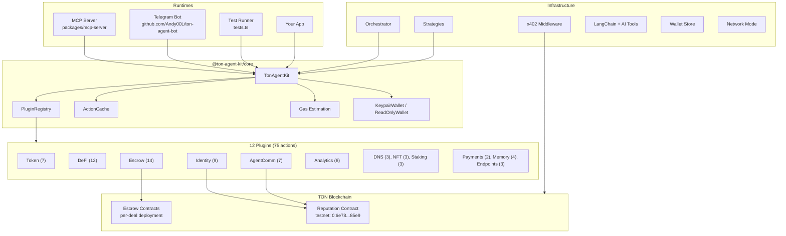
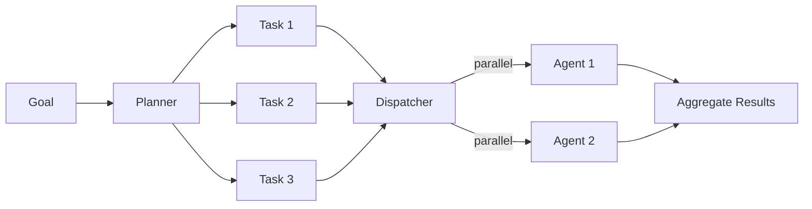
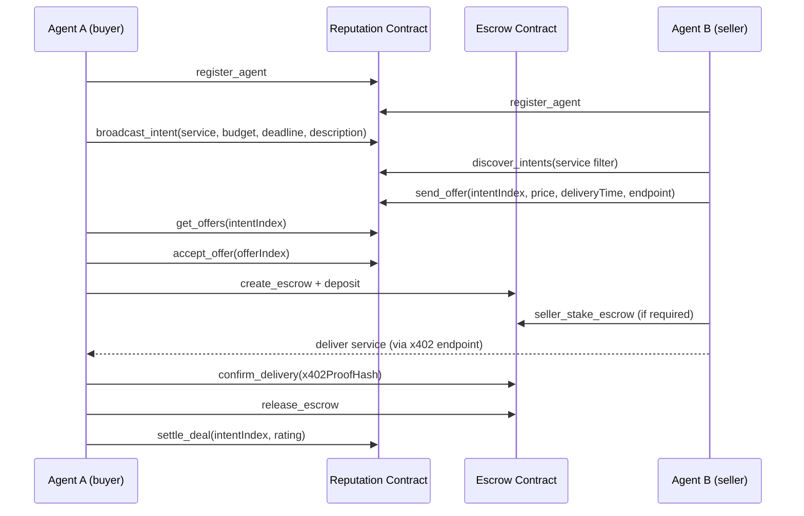
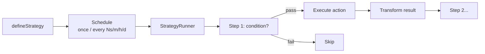

# ARCHITECTURE

TON Agent Kit is a TypeScript monorepo for building AI agents on the TON blockchain. It provides plugins, smart contracts, an orchestrator, a strategy engine, and integrations with MCP, LangChain, and Vercel AI.

---

## 1. System Overview



Note: The Telegram bot has been moved to https://github.com/Andy00L/ton-agent-bot. It imports all 12 plugins from this SDK via npm.

---

## 2. Monorepo Structure

```
.
├── ARCHITECTURE.md
├── README.md
├── LICENSE
├── package.json
├── .env.example
├── tests.ts                # Interactive test runner (28 suites)
│
├── assets/
│   └── hero.png
│
├── contracts/
│   ├── escrow.tact
│   ├── reputation.tact
│   ├── deploy-escrow.ts
│   ├── deploy-reputation.ts
│   ├── tact.config.json
│   └── output/             # Compiled .boc, .fc, .fif, .abi, .ts, .md, .pkg
│
├── docs/                   # 9 markdown documentation files
│
├── examples/
│   ├── simple-agent/
│   ├── telegram-bot/
│   ├── mcp-server/
│   └── x402-server/
│
├── packages/               # 21 npm packages
│   ├── core/
│   ├── plugin-token/
│   ├── plugin-defi/
│   ├── plugin-dns/
│   ├── plugin-nft/
│   ├── plugin-staking/
│   ├── plugin-analytics/
│   ├── plugin-escrow/
│   ├── plugin-identity/
│   ├── plugin-payments/
│   ├── plugin-agent-comm/
│   ├── plugin-memory/
│   ├── plugin-endpoints/   # NEW: dynamic x402 endpoint management
│   ├── orchestrator/
│   ├── strategies/
│   ├── x402-middleware/
│   ├── mcp-server/
│   ├── langchain/
│   ├── ai-tools/
│   ├── wallet-store/       # NEW: AES-256-GCM encrypted wallet/key storage
│   └── network-mode/       # NEW: CLI network mode selector
│
└── tests/                  # 28 test suites + _setup.ts
```

---

## 3. Package Distribution

21 npm packages. 12 plugins with actions, 9 infrastructure modules.

| Package | Version | Description |
|---|---|---|
| `@ton-agent-kit/core` | 1.2.4 | Base classes, wallet providers, plugin registry, cache, gas estimation |
| `@ton-agent-kit/plugin-token` | 1.1.2 | TON and jetton balances, transfers, jetton deployment |
| `@ton-agent-kit/plugin-defi` | 1.2.3 | DEX swaps (DeDust, STON.fi, Omniston), DCA, limit orders, yield, staking pools |
| `@ton-agent-kit/plugin-dns` | 1.0.4 | TON DNS resolution and lookup |
| `@ton-agent-kit/plugin-nft` | 1.0.4 | NFT info, transfer, collection queries |
| `@ton-agent-kit/plugin-staking` | 1.0.4 | Liquid staking info, stake, unstake |
| `@ton-agent-kit/plugin-analytics` | 1.1.2 | Transaction history, portfolio metrics, webhooks, bulk accounts |
| `@ton-agent-kit/plugin-escrow` | 1.5.3 | Escrow lifecycle: create, deposit, release, dispute, arbitration |
| `@ton-agent-kit/plugin-identity` | 1.6.8 | Agent registration, reputation scoring, discovery with scan fallback |
| `@ton-agent-kit/plugin-payments` | 1.0.18 | x402 resource payments, delivery proofs, binary content detection, JSON-unwrap |
| `@ton-agent-kit/plugin-agent-comm` | 1.3.6 | Intent broadcast, offer negotiation, deal settlement, testnet retry |
| `@ton-agent-kit/plugin-memory` | 1.0.2 | Local key-value context storage with TTL and namespaces |
| `@ton-agent-kit/plugin-endpoints` | 1.0.1 | Dynamic x402 endpoint management (open, close, list) |
| `@ton-agent-kit/orchestrator` | 1.1.1 | Multi-agent task planning, dispatch, retry |
| `@ton-agent-kit/strategies` | 1.0.1 | Scheduled strategy templates |
| `@ton-agent-kit/x402-middleware` | 1.1.10 | Express middleware for x402 payment gating, address normalization, forward fee tolerance |
| `@ton-agent-kit/mcp-server` | 1.1.1 | MCP server exposing actions as tools (stdio + SSE) |
| `@ton-agent-kit/langchain` | 1.0.2 | LangChain tool adapters |
| `@ton-agent-kit/ai-tools` | 1.0.2 | Vercel AI SDK and OpenAI tools adapter |
| `@ton-agent-kit/wallet-store` | 1.0.1 | AES-256-GCM encrypted wallet and API key storage, file store with 48h TTL |
| `@ton-agent-kit/network-mode` | 1.0.1 | CLI utility for choosing network mode (local, public IP, tunnel) |

---

## 4. Core Design

### Plugin System

Every plugin is defined with `definePlugin()`. It declares a list of actions. Each action is defined with `defineAction()` and provides a Zod v4 input schema, a handler function, and a description string. The core loads plugins into a `PluginRegistry`, which indexes actions by name for lookup at runtime.

```typescript
const myPlugin = definePlugin({
  name: "my-plugin",
  actions: [
    defineAction({
      name: "do_thing",
      description: "Does the thing",
      schema: z.object({ amount: z.number() }),
      handler: async (agent, params) => { ... }
    })
  ]
});
```

The agent instance is passed as the first argument to every handler. It holds the wallet provider, the TON network configuration, and a reference to the kit instance.

### Wallet Providers

Two implementations are exported from core.

- `KeypairWallet`: holds a private key in memory. Signs and sends transactions. Supports wallet versions V3R2, V4, V5R1. Auto-detects version by checking on-chain balances with `autoDetect()`.
- `ReadOnlyWallet`: accepts only an address. Cannot sign. Use for monitoring or read-only queries.

### ActionCache

`ActionCache` is a TTL-based cache with LRU eviction at 500 entries. It avoids redundant external calls during a single agent run. Cache TTLs are per-action:

| Action | TTL |
|---|---|
| `get_price` | 30 seconds |
| `get_balance` | 10 seconds |
| `resolve_domain` | 5 minutes |

### Gas Estimation

All gas estimates include a 0.1 TON buffer. Excess is refunded by the contracts. Base estimates from `packages/core/src/gas.ts`:

| Operation | Base estimate |
|---|---|
| register / rate | 0.02 TON + (agents * 0.002) |
| broadcast_intent | 0.02 TON + (intents * 0.001) |
| send_offer / accept_offer / settle_deal / cancel_intent | 0.03 TON |
| cleanup | 0.03 TON + ((agents + intents) * 0.002) |
| dispute / join / vote | 0.02 TON + (disputes * 0.0006) |
| deposit / release / refund | 0.02 TON |
| default | 0.02 TON |

Two constants are exported: `DEFAULT_GAS = "0.12"` and `CROSS_CONTRACT_GAS = "0.15"`.

### Contract Execution Verification

`verifyContractExecution` polls the chain after sending a transaction and confirms the desired state change occurred. This is separate from transaction confirmation. It is used by escrow and identity actions to assert the contract state updated as expected.

---

## 5. All 75 Actions

| # | Action | Plugin | Description | Type |
|---|---|---|---|---|
| 1 | `get_balance` | token | Get TON balance of an address | API |
| 2 | `get_jetton_balance` | token | Get jetton balance for a wallet and jetton master | API |
| 3 | `transfer_ton` | token | Send TON to an address | Live |
| 4 | `transfer_jetton` | token | Send jettons to an address | Live |
| 5 | `deploy_jetton` | token | Deploy a new jetton master contract | Live |
| 6 | `get_jetton_info` | token | Fetch metadata for a jetton master | API |
| 7 | `simulate_transaction` | token | Estimate outcome of a transaction before sending | API |
| 8 | `swap_dedust` | defi | Execute a swap on DeDust | Live |
| 9 | `swap_stonfi` | defi | Execute a swap on STON.fi | Live |
| 10 | `swap_best_price` | defi | Aggregated swap via Omniston (best across DEXes) | Live |
| 11 | `get_price` | defi | Get token price from TONAPI | API |
| 12 | `create_dca_order` | defi | Schedule a recurring DCA buy via swap.coffee | Live |
| 13 | `create_limit_order` | defi | Place a limit order via swap.coffee | Live |
| 14 | `cancel_order` | defi | Cancel an open order | Live |
| 15 | `get_yield_pools` | defi | List available yield pools | API |
| 16 | `yield_deposit` | defi | Deposit into a yield pool | Live |
| 17 | `yield_withdraw` | defi | Withdraw from a yield pool | Live |
| 18 | `get_staking_pools` | defi | List liquid staking pools | API |
| 19 | `get_token_trust` | defi | Get trust score for a token from DYOR.io | API |
| 20 | `resolve_domain` | dns | Resolve a .ton domain to an address | API |
| 21 | `lookup_address` | dns | Find the .ton domain for an address | API |
| 22 | `get_domain_info` | dns | Get full metadata for a .ton domain | API |
| 23 | `get_nft_info` | nft | Fetch metadata for an NFT item | API |
| 24 | `transfer_nft` | nft | Transfer an NFT to another address | Live |
| 25 | `get_nft_collection` | nft | Fetch metadata for an NFT collection | API |
| 26 | `get_staking_info` | staking | Get staking position for an address | API |
| 27 | `stake_ton` | staking | Stake TON in a liquid staking pool | Live |
| 28 | `unstake_ton` | staking | Unstake from a liquid staking pool | Live |
| 29 | `get_transaction_history` | analytics | Fetch transaction history for an address | API |
| 30 | `get_wallet_info` | analytics | Get wallet summary from TONAPI | API |
| 31 | `get_portfolio_metrics` | analytics | Compute portfolio metrics across tokens | API |
| 32 | `get_equity_curve` | analytics | Historical equity curve for an address | API |
| 33 | `wait_for_transaction` | analytics | Poll until a specific transaction confirms | Primitive |
| 34 | `subscribe_webhook` | analytics | Register a webhook for address events | API |
| 35 | `call_contract_method` | analytics | Call a getter on any TON contract | Live |
| 36 | `get_accounts_bulk` | analytics | Fetch data for multiple addresses in one call | API |
| 37 | `create_escrow` | escrow | Deploy a new escrow contract | Live |
| 38 | `deposit_to_escrow` | escrow | Buyer deposits funds into escrow | Live |
| 39 | `release_escrow` | escrow | Release funds to seller after delivery | Live |
| 40 | `refund_escrow` | escrow | Refund buyer from escrow | Live |
| 41 | `get_escrow_info` | escrow | Fetch current state of an escrow contract | Live |
| 42 | `confirm_delivery` | escrow | Buyer confirms delivery with x402 proof hash | Live |
| 43 | `auto_release_escrow` | escrow | Trigger auto-release after timeout | Live |
| 44 | `open_dispute` | escrow | Open a dispute on an escrow | Live |
| 45 | `join_dispute` | escrow | Arbiter joins a dispute with stake | Live |
| 46 | `vote_release` | escrow | Arbiter votes to release funds to seller | Live |
| 47 | `vote_refund` | escrow | Arbiter votes to refund buyer | Live |
| 48 | `claim_reward` | escrow | Arbiter claims staking reward after settlement | Live |
| 49 | `fallback_settle` | escrow | Settle escrow after voting deadline expires | Live |
| 50 | `seller_stake_escrow` | escrow | Seller posts reputation stake into escrow | Live |
| 51 | `register_agent` | identity | Register an agent in the reputation contract | Live |
| 52 | `discover_agent` | identity | Look up agents by name, capability, or scan | Live |
| 53 | `get_agent_reputation` | identity | Fetch reputation score and stats | Live |
| 54 | `deploy_reputation_contract` | identity | Deploy a new reputation contract | Live |
| 55 | `withdraw_reputation_fees` | identity | Withdraw accumulated fees (owner only) | Live |
| 56 | `process_pending_ratings` | identity | Process queued ratings for agents | Live |
| 57 | `get_open_disputes` | identity | List open disputes from the reputation contract | Live |
| 58 | `trigger_cleanup` | identity | Trigger stale agent cleanup | Live |
| 59 | `get_agent_cleanup_info` | identity | Get cleanup eligibility info for an agent | Live |
| 60 | `pay_for_resource` | payments | Pay for an x402-gated resource (JSON + binary) | Live |
| 61 | `get_delivery_proof` | payments | Retrieve the delivery proof for a paid resource | Live |
| 62 | `broadcast_intent` | agent-comm | Broadcast a service intent on-chain | Live |
| 63 | `discover_intents` | agent-comm | Query open intents by service type | Live |
| 64 | `send_offer` | agent-comm | Send an offer in response to an intent | Live |
| 65 | `get_offers` | agent-comm | Retrieve offers for a given intent | Live |
| 66 | `accept_offer` | agent-comm | Accept an offer and begin a deal | Live |
| 67 | `settle_deal` | agent-comm | Mark a deal as settled with rating | Live |
| 68 | `cancel_intent` | agent-comm | Cancel a previously broadcast intent | Live |
| 69 | `save_context` | memory | Write a key-value entry to context storage | Primitive |
| 70 | `get_context` | memory | Read a key-value entry from context storage | Primitive |
| 71 | `list_context` | memory | List all context keys in a namespace | Primitive |
| 72 | `delete_context` | memory | Delete a context entry | Primitive |
| 73 | `open_x402_endpoint` | endpoints | Create a paid endpoint calling a data action | Live |
| 74 | `close_x402_endpoint` | endpoints | Remove a paid endpoint by path | Live |
| 75 | `list_x402_endpoints` | endpoints | List all active endpoints | Primitive |

---

## 6. Smart Contracts

Both contracts are written in Tact. Source is in `contracts/`. Compiled output is in `contracts/output/`.

### 6.1 Reputation Contract

Deployed on testnet at `0:6e78355a901729e4218ce6632a6a98df81e7a6740613defc99ef9639942385e9`.

**Purpose.** Stores agent registry, reputation scores, intents, offers, and deal records. Serves as the coordination layer for agent commerce.

**State.** 39 maps. Key types include agent data by address, agent index by name hash, capabilities, disputes, intents, offers, and deals.

**Structs.** 6: `AgentData`, `DisputeInfo`, `AgentCleanupInfo`, `IntentData`, `OfferData`, `StorageInfo`.

**Messages.** 14 defined message types.

**Receive Handlers (14).**

| Handler | storageFund increment |
|---|---|
| Register | 0.015 TON |
| Rate | 0.003 TON |
| UpdateAvailability | 0.003 TON |
| IndexCapability | 0.008 TON |
| TriggerCleanup | none |
| RegisterEscrow | 0.003 TON |
| NotifyDisputeOpened | 0.005 TON |
| NotifyDisputeSettled | 0.003 TON |
| Withdraw | none |
| BroadcastIntent | 0.015 TON |
| SendOffer | 0.008 TON |
| AcceptOffer | 0.003 TON |
| SettleDeal | 0.008 TON |
| CancelIntent | none |

**Getters (19).**
`agentData`, `agentIndexByNameHash`, `agentReputation`, `agentCount`, `contractBalance`, `agentsByCapability`, `disputeCount`, `disputeData`, `agentCleanupInfo`, `intentsByServiceHash`, `intentCount`, `offerCount`, `agentIntentQuota`, `intentData`, `offerData`, `storageInfo`, `dealCount`, `storageFundBalance`, `accumulatedFeesBalance`.

**Reputation scoring.** Score = (successes * 100) / totalTasks. Range 0 to 100.

**Fees.** 0.01 TON per Register or Rate call.

**Storage reserve.** `ton("0.05")`. Gas buffer in nativeReserve calls: 0.01 TON.

**Intent limits.** Max 10 intents per agent. Max intent deadline: 24 hours.

**Cleanup rules.**
- Agents with score below 20% and 100 or more ratings are eligible.
- Agents inactive for 30 or more days are eligible.
- Ghost agents: 0 ratings after 7 days.
- Cascade erase: up to 20 expired intents and up to 30 rejected offers removed per cleanup trigger.

**Fixes applied.**

| Fix | Description |
|---|---|
| FIX 2 | Known escrows validation via `knownEscrows` whitelist |
| FIX 3 | Separate buyer and seller rating paths via `dealBuyerRated`/`dealSellerRated` |
| FIX 4 | Per-intent offer indexing with bounded rejection (max 10 per call) |
| FIX 5 | Cleanup of `nameToIndex` and `agentNameHashes` entries on agent erase |
| FIX 10 | 24-hour deadline cap on intents |
| FIX 11 | Dead entry removal from `intentsByService` linked list heads |
| FIX 12 | Deduplication of capability indexing via `agentCapIndexed` map |
| FIX 14 | Removed `.reputation-contract.json` dependency, hardcoded address in SDK |

---

### 6.2 Escrow Contract

Deployed per deal. Each `create_escrow` action deploys a fresh instance.

**Purpose.** Holds funds, manages delivery confirmation, handles disputes with a 3-of-N arbiter vote.

**State.** 5 maps: `arbiters`, `arbiterIndex`, `stakes`, `voted`, `votes`.

**Structs.** 1: `EscrowData` (25 fields).

**Messages.** 14 defined message types.

**Receive Handlers (12).**

| Handler | storageFund increment |
|---|---|
| SellerStake | 0.003 TON |
| Deposit | 0.003 TON |
| DeliveryConfirmed | 0.003 TON |
| Release | none |
| Refund | none |
| AutoRelease | none |
| OpenDispute | 0.005 TON |
| JoinDispute | 0.003 TON |
| VoteRelease | 0.003 TON |
| VoteRefund | 0.003 TON |
| ClaimReward | none |
| FallbackSettle | none |

**Getters (2).** `escrowData`, `balance`.

**Voting.** Deadline: 72 hours from dispute open. Majority threshold: `floor(arbiterCount / 2) + 1`.

**Seller stake scaling by reputation score.**

| Score range | Required stake |
|---|---|
| 90 to 100 | 50% of baseSellerStake |
| 60 to 89 | 100% of baseSellerStake |
| 30 to 59 | 150% of baseSellerStake |
| Below minRepScore | Blocked from selling |

**Reserve formula.** `amount + sellerStake + totalArbiterStakes + storageFund + 0.01`.

**Storage reserve.** `ton("0.05")`.

**Fixes applied.**

| Fix | Description |
|---|---|
| FIX 1 | nativeReserve protects only remaining arbiter stakes after settlement |
| FIX 7 | Arbiter bonus snapshot (`settlementWinnerCount`, `settlementLoserTotal`) taken at settlement time |
| FIX 8 | Arbiter bonus distribution: `bonus = settlementLoserTotal / settlementWinnerCount` |
| FIX 9 | `x402ProofHash` stored on-chain at `DeliveryConfirmed` |
| FIX 13 | Votes blocked after `votingDeadline` via `require(now() <= self.votingDeadline)` |

---

## 7. Multi-Agent Orchestrator

Package: `@ton-agent-kit/orchestrator` v1.1.1.

**Components.**

- `Orchestrator`: top-level coordinator. Accepts goals and a set of agents.
- `Planner`: breaks goals into ordered task lists using an LLM.
- `Dispatcher`: assigns tasks to available agents based on loaded plugins.
- `AgentManager`: tracks agent lifecycle, restarts, and hooks.



**Defaults.**

| Parameter | Default |
|---|---|
| maxRetries | 2 |
| taskTimeout | 30 seconds |
| maxTasks | 20 |
| parallel | true |

When `parallel` is true, independent tasks run concurrently. Tasks with declared dependencies run after their prerequisites complete.

---

## 8. x402 Middleware

Package: `@ton-agent-kit/x402-middleware` v1.1.10.

Express middleware that gates HTTP endpoints behind TON payments using the x402 protocol. When a request arrives without a valid payment proof, the middleware returns an HTTP 402 response with payment instructions. The client pays, attaches the proof header, and retries. The middleware verifies the proof and forwards the request.

The `EndpointPlugin` (`@ton-agent-kit/plugin-endpoints` v1.0.1) lets agents open/close x402 endpoints at runtime. It provides 3 actions: `open_x402_endpoint`, `close_x402_endpoint`, `list_x402_endpoints`.

---

## 9. Telegram Bot

The Telegram bot has been moved to a separate repository: **https://github.com/Andy00L/ton-agent-bot**

It is a multi-user grammY bot that imports all 12 plugins from this SDK via npm. Features: AES-256-GCM encrypted per-user wallets (`@ton-agent-kit/wallet-store`), HITL approval with inline buttons, 3 operating modes (Normal, Listen, Auto), and 5 LLM provider options.

See [docs/telegram-bot.md](docs/telegram-bot.md) for details.

---

## 10. Agent Commerce Protocol

The full commerce flow involves the Reputation contract, Escrow contracts, and two agents.



If delivery fails or is disputed, arbiters join the escrow and vote within 72 hours. Majority determines release or refund. After settlement, arbiters claim their staking rewards.

---

## 11. Agent Communication Protocol

Intent and offer lifecycle on the reputation contract:

1. Agent broadcasts an intent with `BroadcastIntent`. Stored under `intentsByServiceHash`.
2. Providers discover intents with `intentsByServiceHash` getter (O(1) by service).
3. Provider sends an offer with `SendOffer`. Stored under the intent's offer index.
4. Requester retrieves offers with `offerData` getter.
5. Requester accepts with `AcceptOffer`. Deal record created. Other offers rejected (max 10 per call).
6. After delivery, both parties call `SettleDeal` with a rating.
7. Either party can cancel with `CancelIntent` before acceptance.

**Constraints.**
- Max 10 active intents per agent.
- Max deadline: 24 hours (FIX 10).
- Cascade erase removes expired intents and rejected offers during cleanup.
- Linked list heads for `intentsByService` are cleaned of dead entries (FIX 11).

---

## 12. Strategy Engine

Package: `@ton-agent-kit/strategies` v1.0.1.

**Purpose.** Run scheduled, parameterized agent behaviors without LLM involvement.



**4 built-in templates.**

| Template | Description |
|---|---|
| DCA | Recurring token purchase at fixed intervals |
| PriceMonitor | Alert or act when price crosses a threshold |
| Rebalance | Rebalance portfolio to target allocations |
| ReputationGuard | Monitor and maintain agent reputation score |

**Schedule formats.** `once`, `every Ns`, `every Nm`, `every Nh`, `every Nd`.

**State.** Context persists across runs. Results reset per run.

---

## 13. MCP Server

Package: `@ton-agent-kit/mcp-server` v1.1.1.

**Transport.** Supports both stdio and SSE. SSE mode serves `/sse` and `/messages` with Bearer token auth.

**Plugins loaded (10).**
Token, DeFi, NFT, DNS, Payments, Staking, Escrow, Identity, Analytics, Memory.

AgentComm and Endpoints are not included by default.

**Meta tool.** `ton_agent_info` returns wallet address, network, available actions, and plugin count.

---

## 14. New Packages

Three packages added since v1.1.0:

### wallet-store (1.0.1)

AES-256-GCM encrypted storage for wallet mnemonics and API keys. SQLite backend. Per-user key derivation using HMAC-SHA256. Used by the Telegram bot for multi-user wallet management. Also includes `FileStore` for file uploads (48h TTL, 10MB/file, 50MB/user). 5 LLM provider configs (OpenAI, OpenRouter, Groq, Together, Mistral).

### plugin-endpoints (1.0.1)

Dynamic x402 endpoint management. 3 actions: `open_x402_endpoint`, `close_x402_endpoint`, `list_x402_endpoints`. Uses `MemoryReplayStore`. Endpoints do not persist across restarts.

### network-mode (1.0.1)

CLI utility for choosing how the x402 server is accessed: local (localhost), public (auto-detect IP, verify port), or tunnel (ngrok/cloudflare, verify connectivity). Returns a URL string.

---

## 15. Test Suite

Directory: `tests/`. Entry point: `tests.ts`.

**28 test suites** plus `_setup.ts`.

**Runner modes.**
- Interactive menu: select suites by number.
- Run all: pass `"all"` argument.
- Single suite: pass a single number.
- Multiple suites: pass comma-separated numbers or ranges (e.g., `1,3,5-8`).

Results are saved to `tests/results/<timestamp>.log`.

---

## 16. Technology Stack

| Category | Libraries / Tools |
|---|---|
| Runtime | Bun 1.3+ |
| Language | TypeScript (strict mode) |
| TON SDK | @ton/ton, @ton/core, @ton/crypto |
| DEX SDKs | @dedust/sdk, @ston-fi/sdk |
| MCP | @modelcontextprotocol/sdk |
| AI | OpenAI SDK |
| Telegram | grammY, @grammyjs/runner |
| HTTP | Express |
| Contracts | Tact |
| Validation | Zod v4 |
| APIs | TONAPI, swap.coffee, DYOR.io |

---

## 17. Differentiation

| Feature | TON Agent Kit | Generic Web3 Agent Kits |
|---|---|---|
| On-chain agent identity | Reputation contract on testnet | None |
| On-chain commerce protocol | Intent/offer/deal on Reputation contract | None |
| Reputation-gated escrow | Seller stake scaled by score | None |
| Arbiter network | 3-of-N vote, 72h window, staking rewards | None |
| x402 payment gating | Native middleware + on-chain proof | Rare |
| Dynamic endpoints | LLM opens/closes x402 endpoints at runtime | None |
| MCP integration | 10 plugins, stdio + SSE transport | Uncommon |
| Monorepo with 21 packages | Separately versioned, composable | Varies |
| Tact smart contracts | Source included, deploy scripts provided | None |

**Known limitations.**
- Reputation contract is on testnet only. Mainnet deployment requires audit.
- Gas estimates include a 0.1 TON buffer. This is refunded but requires sufficient wallet balance upfront.
- Memory plugin uses local storage only. It does not persist across process restarts unless the storage file is retained.
- Strategy scheduler uses `setInterval`. No persistence across restarts.
