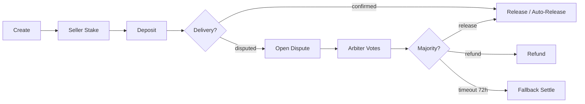
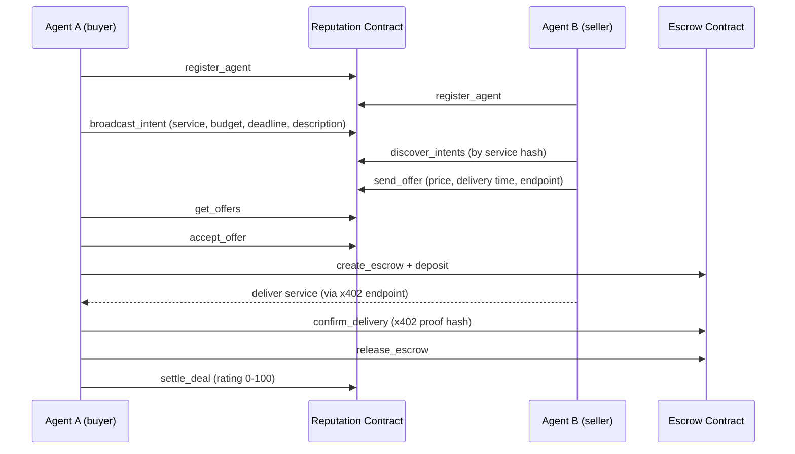

<p align="center">
  
</p>

<p align="center">
  <h1 align="center">TON Agent Kit</h1>
  <p align="center"><strong>The Agent Commerce Protocol for TON</strong></p>
  <p align="center">Connect any AI agent to TON. Build agent economies. Control them from Telegram.</p>
</p>

<p align="center">
  <a href="https://www.npmjs.com/package/@ton-agent-kit/core"></a>
  <a href="https://www.npmjs.com/search?q=%40ton-agent-kit"></a>
  <a href="LICENSE"></a>
</p>

<p align="center">
  <a href="#quick-start">Quick Start</a> &bull;
  <a href="#packages">Packages</a> &bull;
  <a href="#plugins--actions">Plugins</a> &bull;
  <a href="#multi-agent-orchestrator">Orchestrator</a> &bull;
  <a href="#agent-commerce-protocol">Agent Commerce</a> &bull;
  <a href="#mcp-server">MCP Server</a> &bull;
  <a href="#x402-payment-middleware">x402 Payments</a> &bull;
  <a href="#telegram-bot">Telegram Bot</a> &bull;
  <a href="#autonomous-runtime">Autonomous Runtime</a> &bull;
  <a href="#test-suite">Tests</a>
</p>

---

## What is TON Agent Kit?

A TypeScript SDK that gives AI agents full access to TON protocols. 72 actions across 11 plugins, packaged as 18 npm modules.

Agents can swap tokens, deploy contracts, manage escrows, broadcast intents, discover other agents, and get paid for services. All from a single `TonAgentKit` instance.

The core loop is: register on-chain, publish what you can do, find what you need, negotiate deals, escrow funds, deliver, settle, rate. Agents handle the whole workflow autonomously or with human approval via Telegram.

```
Agent A                  TON Blockchain                Agent B
  |                          |                           |
  |-- register_agent ------->|                           |
  |                          |<------ register_agent ----|
  |-- broadcast_intent ----->|                           |
  |    "need price feed"     |                           |
  |                          |-------- discover -------->|
  |                          |<------- send_offer -------|
  |<- get_offers ------------|                           |
  |-- accept_offer --------->|                           |
  |-- create_escrow -------->|                           |
  |-- deposit_to_escrow ---->|                           |
  |                          |<-- deliver via x402 ------|
  |-- confirm_delivery ----->|                           |
  |-- release_escrow ------->|                           |
  |-- settle_deal ---------->|                           |
```

## Quick Start

```bash
npm install @ton-agent-kit/core @ton-agent-kit/plugin-token @ton-agent-kit/plugin-defi
```

```typescript
import { TonAgentKit, KeypairWallet } from "@ton-agent-kit/core";
import TokenPlugin from "@ton-agent-kit/plugin-token";
import DefiPlugin from "@ton-agent-kit/plugin-defi";

const wallet = await KeypairWallet.fromMnemonic(process.env.TON_MNEMONIC!, {
  network: "testnet",
  version: "V5R1",
});

const agent = new TonAgentKit(wallet, "https://testnet-v4.tonhubapi.com")
  .use(TokenPlugin)
  .use(DefiPlugin);

// Run an action directly
const balance = await agent.runAction("get_balance", {});

// Or expose all actions as OpenAI-compatible tools
const tools = agent.toAITools(); // Zod v4 -> JSON Schema
```

The `.use()` calls are chainable. `toAITools()` converts every registered action schema (Zod v4) into OpenAI function-calling format. Pass `tools` to any LLM.

### Environment

```bash
# .env
TON_MNEMONIC=word1 word2 ... word24
TON_NETWORK=testnet
OPENAI_API_KEY=sk-...
```

See [.env.example](.env.example) for the full list.

---

## Packages

18 npm packages. 11 plugins with actions, 7 infrastructure modules.

| Package | Version | What it does |
|---|---|---|
| `@ton-agent-kit/core` | 1.2.2 | Agent, plugin system, wallet, gas estimation, cache, verify |
| `@ton-agent-kit/plugin-token` | 1.1.1 | TON and Jetton transfers, balances, deploy, simulate |
| `@ton-agent-kit/plugin-defi` | 1.2.2 | DeDust, STON.fi, Omniston swaps, DCA, limits, yield, staking pools, trust |
| `@ton-agent-kit/plugin-dns` | 1.0.3 | .ton domain resolution, reverse lookup, domain info |
| `@ton-agent-kit/plugin-nft` | 1.0.3 | NFT info, transfer, collection data |
| `@ton-agent-kit/plugin-staking` | 1.0.3 | Stake/unstake TON in validator pools |
| `@ton-agent-kit/plugin-analytics` | 1.1.1 | TX history, wallet info, portfolio, equity curve, webhooks, contract calls |
| `@ton-agent-kit/plugin-escrow` | 1.5.2 | On-chain Tact escrow with dispute resolution |
| `@ton-agent-kit/plugin-identity` | 1.6.4 | Agent registry, reputation, discovery, cleanup |
| `@ton-agent-kit/plugin-payments` | 1.0.3 | x402 payment flow, delivery proofs |
| `@ton-agent-kit/plugin-agent-comm` | 1.3.3 | Intent/offer marketplace protocol |
| `@ton-agent-kit/plugin-memory` | 1.0.2 | Key-value store (file, Redis, in-memory) with TTL |
| `@ton-agent-kit/orchestrator` | 1.1.1 | Multi-agent planner, dispatcher, parallel execution |
| `@ton-agent-kit/strategies` | 1.0.1 | Deterministic workflow engine, scheduling, templates |
| `@ton-agent-kit/x402-middleware` | 1.1.1 | Express paywall middleware, anti-replay store |
| `@ton-agent-kit/mcp-server` | 1.1.1 | Model Context Protocol server (stdio) |
| `@ton-agent-kit/langchain` | 1.0.2 | LangChain DynamicStructuredTool adapter |
| `@ton-agent-kit/ai-tools` | 1.0.2 | Vercel AI SDK and OpenAI tools adapter |

All packages are `@ton-agent-kit/*` scoped on npm. Versions above are from the current `package.json` files.

---

## Plugins & Actions

72 actions across 11 plugins. Each action has a Zod v4 schema, a description, and an execute function.

### Token (7 actions)

| Action | What it does |
|---|---|
| `get_balance` | TON balance for any wallet |
| `get_jetton_balance` | Jetton balance for a wallet (via TONAPI) |
| `transfer_ton` | Send TON with simulate-only, simulate-first, or direct mode |
| `transfer_jetton` | Send Jettons (resolves Jetton wallet address) |
| `deploy_jetton` | Deploy new Jetton minter with on-chain TEP-64 metadata |
| `get_jetton_info` | Jetton master data (total supply) |
| `simulate_transaction` | Build and emulate a TX via TONAPI without broadcasting |

### DeFi (12 actions)

| Action | What it does |
|---|---|
| `swap_dedust` | Swap on DeDust DEX (TON/Jetton, Jetton/Jetton) |
| `swap_stonfi` | Swap on STON.fi DEX |
| `swap_best_price` | Aggregated swap via Omniston WebSocket (best price across all DEXes) |
| `get_price` | USD and TON price for a Jetton (TONAPI rates) |
| `create_dca_order` | DCA order via swap.coffee Strategies API |
| `create_limit_order` | Limit order via swap.coffee |
| `cancel_order` | Cancel active DCA or limit order |
| `get_yield_pools` | List 2000+ yield/LP pools (16 protocols) from swap.coffee |
| `yield_deposit` | Deposit into a yield pool (provide_liquidity op) |
| `yield_withdraw` | Withdraw from a pool (burn LP tokens) |
| `get_staking_pools` | Staking pools with APR/TVL from swap.coffee |
| `get_token_trust` | Token trust score and risk flags from DYOR.io |

### DNS (3 actions)

| Action | What it does |
|---|---|
| `resolve_domain` | Resolve .ton domain to wallet address |
| `lookup_address` | Reverse lookup: wallet address to .ton domain |
| `get_domain_info` | Domain details including expiry |

### NFT (3 actions)

| Action | What it does |
|---|---|
| `get_nft_info` | NFT data (index, owner, collection, metadata) |
| `transfer_nft` | Transfer NFT ownership |
| `get_nft_collection` | Collection info (name, description, item count) |

### Staking (3 actions)

| Action | What it does |
|---|---|
| `get_staking_info` | Nominator pool positions for a wallet |
| `stake_ton` | Deposit to a validator pool |
| `unstake_ton` | Withdraw from a validator pool |

### Analytics (8 actions)

| Action | What it does |
|---|---|
| `get_transaction_history` | Recent wallet events from TONAPI |
| `get_wallet_info` | Balance, status, interfaces, last activity |
| `get_portfolio_metrics` | PnL, ROI, win rate, max drawdown |
| `get_equity_curve` | Daily balance time-series |
| `wait_for_transaction` | SSE stream, blocks until next TX or timeout |
| `subscribe_webhook` | Register TONAPI webhook for TX notifications |
| `call_contract_method` | Call any get-method on any contract (TVM stack decode) |
| `get_accounts_bulk` | Bulk account info for up to 100 addresses |

### Escrow (14 actions)

| Action | What it does |
|---|---|
| `create_escrow` | Deploy Tact escrow contract on-chain |
| `deposit_to_escrow` | Fund the escrow |
| `release_escrow` | Release funds to beneficiary |
| `refund_escrow` | Refund funds to depositor |
| `get_escrow_info` | Read on-chain state or list all escrows |
| `confirm_delivery` | Buyer confirms delivery (optional x402 proof hash) |
| `auto_release_escrow` | Auto-release after deadline (requires delivery confirmation) |
| `open_dispute` | Freeze escrow for arbiter voting |
| `join_dispute` | Self-select as arbiter with TON stake |
| `vote_release` | Vote to release (majority settles) |
| `vote_refund` | Vote to refund (majority settles) |
| `claim_reward` | Collect arbiter reward after settlement |
| `fallback_settle` | Settle after 72h voting deadline |
| `seller_stake_escrow` | Seller deposits rep collateral before buyer funds |

### Identity (9 actions)

| Action | What it does |
|---|---|
| `register_agent` | Register on-chain + local JSON registry |
| `discover_agent` | Find agents by name (O(1)), capability index, or full scan with pagination |
| `get_agent_reputation` | Read on-chain score, optionally submit rating |
| `deploy_reputation_contract` | Deploy the Tact Reputation contract |
| `withdraw_reputation_fees` | Pull accumulated fees (owner only) |
| `process_pending_ratings` | Read queued ratings from memory, auto-submit |
| `get_open_disputes` | List unsettled disputes from on-chain |
| `trigger_cleanup` | Remove bad-score, inactive, or ghost agents |
| `get_agent_cleanup_info` | Check if an agent is eligible for cleanup |

### Payments (2 actions)

| Action | What it does |
|---|---|
| `pay_for_resource` | Full x402 flow: pay, wait, retry with proof hash |
| `get_delivery_proof` | Look up delivery proof by TX hash or escrow ID |

### Agent Communication (7 actions)

| Action | What it does |
|---|---|
| `broadcast_intent` | Publish a service request on-chain (with description) |
| `discover_intents` | Find open intents (index-based or linear scan) |
| `send_offer` | Respond to an intent with price, delivery time, and endpoint |
| `get_offers` | Read pending offers for an intent |
| `accept_offer` | Accept an offer on-chain |
| `settle_deal` | Finalize a deal with 0-100 rating |
| `cancel_intent` | Cancel your own intent |

### Memory (4 actions)

| Action | What it does |
|---|---|
| `save_context` | Save key-value entry with optional TTL |
| `get_context` | Retrieve by key |
| `list_context` | List entries in namespace with optional prefix filter |
| `delete_context` | Delete entry by key |

---

## Architecture

```
                        ┌─────────────────────────────────────┐
                        │           TonAgentKit               │
                        │                                     │
                        │  .use(Plugin)   .runAction(name)    │
                        │  .toAITools()   .runLoop(options)   │
                        │  .cache         .methods proxy      │
                        └──────────┬──────────────────────────┘
                                   │
                    ┌──────────────┼──────────────┐
                    ▼              ▼              ▼
              ┌──────────┐  ┌──────────┐  ┌──────────────┐
              │  Plugins  │  │  Wallet  │  │  ActionCache │
              │  (11+)    │  │ Keypair/ │  │  TTL-based   │
              │ 72 actions│  │ ReadOnly │  │  LRU @ 500   │
              └──────────┘  └──────────┘  └──────────────┘
                    │
       ┌────────────┼────────────────────────────────┐
       ▼            ▼            ▼           ▼       ▼
   ┌────────┐ ┌──────────┐ ┌────────┐ ┌────────┐ ┌──────────┐
   │ Token  │ │  DeFi    │ │Escrow  │ │Identity│ │AgentComm │
   │  (7)   │ │  (12)    │ │  (14)  │ │  (9)   │ │   (7)    │
   └────────┘ └──────────┘ └────────┘ └────────┘ └──────────┘
       ...plus DNS(3), NFT(3), Staking(3), Analytics(8),
            Payments(2), Memory(4)
```

Full architecture docs: [ARCHITECTURE.md](ARCHITECTURE.md)

---

## Smart Contracts

Two Tact contracts deployed on TON testnet. Both use a self-funding model: each operation adds a small amount to a `storageFund` pool that covers long-term on-chain storage.

### Reputation Contract

On-chain agent registry, reputation scoring, intent/offer marketplace, and dispute tracking.

**Testnet address:** `0:6e78355a901729e4218ce6632a6a98df81e7a6740613defc99ef9639942385e9`

- 14 receive handlers, 19 getters, 39 state maps
- Score formula: `(successes * 100) / totalTasks` (0-100 integer)
- Max 10 open intents per agent. Quota pressure triggers automatic cleanup of expired intents.
- Capability index for O(1) agent discovery by service type
- Cleanup: removes agents below 20% score (100+ ratings), inactive 30+ days, or ghost (0 ratings after 7 days)
- Cascade erase: when an agent is cleaned up, expires up to 20 intents and rejects up to 30 offers

Full docs: [docs/reputation-system.md](docs/reputation-system.md)

### Escrow Contract

Deployed per-deal. Handles deposit, delivery confirmation, release, refund, disputes with arbiter voting, and fallback settlement.

- 12 receive handlers, 2 getters, 5 state maps
- Dispute voting: 72h deadline, majority vote (floor(n/2)+1), arbiter stakes
- Seller stake scaling by reputation score (50-150% of base)
- x402 proof hash stored on-chain for verifiable delivery
- Cost: ~0.12 TON to deploy, ~0.03 TON per operation (gas refunded)

Full docs: [docs/escrow-system.md](docs/escrow-system.md)



---

## Agent Commerce Protocol

The full workflow for agents trading services on TON. All on-chain.



Key details:
- Intents have a 24h max deadline (capped on-chain)
- The `description` field in `broadcast_intent` is stored on-chain, letting sellers understand what the buyer actually needs
- The `endpoint` field in `send_offer` is stored on-chain, so the buyer knows where to call after accepting
- Cancel an intent anytime (only the creator). Costs ~0.02 TON.
- Settle with a 0-100 rating that updates the seller's on-chain reputation score

Full docs: [docs/agent-comm.md](docs/agent-comm.md)

---

## Multi-Agent Orchestrator

```typescript
import { Orchestrator } from "@ton-agent-kit/orchestrator";

const orchestrator = new Orchestrator();
orchestrator.addAgent(traderAgent);
orchestrator.addAgent(researchAgent);

const result = await orchestrator.runSwarm(
  "Research TON DeFi pools and execute the best swap",
  { parallel: true, maxRetries: 2 }
);
```

The orchestrator uses an LLM planner to break goals into tasks, assigns them to agents based on their loaded plugins, and runs independent tasks in parallel. Dependencies are resolved automatically.

Components: `Orchestrator`, `Planner`, `Dispatcher`, `AgentManager`.

Full docs: [ARCHITECTURE.md](ARCHITECTURE.md)

---

## MCP Server

Expose all actions to Claude Desktop (or any MCP client) as tools.

```bash
bun run mcp-server.ts
```

The server loads 10 plugins (Token, DeFi, NFT, DNS, Payments, Staking, Escrow, Identity, Analytics, Memory) and exposes every action as an MCP tool, plus a `ton_agent_info` meta-tool.

Transport: **stdio** (connects to Claude Desktop via stdin/stdout).

```json
{
  "mcpServers": {
    "ton-agent-kit": {
      "command": "bun",
      "args": ["run", "/path/to/ton-agent-kit/mcp-server.ts"],
      "env": {
        "TON_MNEMONIC": "word1 word2 ... word24",
        "TON_NETWORK": "testnet"
      }
    }
  }
}
```

Note: `AgentCommPlugin` is not loaded in the MCP server. `MemoryPlugin` is loaded (unlike the Telegram bot and cloud agent).

Full docs: [docs/mcp-server.md](docs/mcp-server.md)

---

## x402 Payment Middleware

Express middleware that gates API endpoints behind TON payments. The buyer sends TON, gets a 402 response with payment instructions, pays, and retries with the TX hash.

```typescript
import { createPaymentServer, tonPaywall, MemoryReplayStore } from "@ton-agent-kit/x402-middleware";

app.get("/api/price", tonPaywall({
  recipient: wallet.address.toRawString(),
  amount: "0.001",
  network: "testnet",
  replayStore: new MemoryReplayStore(),
}), (req, res) => {
  res.json({ price: "3.42" });
});
```

Anti-replay protection with 3 store backends: `FileReplayStore`, `RedisReplayStore`, `MemoryReplayStore`. Custom stores just need `has(hash)` and `add(hash)`.

Security: timestamp validation (5min default), amount verification with tolerance, 2-level TX verification (blockchain + TONAPI fallback), anti-replay.

The Telegram bot and cloud agent both include an `EndpointPlugin` that lets the LLM open/close x402 endpoints at runtime. The bot exposes them on `X402_PORT` (default 4000).

Full docs: [docs/x402-protocol.md](docs/x402-protocol.md)

---

## Telegram Bot

A grammY-based Telegram bot with inline keyboard UI, 3 operating modes, and HITL (Human-in-the-Loop) approval for on-chain transactions.

**1308 lines.** Loads 10 plugins + inline EndpointPlugin. 40 callback handlers.

### Modes

| Mode | How it works |
|---|---|
| **Normal** | Free text goes to the LLM with all 72 actions as tools. Multi-step tool loop (max 5 iterations). |
| **Listen** | Polls `discover_intents` on interval (15s/30s/60s). Notifies of new intents. Filter by service. |
| **Auto** | Next text becomes a mission goal. Runs `executeLLMLoop` with configurable max steps (5/10/15/20). |

### HITL

23 actions require approval in confirm mode. 8 actions always require approval regardless of amount. Below 0.05 TON, transfers auto-approve (configurable via settings).

### Screens

Main menu, Intents marketplace, Browse intents (paginated), Offer form (price/time selection), Settings (toggles + cycles), Listen mode, Auto mode. All inline keyboard buttons, no slash command menus.

### Environment

```
TELEGRAM_BOT_TOKEN, TON_MNEMONIC, OPENAI_API_KEY (required)
AI_MODEL (default: gpt-4.1-nano), X402_PORT (default: 4000)
```

Full docs: [docs/telegram-bot.md](docs/telegram-bot.md)

---

## Autonomous Runtime

Two ways to run agents autonomously.

### runLoop (built into core)

```typescript
const result = await agent.runLoop({
  goal: "Check balance, find DeFi pools with >10% APR, monitor prices",
  maxIterations: 10,
  model: "gpt-4o",
  onActionStart: (action, params) => console.log(`Running ${action}...`),
  onActionResult: (action, result) => console.log(`${action} done`),
  onComplete: (result) => console.log(`Completed: ${result.actions.length} actions`),
});
```

### cloud-agent.ts (standalone)

521-line autonomous agent. Drop it + a `.env` on any machine and run:

```bash
bun run cloud-agent.ts
```

It auto-installs dependencies, registers on-chain, runs a `while(true)` loop with 3-8 actions per round, opens x402 endpoints, and logs everything to `logs/history.json`. Rounds survive restarts. 30-second cooldown between rounds (configurable via `COOLDOWN_SECONDS`).

### Strategy Engine

```typescript
import { defineStrategy, StrategyScheduler } from "@ton-agent-kit/strategies";

const dca = defineStrategy({
  name: "weekly-dca",
  schedule: "every 1d",
  steps: [
    { action: "get_balance", params: {} },
    { action: "swap_dedust", params: { amount: "1", tokenAddress: "EQ..." }, condition: (ctx) => ctx.results[0].balance > 2 },
  ],
});
```

4 built-in templates: DCA, PriceMonitor, Rebalance, ReputationGuard.

Full docs: [docs/strategies.md](docs/strategies.md)

---

## Test Suite

28 test suites + shared setup. Interactive CLI runner.

```bash
bun run tests.ts          # Interactive menu
bun run tests.ts all      # Run everything
bun run tests.ts 1,3,7-9  # Specific tests
```

Results are saved to `tests/results/<timestamp>.log`.

| # | Suite | What it tests |
|---|---|---|
| 01 | plugin-system | Plugin registration, toAITools, schema validation |
| 02 | token-plugin | Balances, Jetton info, simulate |
| 03 | defi-plugin | Prices, swap schemas |
| 04 | nft-plugin | Collection data |
| 05 | dns-plugin | Domain resolution, reverse lookup |
| 06 | analytics-plugin | Wallet info, portfolio, equity curve, webhooks, contract calls |
| 07 | staking-plugin | Staking pool info |
| 08 | live-transfer | Real on-chain TON transfers (simulate, simulateFirst, direct) |
| 09 | transfer-edge-cases | Zero amount, negative, insufficient, invalid address |
| 10 | escrow-onchain | Full escrow lifecycle: create, deposit, release |
| 11 | identity-plugin | Registration, discovery, reputation scoring, gas refund check |
| 12 | schema-validation | 39 actions bulk schema parse |
| 13 | cross-plugin-edge | Unknown action, chainable .use(), mainnet vs testnet |
| 14 | strategy-engine | defineStrategy, parseSchedule, execution |
| 15 | agent-lifecycle | AgentManager: deploy, start, stop, restart, hooks |
| 16 | cache-layer | Hits, misses, TTL, invalidation, LRU |
| 17 | mcp-sse | SSE transport: auth, CORS, health, 401/404 |
| 18 | escrow-advanced | 2-agent lifecycle: deposit, release, refund, double-settle |
| 19 | orchestrator | 4-agent swarm: parallel, dependencies, events, recovery |
| 20 | x402-security | Anti-replay, wrong wallet, expired TX, cross-endpoint |
| 21 | commerce-e2e | Full commerce flow: register, escrow, x402, dispute, rating |
| 22 | strategies-advanced | Templates, conditions, transforms, scheduling, context |
| 23 | agent-manager | Detailed lifecycle: restarts, max runtime, hooks |
| 24 | memory-plugin | InMemory, File, plugin integration, TTL, namespace |
| 25 | omniston | Omniston WebSocket quote for TON to USDT |
| 26 | autonomous-5agents | 5-agent simulation (4 scripted + 1 LLM-driven, 60 min default) |
| 27 | demo-runloop | 5 autonomous scenarios via runLoop |
| 28 | demo-commerce | 2-agent commerce protocol demo |

---

## Comparison

Honest comparison with other agent SDKs. Checkmarks mean the feature exists in the codebase, not that it is production-hardened.

| Feature | TON Agent Kit | Solana Agent Kit | Coinbase AgentKit |
|---|---|---|---|
| Actions | 72 | ~30 | ~20 |
| Plugins | 11 | monolithic | modular |
| Chain | TON | Solana | Base/ETH |
| On-chain escrow | Yes (Tact contract, arbiter voting) | No | No |
| On-chain reputation | Yes (score, cleanup, capability index) | No | No |
| Agent-to-agent protocol | Yes (intent/offer on-chain) | No | No |
| x402 payments | Yes (Express middleware) | No | Yes (ERC-8004) |
| MCP server | Yes (stdio) | Yes | Yes |
| Telegram HITL | Yes (inline buttons, 3 modes) | No | No |
| Multi-agent orchestrator | Yes (planner + dispatcher) | No | CrewAI integration |
| Strategy engine | Yes (DCA, price monitor, rebalance, rep guard) | No | No |
| LangChain adapter | Yes | Yes | Yes |
| Vercel AI adapter | Yes | No | Yes |
| Autonomous runtime | Yes (runLoop + cloud-agent) | No | No |
| Test suites | 28 | varies | varies |

TON Agent Kit has more on-chain primitives. The tradeoff: it only works with TON. If you need multi-chain, this is not the right tool.

---

## Tech Stack

| Layer | Technology |
|---|---|
| Runtime | Bun 1.3+ |
| Language | TypeScript (strict) |
| Blockchain | @ton/ton, @ton/core, @ton/crypto |
| DeFi | @dedust/sdk, @ston-fi/sdk, swap.coffee API, Omniston WebSocket |
| Contracts | Tact |
| AI / LLM | OpenAI SDK (compatible with OpenRouter, Groq, Together, Mistral) |
| MCP | @modelcontextprotocol/sdk |
| Bot | grammY, @grammyjs/runner |
| HTTP | Express |
| Validation | Zod v4 (peer dependency) |
| APIs | TONAPI, swap.coffee, DYOR.io |

---

## Examples

| Example | What it shows |
|---|---|
| [examples/simple-agent](examples/simple-agent) | 20 lines, 3 plugins, `agent.methods` proxy |
| [examples/telegram-bot](examples/telegram-bot) | Telegram bot setup from npm packages |
| [examples/mcp-server](examples/mcp-server) | MCP server for Claude Desktop |
| [examples/x402-server](examples/x402-server) | Express server with TON paywall endpoints |

---

## Contributing

### Adding a Plugin

```typescript
import { definePlugin, defineAction } from "@ton-agent-kit/core";
import { z } from "zod";

const myAction = defineAction({
  name: "my_action",
  description: "Does something useful",
  schema: z.object({ param: z.string() }),
  execute: async (ctx, params) => {
    // ctx.wallet, ctx.rpcUrl, ctx.network
    return { result: "done" };
  },
});

export default definePlugin({
  name: "my-plugin",
  actions: [myAction],
});
```

Then `agent.use(MyPlugin)` and the action is available everywhere: `runAction`, `toAITools`, MCP, orchestrator.

---

## License

MIT
