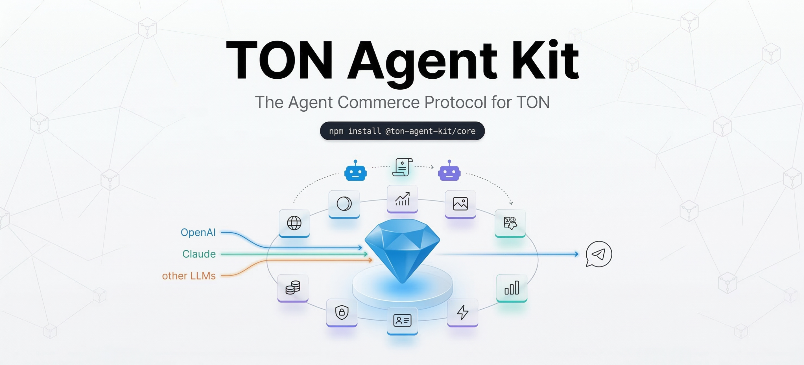
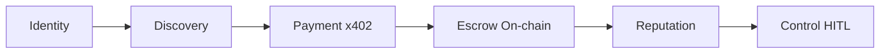
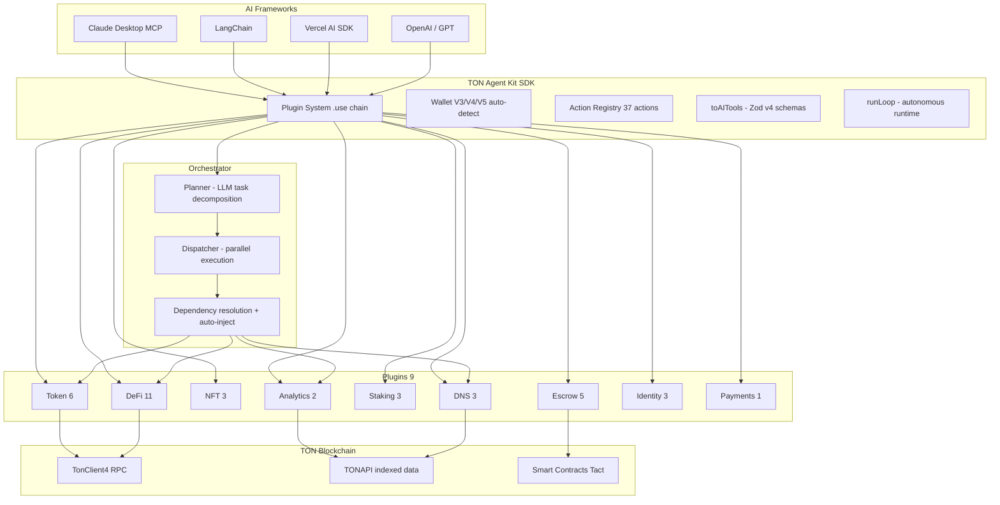
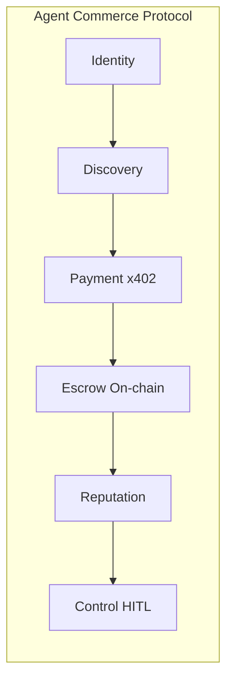
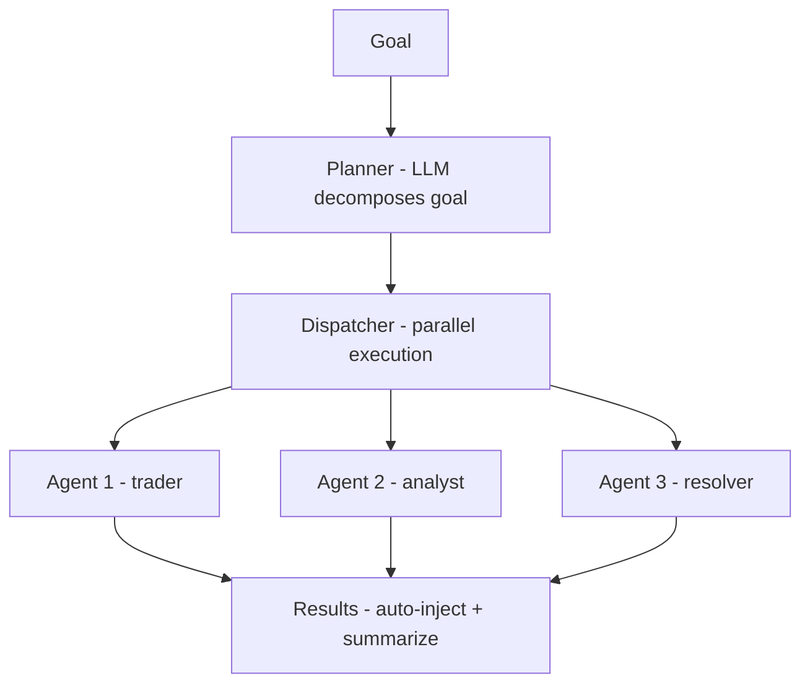

<p align="center">
  
</p>

<p align="center">
  <h1 align="center">&#x1F916; TON Agent Kit</h1>
  <p align="center"><strong>The Agent Commerce Protocol for TON</strong></p>
  <p align="center">Connect any AI agent to TON. Build agent economies. Control them from Telegram.</p>
</p>

<p align="center">
  <a href="https://www.npmjs.com/package/@ton-agent-kit/core"></a>
  <a href="https://www.npmjs.com/search?q=%40ton-agent-kit"></a>
  <a href="LICENSE"></a>
</p>

<p align="center">
  <a href="#quick-start">Quick Start</a> &bull;
  <a href="#available-packages">Packages</a> &bull;
  <a href="#plugins--actions">Plugins</a> &bull;
  <a href="#multi-agent-orchestrator">Orchestrator</a> &bull;
  <a href="#agent-commerce-protocol">Agent Commerce</a> &bull;
  <a href="#mcp-server">MCP Server</a> &bull;
  <a href="#x402-payment-middleware">x402 Payments</a> &bull;
  <a href="#telegram-bot">Telegram Bot</a> &bull;
  <a href="#autonomous-runtime">Autonomous Runtime</a> &bull;
  <a href="#examples">Examples</a> &bull;
  <a href="#test-results">Tests</a>
</p>

---

## What is TON Agent Kit?

TON Agent Kit is more than an SDK -- it's the **infrastructure for an AI agent economy on TON**.

The toolkit ships as **15 npm packages** with **37 actions** across **9 plugins**. Call `agent.toAITools()` to get OpenAI-compatible function definitions that work with any LLM provider -- OpenAI, Anthropic, Google, Groq, Mistral, OpenRouter, Together. Call `agent.runLoop("goal")` to hand a natural-language objective to the LLM and let it autonomously plan and execute on-chain actions. The **Orchestrator** lets N specialized agents collaborate on complex goals -- an LLM decomposes the goal into tasks, a dispatcher executes them in parallel with dependency resolution, and results auto-inject between dependent tasks. Agents discover each other via an **agent registry** with reputation scoring. They pay each other through **x402 middleware** -- production-hardened with anti-replay protection, timestamp verification, and 2-level on-chain validation. Trustless task payment flows through an **on-chain Tact escrow smart contract** (gas-optimized with `SendRemainingBalance | SendIgnoreErrors`) deployed per deal. Users control agents safely from **Telegram with human-in-the-loop approval buttons**. Any AI -- Claude Desktop, Cursor, GPT -- can interact with TON through a single **MCP server** exposing all 37 tools. The [multi-agent commerce demo](demo-agent-commerce.ts) runs the full protocol with **2 real wallets** and **8 on-chain steps**. Advanced DeFi primitives cover DCA orders, limit orders, yield farming, staking pool discovery, and token trust scoring. LangChain and Vercel AI SDK adapters are included.

### The Problem

On Solana, the [Solana Agent Kit](https://github.com/sendaifun/solana-agent-kit) (1,600+ stars) gave agents blockchain access. On Base, [ERC-8004](https://eips.ethereum.org/EIPS/eip-8004) registered 123,000+ agents in 2 months. On Ethereum, x402 processed 162M+ transactions for agent-to-agent payments.

**On TON? Nothing.** Despite having the best architecture for AI agents -- native payment channels, encrypted P2P networking (ADNL), decentralized DNS, and 1 billion Telegram users.

### The Solution

| Capability               | Solana                 | Base/ETH                | TON (before) | TON Agent Kit                                               |
| ------------------------ | ---------------------- | ----------------------- | ------------ | ----------------------------------------------------------- |
| Agent SDK                | Solana Agent Kit (60+) | Coinbase AgentKit (50+) | -            | **37 actions, 9 plugins**                                   |
| Agent Identity           | SATI                   | ERC-8004 (123K agents)  | -            | **Agent registry + reputation**                             |
| Agent Payments           | x402 ($0.00025/tx)     | Virtuals ACP            | -            | **x402 middleware**                                         |
| Agent Security           | Embedded wallets       | Agentic Wallets (TEE)   | -            | **Telegram HITL + balance guards**                          |
| Escrow                   | --                     | --                      | -            | **On-chain Tact escrow smart contract**                     |
| Autonomous Runtime       | --                     | --                      | -            | **`agent.runLoop()` -- LLM-driven execution**               |
| Multi-Agent Orchestrator | --                     | --                      | -            | **N agents, parallel execution, dependency resolution**     |
| DeFi Primitives          | --                     | --                      | -            | **DCA, limit orders, yield farming, staking, trust scores** |
| User Access              | --                     | --                      | --           | **1B Telegram users**                                       |

---

## Quick Start

### Install

```bash
npm install @ton-agent-kit/core @ton-agent-kit/plugin-token @ton-agent-kit/plugin-defi zod
```

> **Peer Dependencies:** All `@ton-agent-kit/*` packages require `zod` (>=4.0.0) as a peer dependency. You must install it explicitly alongside the SDK. This ensures a single Zod instance is shared across the SDK, which is critical for `toAITools()` -- Zod v4's `toJSONSchema()` only works when schemas are created by the same Zod instance that generates the JSON schema.

> **Contributing?** Clone the repo instead:
>
> ```bash
> git clone https://github.com/Andy00L/ton-agent-kit.git
> cd ton-agent-kit && bun install
> ```

### Setup

```bash
cp .env.example .env
# Edit .env with your TON_MNEMONIC and TON_NETWORK
```

### Basic Usage

```typescript
import { TonAgentKit, KeypairWallet } from "@ton-agent-kit/core";
import TokenPlugin from "@ton-agent-kit/plugin-token";
import DefiPlugin from "@ton-agent-kit/plugin-defi";

const wallet = await KeypairWallet.fromMnemonic(mnemonic, {
  version: "V5R1",
  network: "testnet",
});

const agent = new TonAgentKit(wallet, "https://testnet-v4.tonhubapi.com")
  .use(TokenPlugin)
  .use(DefiPlugin);

// Check balance
const balance = await agent.methods.get_balance({});

// Transfer TON (with balance guard -- prevents insufficient funds)
await agent.methods.transfer_ton({
  to: "0:a5556ae...",
  amount: "5",
  comment: "Payment from AI agent",
});
```

### LLM Tool Integration (`agent.toAITools()`)

Works with any LLM provider -- OpenAI, Anthropic, Google, Groq, Mistral, OpenRouter, Together. Uses Zod v4 native `toJSONSchema()` for proper JSON schema generation -- produces correct parameter names and types. Works correctly via `npm install` (the dual-Zod instance problem has been solved by making `zod` a peer dependency).

```typescript
// Build AI-compatible tools -- works with OpenAI, Anthropic, Google, Groq, Mistral
const tools = agent.toAITools();

const response = await openai.chat.completions.create({
  model: "gpt-4o",
  messages: [{ role: "user", content: "Send 1 TON to alice.ton" }],
  tools,
});
```

### Autonomous Runtime (`agent.runLoop()`)

Give your agent a natural-language goal -- the LLM decides which blockchain actions to execute, autonomously.

```typescript
import { TonAgentKit, KeypairWallet } from "@ton-agent-kit/core";
import TokenPlugin from "@ton-agent-kit/plugin-token";
import DefiPlugin from "@ton-agent-kit/plugin-defi";
import DnsPlugin from "@ton-agent-kit/plugin-dns";

const agent = new TonAgentKit(wallet, rpcUrl)
  .use(TokenPlugin)
  .use(DefiPlugin)
  .use(DnsPlugin);

const result = await agent.runLoop(
  "Check my TON balance, get the USDT price, and calculate my holdings in USD",
  {
    model: "gpt-4.1-nano", // or any OpenAI-compatible model
    apiKey: process.env.OPENAI_API_KEY,
    baseURL: process.env.OPENAI_BASE_URL, // OpenRouter, Groq, Together, Mistral
  },
);

console.log(result.summary); // "Your balance is 3.98 TON worth ~$15.12 USD"
console.log(result.steps); // [{action: "get_balance", ...}, {action: "get_price", ...}]
```

The agent autonomously plans, executes actions, and returns a structured summary. Supports any OpenAI-compatible provider via `baseURL`.

### Multi-Agent Orchestrator

N specialized agents collaborate on complex goals with parallel execution and dependency resolution.

```typescript
import { Orchestrator } from "@ton-agent-kit/orchestrator";

const orchestrator = new Orchestrator({ apiKey: process.env.OPENAI_API_KEY });

orchestrator
  .agent("trader", "Handles token operations and DeFi", traderAgent)
  .agent("analyst", "Provides analytics and market data", analystAgent)
  .agent("resolver", "Resolves DNS and identity lookups", resolverAgent);

const result = await orchestrator.swarm(
  "Check the balance, get USDT price, resolve foundation.ton, and report",
  {
    parallel: true,
    maxRetries: 2,
    taskTimeout: 30_000,
    onPlanReady: (tasks) => console.log(`Plan: ${tasks.length} tasks`),
    onTaskComplete: (id, result) => console.log(`Done: ${id}`),
  },
);

console.log(result.summary); // Natural language summary
console.log(result.agentsUsed); // ["trader", "analyst", "resolver"]
console.log(result.tasksCompleted); // 4
```

### Auto-detect Wallet Version

```typescript
const agent = await TonAgentKit.fromMnemonic(
  mnemonic.split(" "),
  "https://testnet-v4.tonhubapi.com",
);
// Auto-detects V5R1, V4, or V3R2 based on which has funds
```

### Generate Multiple Wallets

```typescript
const wallets = await KeypairWallet.generateMultiple(3, { network: "testnet" });
// Returns [{wallet, mnemonic}, {wallet, mnemonic}, {wallet, mnemonic}]
```

---

## Available Packages

All 15 packages are published on npm under the `@ton-agent-kit` scope. Install only what you need.

| Package                           | Description                                                                   | npm                                                                                                                                   |
| --------------------------------- | ----------------------------------------------------------------------------- | ------------------------------------------------------------------------------------------------------------------------------------- |
| `@ton-agent-kit/core`             | Core SDK -- plugin system, wallet, agent                                      | [](https://www.npmjs.com/package/@ton-agent-kit/core)                         |
| `@ton-agent-kit/plugin-token`     | TON & Jetton operations                                                       | [](https://www.npmjs.com/package/@ton-agent-kit/plugin-token)         |
| `@ton-agent-kit/plugin-defi`      | DeDust & STON.fi swaps, DCA, limit orders, yield, staking pools, trust scores | [](https://www.npmjs.com/package/@ton-agent-kit/plugin-defi)           |
| `@ton-agent-kit/plugin-nft`       | NFT operations                                                                | [](https://www.npmjs.com/package/@ton-agent-kit/plugin-nft)             |
| `@ton-agent-kit/plugin-dns`       | TON DNS resolution & management                                               | [](https://www.npmjs.com/package/@ton-agent-kit/plugin-dns)             |
| `@ton-agent-kit/plugin-staking`   | Stake/unstake TON                                                             | [](https://www.npmjs.com/package/@ton-agent-kit/plugin-staking)     |
| `@ton-agent-kit/plugin-analytics` | Transaction history & wallet info                                             | [](https://www.npmjs.com/package/@ton-agent-kit/plugin-analytics) |
| `@ton-agent-kit/plugin-escrow`    | On-chain Tact escrow contracts                                                | [](https://www.npmjs.com/package/@ton-agent-kit/plugin-escrow)       |
| `@ton-agent-kit/plugin-identity`  | Agent registry & reputation                                                   | [](https://www.npmjs.com/package/@ton-agent-kit/plugin-identity)   |
| `@ton-agent-kit/plugin-payments`  | x402 payment processing                                                       | [](https://www.npmjs.com/package/@ton-agent-kit/plugin-payments)   |
| `@ton-agent-kit/mcp-server`       | MCP server for Claude/GPT/Cursor                                              | [](https://www.npmjs.com/package/@ton-agent-kit/mcp-server)             |
| `@ton-agent-kit/langchain`        | LangChain tool wrappers                                                       | [](https://www.npmjs.com/package/@ton-agent-kit/langchain)               |
| `@ton-agent-kit/ai-tools`         | Vercel AI SDK & OpenAI tools                                                  | [](https://www.npmjs.com/package/@ton-agent-kit/ai-tools)                 |
| `@ton-agent-kit/x402-middleware`  | x402 payment middleware for Express                                           | [](https://www.npmjs.com/package/@ton-agent-kit/x402-middleware)   |
| `@ton-agent-kit/orchestrator`     | Multi-agent orchestration with parallel execution                             | [](https://www.npmjs.com/package/@ton-agent-kit/orchestrator)         |

---

## Plugins & Actions

**37 actions across 9 plugins.** Install only what you need.

### &#x1FA99; Token Plugin (6 actions)

```bash
npm install @ton-agent-kit/plugin-token zod
```

| Action               | Description                                       | Status                               |
| -------------------- | ------------------------------------------------- | ------------------------------------ |
| `get_balance`        | Get TON balance (any address format: raw, EQ, UQ) | Live testnet + mainnet               |
| `get_jetton_balance` | Get Jetton (USDT, NOT, etc.) balance via TONAPI   | Live                                 |
| `transfer_ton`       | Send TON with balance guard + comment support     | Live (TX confirmed)                  |
| `transfer_jetton`    | Send Jettons                                      | Schema validated                     |
| `deploy_jetton`      | Deploy a new token                                | Live (AgentCoin deployed on testnet) |
| `get_jetton_info`    | Get token metadata                                | Schema validated                     |

### &#x1F4C8; DeFi Plugin (11 actions)

```bash
npm install @ton-agent-kit/plugin-defi zod
```

| Action               | Description                           | Status                       |
| -------------------- | ------------------------------------- | ---------------------------- |
| `swap_dedust`        | Swap on DeDust DEX (mainnet)          | Live                         |
| `swap_stonfi`        | Swap on STON.fi DEX                   | Live                         |
| `get_price`          | Get token price in USD and TON        | Live                         |
| `create_dca_order`   | Dollar Cost Averaging via swap.coffee | Requires SWAP_COFFEE_API_KEY |
| `create_limit_order` | Limit order with min output trigger   | Requires SWAP_COFFEE_API_KEY |
| `cancel_order`       | Cancel active DCA or limit order      | Requires SWAP_COFFEE_API_KEY |
| `get_yield_pools`    | List 2000+ yield pools by APR/TVL     | Public API                   |
| `yield_deposit`      | Deposit into liquidity pool           | Requires SWAP_COFFEE_API_KEY |
| `yield_withdraw`     | Withdraw from liquidity pool          | Requires SWAP_COFFEE_API_KEY |
| `get_staking_pools`  | Multi-protocol staking pools with APR | Public API                   |
| `get_token_trust`    | Token trust score and scam detection  | Requires DYOR_API_KEY        |

> Actions marked with API key requirements are implemented and schema-validated primitives. They require external API keys and have not been tested on-chain yet.

### &#x1F5BC;&#xFE0F; NFT Plugin (3 actions)

```bash
npm install @ton-agent-kit/plugin-nft zod
```

| Action               | Description                | Status                      |
| -------------------- | -------------------------- | --------------------------- |
| `get_nft_info`       | Get NFT metadata and owner | Live                        |
| `get_nft_collection` | Get collection info        | Live ("Telegram Usernames") |
| `transfer_nft`       | Transfer an NFT            | Schema validated            |

### &#x1F310; DNS Plugin (3 actions)

```bash
npm install @ton-agent-kit/plugin-dns zod
```

| Action            | Description                       | Status                |
| ----------------- | --------------------------------- | --------------------- |
| `resolve_domain`  | Resolve `.ton` domain to address  | Live (foundation.ton) |
| `lookup_address`  | Reverse lookup: address to domain | Live                  |
| `get_domain_info` | Get domain registration details   | Live                  |

### &#x1F4B0; Staking Plugin (3 actions)

```bash
npm install @ton-agent-kit/plugin-staking zod
```

| Action             | Description                       | Status           |
| ------------------ | --------------------------------- | ---------------- |
| `stake_ton`        | Stake TON with a validator pool   | Schema validated |
| `unstake_ton`      | Unstake from a pool               | Schema validated |
| `get_staking_info` | Get staking positions and rewards | Live             |

### &#x1F4CA; Wallet Analytics Plugin (2 actions)

```bash
npm install @ton-agent-kit/plugin-analytics zod
```

| Action                    | Description                        | Status |
| ------------------------- | ---------------------------------- | ------ |
| `get_transaction_history` | Recent transactions with details   | Live   |
| `get_wallet_info`         | Wallet status, type, last activity | Live   |

### &#x1F512; Escrow Plugin (5 actions)

```bash
npm install @ton-agent-kit/plugin-escrow zod
```

_On-chain trustless escrow -- each deal deploys a [Tact smart contract](contracts/escrow.tact) to TON. Gas-optimized with `SendRemainingBalance | SendIgnoreErrors` -- all state (deposit, release, refund) is on-chain and verifiable on [tonviewer.com](https://tonviewer.com). 21/21 tests passing, gas fix verified on-chain._

| Action              | Description                                      | Status          |
| ------------------- | ------------------------------------------------ | --------------- |
| `create_escrow`     | Deploy escrow contract with deadline + arbiter   | Live (on-chain) |
| `deposit_to_escrow` | Lock funds in escrow contract                    | Live (on-chain) |
| `release_escrow`    | Release to beneficiary via contract              | Live (on-chain) |
| `refund_escrow`     | Refund after deadline or by arbiter via contract | Live (on-chain) |
| `get_escrow_info`   | Read on-chain contract state                     | Live (on-chain) |

### &#x1FAAA; Agent Identity Plugin (3 actions)

```bash
npm install @ton-agent-kit/plugin-identity zod
```

_Agent registry with capabilities and reputation scoring._

| Action                 | Description                       | Status |
| ---------------------- | --------------------------------- | ------ |
| `register_agent`       | Register with name + capabilities | Live   |
| `discover_agent`       | Find agents by capability or name | Live   |
| `get_agent_reputation` | Read + update reputation scores   | Live   |

### &#x26A1; Payments Plugin (1 action)

```bash
npm install @ton-agent-kit/plugin-payments zod
```

_Client-side x402 payment -- auto-detects 402 responses, pays, and retries._

| Action             | Description                  | Status |
| ------------------ | ---------------------------- | ------ |
| `pay_for_resource` | Auto-pay for x402-gated APIs | Live   |

---

## Multi-Agent Orchestrator

The `@ton-agent-kit/orchestrator` package enables **N specialized agents to collaborate on complex goals** with LLM-powered task decomposition, parallel execution, and automatic dependency resolution.

```bash
npm install @ton-agent-kit/orchestrator zod
```

### How It Works

1. **Plan** -- An LLM decomposes the goal into a task plan, assigning each task to the best agent based on capabilities. The planner extracts exact action names and parameter names from agent schemas. Tasks can declare `dependsOn` relationships.
2. **Dispatch** -- The dispatcher finds all tasks whose dependencies are satisfied and executes them in parallel. Completed task results are auto-injected into dependent tasks' parameters (e.g., `resolve_domain` returns `address`, which auto-fills `get_balance`'s `address` param).
3. **Summarize** -- The LLM generates a natural language summary from all task results.

### Features

- **Parallel execution** -- Tasks without dependencies run concurrently via `Promise.allSettled`
- **Dependency resolution** -- Tasks declare `dependsOn` arrays; the dispatcher topologically orders execution
- **Auto-inject** -- Results from dependency tasks are automatically mapped to matching parameter names in downstream tasks
- **Retry with backoff** -- Exponential backoff (1s, 2s, 4s) with configurable `maxRetries`
- **Timeout per task** -- Each task has a configurable `taskTimeout` (default: 30s)
- **Deadlock detection** -- Throws if no tasks are ready but pending tasks remain
- **Event hooks** -- `onPlanReady`, `onTaskStart`, `onTaskComplete`, `onTaskError`, `onComplete`
- **Cycle detection** -- DFS-based validation prevents circular dependencies in plans
- **Placeholder sanitization** -- Removes "your_wallet_address" type values from LLM plans

### Usage

```typescript
import { TonAgentKit, KeypairWallet } from "@ton-agent-kit/core";
import { Orchestrator } from "@ton-agent-kit/orchestrator";
import TokenPlugin from "@ton-agent-kit/plugin-token";
import DefiPlugin from "@ton-agent-kit/plugin-defi";
import DnsPlugin from "@ton-agent-kit/plugin-dns";
import AnalyticsPlugin from "@ton-agent-kit/plugin-analytics";

// Create specialized agents
const traderAgent = new TonAgentKit(wallet, rpcUrl)
  .use(TokenPlugin)
  .use(DefiPlugin);
const analystAgent = new TonAgentKit(wallet, rpcUrl)
  .use(TokenPlugin)
  .use(AnalyticsPlugin);
const resolverAgent = new TonAgentKit(wallet, rpcUrl)
  .use(TokenPlugin)
  .use(DnsPlugin);

// Build orchestrator
const orchestrator = new Orchestrator({
  apiKey: process.env.OPENAI_API_KEY,
  model: "gpt-4o",
});

orchestrator
  .agent("trader", "Handles token transfers and DeFi swaps", traderAgent)
  .agent("analyst", "Provides wallet analytics and market data", analystAgent)
  .agent("resolver", "Resolves TON DNS domains and lookups", resolverAgent);

// Execute multi-agent swarm
const result = await orchestrator.swarm(
  "Get my balance, check USDT price, resolve foundation.ton, and summarize everything",
  {
    parallel: true,
    maxRetries: 2,
    taskTimeout: 30_000,
    onPlanReady: (tasks) => console.log(`Plan: ${tasks.length} tasks`),
    onTaskStart: (id) => console.log(`Starting: ${id}`),
    onTaskComplete: (id, res) => console.log(`Done: ${id}`, res),
    onTaskError: (id, err) => console.log(`Failed: ${id}`, err),
  },
);

console.log(result.goal); // Original goal
console.log(result.plan); // Task[] with agent assignments
console.log(result.results); // TaskResult[] with outputs
console.log(result.summary); // Natural language summary
console.log(result.totalDuration); // Total execution time in ms
console.log(result.agentsUsed); // ["trader", "analyst", "resolver"]
console.log(result.tasksCompleted); // Number of successful tasks
console.log(result.tasksFailed); // Number of failed tasks
```

### Test Coverage

33/34 tests passing across 11 sections -- agent registration, parallel swarms, dependency chains, event callbacks, error recovery, and edge cases.

---

## Agent Commerce Protocol

The plugins combine into a **complete agent economy**:



```
1. IDENTITY    -- Agent registers as trading-bot with capabilities
       |
2. DISCOVERY   -- Other agents find it via discover_agent
       |
3. PAYMENT     -- Auto-pay via x402 middleware (HTTP 402 -> pay -> retry)
       |
4. ESCROW      -- Trustless task verification via on-chain Tact smart contract
       |
5. REPUTATION  -- Completed tasks build reputation score
       |
6. CONTROL     -- Users approve high-value actions via Telegram HITL
```

This is the **first Agent Commerce Protocol on TON** -- agents discover, pay, trust, and rate each other autonomously.

### Multi-Agent Commerce Demo

Two AI agents with **separate wallets** execute **real on-chain commerce** -- every transaction verifiable on [tonviewer.com](https://tonviewer.com):

```bash
# Set TON_MNEMONIC (Agent A) and TON_MNEMONIC_AGENT_B (Agent B) in .env
bun run demo-agent-commerce.ts
```

**Full 8-step flow:**

1. **Identity** -- Both agents register with capabilities (separate wallets)
2. **Discovery** -- Agent B discovers Agent A by `price_feed` capability
3. **Escrow** -- Agent B deploys an on-chain Tact escrow contract (0.05 TON, 10 min deadline)
4. **Deposit** -- Agent B locks TON in the escrow contract
5. **Service** -- Agent A delivers market data (USDT price)
6. **Release** -- Agent B releases funds to Agent A via the contract
7. **Reputation** -- Both agents rate each other (100/100)
8. **Verify** -- Agent A balance confirmed increased, all TXs on tonviewer.com

See [demo-agent-commerce.ts](demo-agent-commerce.ts) for the full source.

---

## MCP Server

Let Claude, GPT, Cursor, or any MCP-compatible AI interact with TON directly. **37 tools available.**

### Setup (Claude Desktop)

```json
{
  "mcpServers": {
    "ton-agent-kit": {
      "command": "npx",
      "args": ["@ton-agent-kit/mcp-server"],
      "env": {
        "TON_PRIVATE_KEY": "your-base64-private-key",
        "TON_NETWORK": "mainnet",
        "TON_RPC_URL": "https://mainnet-v4.tonhubapi.com"
      }
    }
  }
}
```

Or run from source:

```json
{
  "mcpServers": {
    "ton-agent-kit": {
      "command": "bun",
      "args": ["run", "/path/to/ton-agent-kit/mcp-server.ts"],
      "env": {
        "TON_MNEMONIC": "word1 word2 ... word24",
        "TON_NETWORK": "testnet"
      }
    }
  }
}
```

> Uses stdio transport (local only). For remote deployment use Vercel AI or LangChain adapters.

### Tested live in Claude Desktop:

> **You:** "What's my TON balance?"
> **Claude:** "Your balance is 3.98 TON"

> **You:** "Send 0.01 TON to 0:921... with comment hello"
> **Claude:** "Sent 0.01 TON. TX confirmed."

> **You:** "Register an agent called market-data with capabilities price_feed, analytics"
> **Claude:** "Registered! ID: agent_market-data, reputation: 0"

> **You:** "Create an escrow for 0.5 TON to 0:921..."
> **Claude:** "Escrow created, deadline: 30 minutes"

---

## x402 Payment Middleware

Production-hardened HTTP payment middleware for TON. Available as [`@ton-agent-kit/x402-middleware`](https://www.npmjs.com/package/@ton-agent-kit/x402-middleware) on npm.

### Make any API payable in 3 lines:

```typescript
import { tonPaywall } from "@ton-agent-kit/x402-middleware";

app.get(
  "/api/data",
  tonPaywall({ amount: "0.001", recipient: "0:abc..." }),
  (req, res) => {
    res.json({ price: 3.85 });
  },
);
```

### How it works:

1. Agent requests `GET /api/data` -> receives `402 Payment Required` with payment instructions
2. Agent pays via `transfer_ton` on-chain
3. Agent retries with `X-Payment-Hash` header -> middleware verifies on-chain -> `200 OK`

### Security:

- **Anti-replay** -- each tx hash used only once (per-instance cache + pluggable `ReplayStore`)
- **Replay store checked first** -- store is queried before in-memory cache to prevent race conditions
- **Timestamp check** -- transactions must be < 5 min old (configurable `proofTTL`)
- **Amount verification** -- smart tolerance (0.0005 TON cross-transfer, 0.005 TON self-transfer for gas)
- **2-level on-chain verification** -- blockchain endpoint -> events fallback
- **Recipient validation** -- normalized address matching
- **Per-instance cache** -- `verifiedPayments` lives inside `tonPaywall()` closure, not module scope -- no cross-server leaks

### Storage options:

```typescript
import {
  tonPaywall,
  FileReplayStore,
  RedisReplayStore,
  MemoryReplayStore,
} from "@ton-agent-kit/x402-middleware";

// Default -- file-based, zero dependencies, survives restarts
tonPaywall({ amount: "0.001", recipient: "0:abc..." });

// Upstash Redis -- production scale
tonPaywall({
  amount: "0.001",
  recipient: "0:abc...",
  replayStore: new RedisReplayStore(redis),
});

// Memory -- testing only (data lost on restart)
tonPaywall({
  amount: "0.001",
  recipient: "0:abc...",
  replayStore: new MemoryReplayStore(),
});

// Custom -- implement the ReplayStore interface (PostgreSQL, MongoDB, DynamoDB...)
tonPaywall({
  amount: "0.001",
  recipient: "0:abc...",
  replayStore: myCustomStore,
});
```

### Test Coverage:

29/29 security tests passing -- anti-replay, cross-endpoint replay attack, wrong wallet TX, expired timestamp, insufficient amount, wrong network.

---

## Telegram Bot

AI agent bot with natural language, HITL approval, and **37 blockchain actions** via `toAITools()`.

### Features:

- 37 actions via natural language using `toAITools()` for proper LLM schemas
- **HITL approval** -- transfers > 0.05 TON require Approve/Reject inline buttons
- **TX mode control** -- `TX auto` (skip buttons) / `TX confirm` (require approval)
- **Balance guard** -- prevents sending more than available balance
- **HTML formatting** -- bold, monospace, explorer links, shortened addresses
- **Typing indicators** -- shows "typing..." during processing
- Per-user chat history with error recovery
- Concurrent processing via @grammyjs/runner
- Multi-provider LLM support via `OPENAI_BASE_URL` and `AI_MODEL` env vars
- Bot commands: `/start` (onboarding), `/help` (command reference), `/wallet` (quick balance)
- Registered bot commands menu via `bot.api.setMyCommands()`

### Demo:

```
User: What's my balance?
Bot:  Your current balance is 3.9522 TON.

User: Send 1 TON to 0:921...
Bot:  Approval Required
      Send 1 TON to 0:921...
      [Approve]  [Reject]

User: [taps Approve]
Bot:  Approved! Executing transaction...
      Successfully sent 1.0000 TON. Remaining balance: 2.9422 TON.

User: Send 100 TON to 0:921...
Bot:  Insufficient balance. You have approximately 2.93 TON.
```

### Run:

```bash
# Add to .env: TELEGRAM_BOT_TOKEN, OPENAI_API_KEY, AI_MODEL
bun run telegram-bot.ts
```

---

## Autonomous Runtime

`agent.runLoop()` gives an LLM a natural-language goal and lets it autonomously decide which on-chain actions to execute. The LLM plans, calls tools, reads results, and iterates until the goal is achieved.

```typescript
const result = await agent.runLoop(
  "Register an agent, check my balance, get USDT price, resolve foundation.ton, and give me a full report",
  {
    model: "gpt-4.1-nano",
    apiKey: process.env.OPENAI_API_KEY,
    baseURL: process.env.OPENAI_BASE_URL,
    maxIterations: 10,
    onActionStart: (name, params) => console.log(`> ${name}`, params),
    onActionResult: (name, params, result) => console.log(`< ${name}`, result),
  },
);

console.log(result.summary); // Natural language summary
console.log(result.steps); // [{action, params, result}, ...]
```

### demo-runloop.ts -- 5 Scenarios

```bash
bun run demo-runloop.ts                # run all 5 scenarios
bun run demo-runloop.ts "custom goal"  # run a single custom goal
```

| #   | Scenario                 | Actions Used                                                                     |
| --- | ------------------------ | -------------------------------------------------------------------------------- |
| 1   | Balance & Price Analysis | `get_balance`, `get_price`                                                       |
| 2   | Autonomous Transfer      | `transfer_ton`, `get_balance`                                                    |
| 3   | Multi-Step Research      | `resolve_domain`, `get_balance`, `get_price`                                     |
| 4   | Full Agent Workflow      | `register_agent`, `get_balance`, `get_price`, `resolve_domain`, `discover_agent` |
| 5   | Autonomous Escrow        | `create_escrow`, `get_escrow_info`                                               |

---

## Examples

Four ready-to-run examples in the `examples/` directory:

### &#x1F4E6; [Simple Agent](examples/simple-agent/) -- SDK Hello World

```typescript
import { TonAgentKit, KeypairWallet } from "@ton-agent-kit/core";
import TokenPlugin from "@ton-agent-kit/plugin-token";
import DefiPlugin from "@ton-agent-kit/plugin-defi";
import DnsPlugin from "@ton-agent-kit/plugin-dns";

const wallet = await KeypairWallet.fromMnemonic(mnemonic);
const agent = new TonAgentKit(
  wallet,
  "https://testnet-v4.tonhubapi.com",
  {},
  "testnet",
)
  .use(TokenPlugin)
  .use(DefiPlugin)
  .use(DnsPlugin);

const balance = await agent.runAction("get_balance", {});
const dns = await agent.runAction("resolve_domain", {
  domain: "foundation.ton",
});
```

```bash
cd examples/simple-agent && npm install && npx ts-node index.ts
```

### &#x1F916; [Telegram Bot](examples/telegram-bot/) -- Full Bot with npm Imports

Full Telegram bot using `@ton-agent-kit/*` npm packages with HITL approval, 7 plugins, and multi-provider LLM support.

```bash
cd examples/telegram-bot && npm install && npx ts-node src/index.ts
```

### &#x1F50C; [MCP Server](examples/mcp-server/) -- Claude Desktop Integration

MCP server using `@ton-agent-kit/mcp-server` npm package for Claude Desktop, Cursor, or any MCP client. Supports both mnemonic and private key authentication.

```bash
cd examples/mcp-server && npm install && npm run build && npm start
```

### &#x1F4B3; [x402 Server](examples/x402-server/) -- Paywall Any API

Express server using `@ton-agent-kit/x402-middleware` with tiered pricing:

| Endpoint             | Price     | Data             |
| -------------------- | --------- | ---------------- |
| `GET /`              | Free      | Server info      |
| `GET /api/price`     | 0.001 TON | Price data       |
| `GET /api/analytics` | 0.01 TON  | Wallet analytics |
| `GET /api/premium`   | 0.05 TON  | Research report  |

```bash
cd examples/x402-server && npm install && npm run dev
```

---

## Architecture







### Monorepo Structure

```
ton-agent-kit/
├── packages/
│   ├── core/                     # TonAgentKit, plugin system, wallet (V3/V4/V5 auto-detect)
│   ├── plugin-token/             # TON & Jetton operations (6 actions)
│   ├── plugin-defi/              # DeDust, STON.fi, DCA, limit orders, yield, staking, trust (11 actions)
│   ├── plugin-nft/               # NFT operations (3 actions)
│   ├── plugin-dns/               # TON DNS: resolve, lookup, info (3 actions)
│   ├── plugin-staking/           # TON staking (3 actions)
│   ├── plugin-analytics/         # Wallet analytics (2 actions)
│   ├── plugin-escrow/            # Trustless escrow -- on-chain Tact (5 actions)
│   ├── plugin-identity/          # Agent registry + reputation (3 actions)
│   ├── plugin-payments/          # x402 pay_for_resource (1 action)
│   ├── mcp-server/               # MCP server npm package
│   ├── langchain/                # LangChain tool wrappers
│   ├── ai-tools/                 # Vercel AI SDK tools
│   ├── x402-middleware/          # x402 payment middleware npm package
│   └── orchestrator/             # Multi-agent orchestration (Planner + Dispatcher)
├── contracts/
│   └── escrow.tact               # Escrow smart contract (Tact -- on-chain)
├── examples/
│   ├── simple-agent/             # SDK hello world (~20 lines)
│   ├── telegram-bot/             # Full bot with npm imports
│   ├── mcp-server/               # Claude Desktop integration
│   └── x402-server/              # Paywall any API
├── mcp-server.ts                 # Standalone MCP server (37 tools)
├── telegram-bot.ts               # Telegram bot with HITL (37 actions)
├── demo-agent-commerce.ts        # Multi-agent commerce (2 wallets, 8 steps)
├── demo-runloop.ts               # Autonomous runtime (5 scenarios)
├── test-all-actions.ts           # Full test suite (13 sections)
├── test-escrow.ts                # Escrow on-chain tests (7 sections, 21 tests)
├── test-orchestrator.ts          # Orchestrator tests (11 sections, 33+ tests)
├── test-x402.ts                  # x402 security tests (29/29)
├── test-npm-exhaustive.ts        # npm install test (75/75)
├── test-toaitools.ts             # toAITools() schema test (458/462)
└── .env.example                  # Environment variable template
```

---

## Test Results

### test-all-actions.ts -- 13 Sections, 29 Core Actions, 9 Plugins

```
Plugin System & toAITools()     8 tests -- validate 37 actions, OpenAI format, JSON serialization
Token Plugin                   10 tests -- balance (own/explicit/friendly/other), jetton, transfers
DeFi Plugin                     3 tests -- price by address, by symbol, invalid token
NFT Plugin                      2 tests -- collection, error handling
DNS Plugin                      5 tests -- resolve, auto-suffix .ton, reverse lookup, domain info
Analytics Plugin                5 tests -- wallet info (own/other), tx history
Staking Plugin                  1 test  -- staking info
Live Transfer                   5 tests -- real 0.01 TON transfer, balance verified
Transfer Edge Cases             5 tests -- zero/negative/insufficient/invalid address
Escrow On-Chain                10 tests -- full lifecycle: deploy -> deposit -> release on-chain
Identity Plugin                15 tests -- register 2 agents, discovery, reputation scoring
Schema Validation               8 tests -- all write actions schema-checked
Cross-Plugin Edge Cases         4 tests -- unknown action, chainable .use(), single plugin
```

### test-escrow.ts -- 7 Sections, 21/21 Passed

```
Deploy Escrow                   1 test  -- create contract on-chain
Verify Initial State            2 tests -- status: created, balance: 0
Deposit                         3 tests -- fund escrow, verify balance > 0
Release                         4 tests -- funds to beneficiary, released: true, balance -> 0
Double-Settle Prevention        2 tests -- can't release twice, can't refund after release
Refund Flow                     5 tests -- create, deposit, refund, refunded: true, funds returned
Schema Validation               2 tests -- missing fields rejected, list all escrows
```

Gas fix verified on-chain: `SendRemainingBalance | SendIgnoreErrors` with `value: 0`.

### test-orchestrator.ts -- 11 Sections, 33/34 Passed

```
Agent Registration              6 tests -- chainable API, getAgents, removeAgent, capabilities
Basic Swarm                     3 tests -- 2 agents, parallel tasks, no dependencies
Complex Swarm                   1 test  -- tasks with dependencies, sequential + parallel mix
Single Agent Swarm              1 test  -- orchestrator with 1 agent
Many Agents Swarm               1 test  -- 4 specialized agents collaborate
Event Callbacks                 4 tests -- onPlanReady, onTaskStart, onTaskComplete, onComplete
SwarmResult Structure           7 tests -- goal, plan, results, summary, totalDuration, agentsUsed
Parallel Verification           1 test  -- concurrent execution timestamps
Dependency Chain                1 test  -- sequential task ordering with dependsOn
Error Recovery                  2 tests -- swarm survives partial failures, error reporting
Edge Cases                      5 tests -- minimal goal, long goal, empty orchestrator
```

### test-x402.ts -- 29/29 Security Tests

```
Free endpoint (200)              402 Payment Required
Payment sent on-chain            Paid access with proof (200)
Second paywall (402)             Cross-endpoint replay attack (rejected)
Wrong wallet TX (rejected)       Old TX / timestamp expired (rejected)
Insufficient amount (rejected)   Wrong network TX (rejected)
```

### demo-runloop.ts -- 5 Scenarios, 15+ Autonomous Actions

```
Balance & Price Analysis     -- multi-step autonomous reasoning
Autonomous Transfer          -- send TON + verify balance change
Multi-Step Research          -- resolve domain + check balance + get price
Full Agent Workflow          -- register + balance + price + DNS + discover
Autonomous Escrow            -- create escrow + list + inspect
```

### demo-agent-commerce.ts -- 8 Steps, On-Chain Verified

```
Identity (2 agents, 2 wallets)  Discovery (by capability)
Escrow (contract deployed)      Deposit (funded on-chain)
Service (data delivered)        Release (payment sent)
Reputation (100/100)            Verify (balance increased)
```

### Other Test Suites

```
npm Install Exhaustive   75/75 passed (1 skip)   -- all actions via npm install
toAITools() Schemas     458/462 passed           -- Zod v4 native toJSONSchema()
x402 npm Tests           29/29 passed            -- anti-replay, cross-endpoint, wrong wallet, old TX
Claude Desktop MCP         8/8 passed            -- live tool calls
Telegram Bot             13/13 passed            -- correct parameter names
```

---

## Comparison

| Feature                      | TON Agent Kit                               | Solana Agent Kit | Coinbase AgentKit | CrewAI          |
| ---------------------------- | ------------------------------------------- | ---------------- | ----------------- | --------------- |
| **Chain**                    | TON                                         | Solana           | Base/ETH          | Chain-agnostic  |
| **Actions**                  | 37                                          | 60+              | 50+               | N/A (tasks)     |
| **npm Packages**             | 15                                          | 1                | 1                 | pip             |
| **Multi-Agent Orchestrator** | **N agents, parallel, dependencies**        | --               | --                | **Multi-agent** |
| **Autonomous Runtime**       | `agent.runLoop()` -- LLM-driven             | --               | --                | --              |
| **On-chain Escrow**          | **Tact smart contract**                     | --               | --                | --              |
| **MCP Server**               | 37 tools                                    | Partial          | Partial           | --              |
| **LangChain**                | Adapter                                     | Adapter          | Adapter           | Built-in        |
| **Vercel AI SDK**            | Adapter                                     | --               | --                | --              |
| **Multi-provider LLM**       | OpenAI, OpenRouter, Groq, Together, Mistral | Partial          | Partial           | Multi           |
| **x402 Middleware**          | **Production-hardened, anti-replay**        | --               | --                | --              |
| **Agent Identity**           | **Registry + reputation**                   | --               | --                | --              |
| **Human-in-the-loop**        | **Telegram native**                         | --               | Partial (TEE)     | --              |
| **DCA / Limit Orders**       | **swap.coffee integration**                 | --               | --                | --              |
| **Yield Farming**            | **2000+ pools, deposit/withdraw**           | --               | --                | --              |
| **Token Trust Scores**       | **DYOR.io scam detection**                  | --               | --                | --              |
| **1B User Distribution**     | **Telegram**                                | --               | --                | --              |
| **Plugin System**            | `.use()` chain                              | `.use()`         | `.use()`          | --              |
| **On-chain Commerce**        | **2 wallets, 8-step demo**                  | --               | --                | --              |

---

## Tech Stack

- **TypeScript** + **Bun** -- Full type safety, fast runtime
- **@ton/ton** + **@ton/core** + **@ton/crypto** -- TON blockchain
- **@dedust/sdk** + **@ston-fi/sdk** -- DEX integrations
- **@modelcontextprotocol/sdk** -- MCP server
- **grammY** + **@grammyjs/runner** -- Telegram bot
- **OpenAI** (configurable via `OPENAI_BASE_URL` + `AI_MODEL` env vars) -- Natural language
- **Express** -- x402 payment server
- **Tact** -- Smart contracts (escrow)
- **Zod v4** -- Schema validation + native `toJSONSchema()` (no external converters)
- **TONAPI** -- Indexed blockchain data
- **swap.coffee API** -- DCA orders, limit orders, yield farming, staking pool discovery
- **DYOR.io API** -- Token trust scores and scam detection

---

## Peer Dependencies

All `@ton-agent-kit/*` packages require `zod` (>=4.0.0) as a **peer dependency**. You must install it explicitly:

```bash
npm install @ton-agent-kit/core zod
```

This ensures a single Zod instance is shared across the SDK, which is critical for `toAITools()` -- Zod v4's `toJSONSchema()` only works when schemas are created by the same Zod instance that generates the JSON schema.

---

## Production Roadmap

- [x] npm package publishing (@ton-agent-kit/\* -- 15 packages live)
- [x] `toAITools()` -- Zod v4 native JSON schemas, works via npm install
- [x] `@ton-agent-kit/orchestrator` -- multi-agent swarm with parallel execution + dependency resolution
- [x] `@ton-agent-kit/x402-middleware` npm package with pluggable anti-replay
- [x] Per-instance anti-replay cache (inside `tonPaywall`, not module-scoped)
- [x] Escrow gas fix (`SendRemainingBalance | SendIgnoreErrors`)
- [x] `KeypairWallet.generateMultiple()` helper for creating N wallets
- [x] 8 DeFi primitives -- DCA, limit orders, yield farming, staking pools, token trust scores
- [ ] Payment channel integration via tonweb SDK for zero-fee streaming payments
- [ ] On-chain agent identity (TON DNS -- register agents as .ton subdomains)
- [ ] Multi-wallet support per agent (hot/cold wallet separation)
- [ ] Dispute resolution with third-party arbitration
- [ ] ADNL agent-to-agent encrypted communication
- [ ] AppKit/AgenticKit integration
- [ ] SSE transport for remote MCP
- [ ] Advanced DeFi on-chain testing
- [ ] Docker images

---

## Contributing

```typescript
import { definePlugin, defineAction } from "@ton-agent-kit/core";
import { z } from "zod";

const MyPlugin = definePlugin({
  name: "my-plugin",
  actions: [
    defineAction({
      name: "my_action",
      description: "Does something cool on TON",
      schema: z.object({ param: z.string() }),
      handler: async (agent, params) => ({ result: "success" }),
    }),
  ],
});
```

---

## License

MIT

---

<p align="center">
  <strong>Built for the TON AI Hackathon 2026</strong><br>
  <em>The infrastructure for the AI agent economy on TON.</em>
</p>
