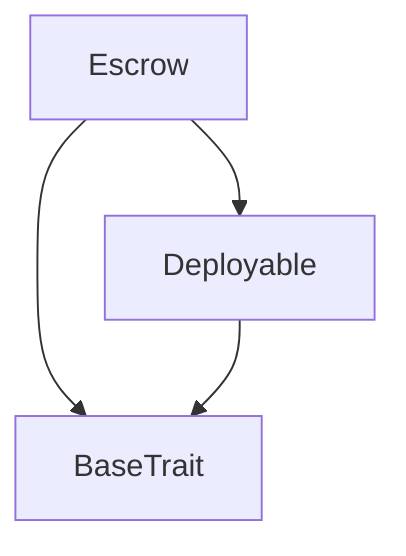

# Tact compilation report
Contract: Escrow
BoC Size: 6487 bytes

## Structures (Structs and Messages)
Total structures: 31

### DataSize
TL-B: `_ cells:int257 bits:int257 refs:int257 = DataSize`
Signature: `DataSize{cells:int257,bits:int257,refs:int257}`

### SignedBundle
TL-B: `_ signature:fixed_bytes64 signedData:remainder<slice> = SignedBundle`
Signature: `SignedBundle{signature:fixed_bytes64,signedData:remainder<slice>}`

### StateInit
TL-B: `_ code:^cell data:^cell = StateInit`
Signature: `StateInit{code:^cell,data:^cell}`

### Context
TL-B: `_ bounceable:bool sender:address value:int257 raw:^slice = Context`
Signature: `Context{bounceable:bool,sender:address,value:int257,raw:^slice}`

### SendParameters
TL-B: `_ mode:int257 body:Maybe ^cell code:Maybe ^cell data:Maybe ^cell value:int257 to:address bounce:bool = SendParameters`
Signature: `SendParameters{mode:int257,body:Maybe ^cell,code:Maybe ^cell,data:Maybe ^cell,value:int257,to:address,bounce:bool}`

### MessageParameters
TL-B: `_ mode:int257 body:Maybe ^cell value:int257 to:address bounce:bool = MessageParameters`
Signature: `MessageParameters{mode:int257,body:Maybe ^cell,value:int257,to:address,bounce:bool}`

### DeployParameters
TL-B: `_ mode:int257 body:Maybe ^cell value:int257 bounce:bool init:StateInit{code:^cell,data:^cell} = DeployParameters`
Signature: `DeployParameters{mode:int257,body:Maybe ^cell,value:int257,bounce:bool,init:StateInit{code:^cell,data:^cell}}`

### StdAddress
TL-B: `_ workchain:int8 address:uint256 = StdAddress`
Signature: `StdAddress{workchain:int8,address:uint256}`

### VarAddress
TL-B: `_ workchain:int32 address:^slice = VarAddress`
Signature: `VarAddress{workchain:int32,address:^slice}`

### BasechainAddress
TL-B: `_ hash:Maybe int257 = BasechainAddress`
Signature: `BasechainAddress{hash:Maybe int257}`

### Deploy
TL-B: `deploy#946a98b6 queryId:uint64 = Deploy`
Signature: `Deploy{queryId:uint64}`

### DeployOk
TL-B: `deploy_ok#aff90f57 queryId:uint64 = DeployOk`
Signature: `DeployOk{queryId:uint64}`

### FactoryDeploy
TL-B: `factory_deploy#6d0ff13b queryId:uint64 cashback:address = FactoryDeploy`
Signature: `FactoryDeploy{queryId:uint64,cashback:address}`

### ChangeOwner
TL-B: `change_owner#819dbe99 queryId:uint64 newOwner:address = ChangeOwner`
Signature: `ChangeOwner{queryId:uint64,newOwner:address}`

### ChangeOwnerOk
TL-B: `change_owner_ok#327b2b4a queryId:uint64 newOwner:address = ChangeOwnerOk`
Signature: `ChangeOwnerOk{queryId:uint64,newOwner:address}`

### Deposit
TL-B: `deposit#f8aa2f92 queryId:uint64 = Deposit`
Signature: `Deposit{queryId:uint64}`

### Release
TL-B: `release#1856d189 queryId:uint64 = Release`
Signature: `Release{queryId:uint64}`

### Refund
TL-B: `refund#83fb1615 queryId:uint64 = Refund`
Signature: `Refund{queryId:uint64}`

### DeliveryConfirmed
TL-B: `delivery_confirmed#d2d77e02 x402TxHash:^string = DeliveryConfirmed`
Signature: `DeliveryConfirmed{x402TxHash:^string}`

### AutoRelease
TL-B: `auto_release#464d5ef3  = AutoRelease`
Signature: `AutoRelease{}`

### OpenDispute
TL-B: `open_dispute#9ec0cde6  = OpenDispute`
Signature: `OpenDispute{}`

### JoinDispute
TL-B: `join_dispute#c28a4884  = JoinDispute`
Signature: `JoinDispute{}`

### VoteRelease
TL-B: `vote_release#02aade5b  = VoteRelease`
Signature: `VoteRelease{}`

### VoteRefund
TL-B: `vote_refund#4cbc6df3  = VoteRefund`
Signature: `VoteRefund{}`

### ClaimReward
TL-B: `claim_reward#80432205  = ClaimReward`
Signature: `ClaimReward{}`

### FallbackSettle
TL-B: `fallback_settle#dcaf1044  = FallbackSettle`
Signature: `FallbackSettle{}`

### SellerStake
TL-B: `seller_stake#f19f83ef  = SellerStake`
Signature: `SellerStake{}`

### NotifyDisputeOpened
TL-B: `notify_dispute_opened#2f7e5059 escrowAddress:address depositor:address beneficiary:address amount:coins votingDeadline:uint32 = NotifyDisputeOpened`
Signature: `NotifyDisputeOpened{escrowAddress:address,depositor:address,beneficiary:address,amount:coins,votingDeadline:uint32}`

### NotifyDisputeSettled
TL-B: `notify_dispute_settled#bfa05986 escrowAddress:address released:bool refunded:bool = NotifyDisputeSettled`
Signature: `NotifyDisputeSettled{escrowAddress:address,released:bool,refunded:bool}`

### EscrowData
TL-B: `_ depositor:address beneficiary:address reputationContract:address amount:coins deadline:uint32 released:bool refunded:bool deliveryConfirmed:bool disputed:bool votingDeadline:uint32 arbiterCount:uint16 votesRelease:uint16 votesRefund:uint16 minArbiters:uint8 minStake:coins sellerStake:coins sellerStaked:bool requireSellerStake:bool baseSellerStake:coins requireRepCollateral:bool minRepScore:uint8 autoReleaseAvailable:bool refundAvailable:bool x402ProofHash:^string = EscrowData`
Signature: `EscrowData{depositor:address,beneficiary:address,reputationContract:address,amount:coins,deadline:uint32,released:bool,refunded:bool,deliveryConfirmed:bool,disputed:bool,votingDeadline:uint32,arbiterCount:uint16,votesRelease:uint16,votesRefund:uint16,minArbiters:uint8,minStake:coins,sellerStake:coins,sellerStaked:bool,requireSellerStake:bool,baseSellerStake:coins,requireRepCollateral:bool,minRepScore:uint8,autoReleaseAvailable:bool,refundAvailable:bool,x402ProofHash:^string}`

### Escrow$Data
TL-B: `_ depositor:address beneficiary:address reputationContract:address amount:coins deadline:uint32 released:bool refunded:bool deliveryConfirmed:bool disputed:bool votingDeadline:uint32 minArbiters:uint8 minStake:coins arbiters:dict<int, address> arbiterIndex:dict<address, int> stakes:dict<int, int> voted:dict<int, bool> votes:dict<int, bool> arbiterCount:uint16 votesRelease:uint16 votesRefund:uint16 sellerStake:coins sellerStaked:bool requireSellerStake:bool baseSellerStake:coins requireRepCollateral:bool minRepScore:uint8 totalArbiterStakes:coins storageFund:coins settlementWinnerCount:uint16 settlementLoserTotal:coins x402ProofHash:^string = Escrow`
Signature: `Escrow{depositor:address,beneficiary:address,reputationContract:address,amount:coins,deadline:uint32,released:bool,refunded:bool,deliveryConfirmed:bool,disputed:bool,votingDeadline:uint32,minArbiters:uint8,minStake:coins,arbiters:dict<int, address>,arbiterIndex:dict<address, int>,stakes:dict<int, int>,voted:dict<int, bool>,votes:dict<int, bool>,arbiterCount:uint16,votesRelease:uint16,votesRefund:uint16,sellerStake:coins,sellerStaked:bool,requireSellerStake:bool,baseSellerStake:coins,requireRepCollateral:bool,minRepScore:uint8,totalArbiterStakes:coins,storageFund:coins,settlementWinnerCount:uint16,settlementLoserTotal:coins,x402ProofHash:^string}`

## Get methods
Total get methods: 2

## escrowData
No arguments

## balance
No arguments

## Exit codes
* 2: Stack underflow
* 3: Stack overflow
* 4: Integer overflow
* 5: Integer out of expected range
* 6: Invalid opcode
* 7: Type check error
* 8: Cell overflow
* 9: Cell underflow
* 10: Dictionary error
* 11: 'Unknown' error
* 12: Fatal error
* 13: Out of gas error
* 14: Virtualization error
* 32: Action list is invalid
* 33: Action list is too long
* 34: Action is invalid or not supported
* 35: Invalid source address in outbound message
* 36: Invalid destination address in outbound message
* 37: Not enough Toncoin
* 38: Not enough extra currencies
* 39: Outbound message does not fit into a cell after rewriting
* 40: Cannot process a message
* 41: Library reference is null
* 42: Library change action error
* 43: Exceeded maximum number of cells in the library or the maximum depth of the Merkle tree
* 50: Account state size exceeded limits
* 128: Null reference exception
* 129: Invalid serialization prefix
* 130: Invalid incoming message
* 131: Constraints error
* 132: Access denied
* 133: Contract stopped
* 134: Invalid argument
* 135: Code of a contract was not found
* 136: Invalid standard address
* 138: Not a basechain address
* 1185: Disputed — waiting for arbiter vote
* 1933: Seller stake not required
* 3977: Max arbiters reached
* 5721: Already settled
* 9603: Not registered
* 9959: Stake too low
* 10757: Delivery confirmed — open a dispute to contest
* 15501: Voting period ended
* 15591: Depositor cannot be arbiter
* 18953: Not an arbiter
* 21498: Not enough arbiters yet
* 22362: No active dispute
* 23632: Only beneficiary (seller) can stake
* 25639: Disputed — use voting
* 25931: Already joined
* 26711: Not settled yet
* 29680: Only depositor can deposit
* 29889: Did not vote
* 37120: Beneficiary cannot be arbiter
* 38875: Only depositor can confirm delivery
* 40307: Already claimed or no stake
* 41415: No funds
* 44631: Already disputed
* 44917: Only depositor can release
* 48201: Deadline not reached
* 50968: Must send TON as stake
* 52264: Delivery not confirmed by buyer
* 55595: Voting period not ended
* 57996: Only depositor or beneficiary
* 59369: Already voted
* 59472: Already staked
* 62001: Seller must stake first
* 63309: Only depositor can refund before deadline

## Trait inheritance diagram

## Contract dependency diagram

