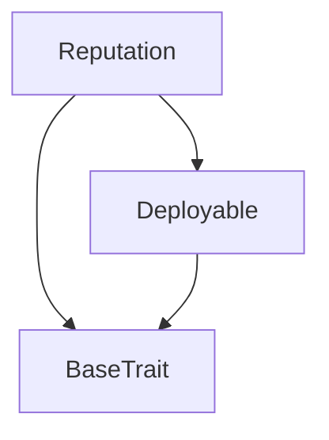

# Tact compilation report
Contract: Reputation
BoC Size: 14528 bytes

## Structures (Structs and Messages)
Total structures: 33

### DataSize
TL-B: `_ cells:int257 bits:int257 refs:int257 = DataSize`
Signature: `DataSize{cells:int257,bits:int257,refs:int257}`

### SignedBundle
TL-B: `_ signature:fixed_bytes64 signedData:remainder<slice> = SignedBundle`
Signature: `SignedBundle{signature:fixed_bytes64,signedData:remainder<slice>}`

### StateInit
TL-B: `_ code:^cell data:^cell = StateInit`
Signature: `StateInit{code:^cell,data:^cell}`

### Context
TL-B: `_ bounceable:bool sender:address value:int257 raw:^slice = Context`
Signature: `Context{bounceable:bool,sender:address,value:int257,raw:^slice}`

### SendParameters
TL-B: `_ mode:int257 body:Maybe ^cell code:Maybe ^cell data:Maybe ^cell value:int257 to:address bounce:bool = SendParameters`
Signature: `SendParameters{mode:int257,body:Maybe ^cell,code:Maybe ^cell,data:Maybe ^cell,value:int257,to:address,bounce:bool}`

### MessageParameters
TL-B: `_ mode:int257 body:Maybe ^cell value:int257 to:address bounce:bool = MessageParameters`
Signature: `MessageParameters{mode:int257,body:Maybe ^cell,value:int257,to:address,bounce:bool}`

### DeployParameters
TL-B: `_ mode:int257 body:Maybe ^cell value:int257 bounce:bool init:StateInit{code:^cell,data:^cell} = DeployParameters`
Signature: `DeployParameters{mode:int257,body:Maybe ^cell,value:int257,bounce:bool,init:StateInit{code:^cell,data:^cell}}`

### StdAddress
TL-B: `_ workchain:int8 address:uint256 = StdAddress`
Signature: `StdAddress{workchain:int8,address:uint256}`

### VarAddress
TL-B: `_ workchain:int32 address:^slice = VarAddress`
Signature: `VarAddress{workchain:int32,address:^slice}`

### BasechainAddress
TL-B: `_ hash:Maybe int257 = BasechainAddress`
Signature: `BasechainAddress{hash:Maybe int257}`

### Deploy
TL-B: `deploy#946a98b6 queryId:uint64 = Deploy`
Signature: `Deploy{queryId:uint64}`

### DeployOk
TL-B: `deploy_ok#aff90f57 queryId:uint64 = DeployOk`
Signature: `DeployOk{queryId:uint64}`

### FactoryDeploy
TL-B: `factory_deploy#6d0ff13b queryId:uint64 cashback:address = FactoryDeploy`
Signature: `FactoryDeploy{queryId:uint64,cashback:address}`

### Register
TL-B: `register#38a0a307 name:^string capabilities:^string available:bool = Register`
Signature: `Register{name:^string,capabilities:^string,available:bool}`

### Rate
TL-B: `rate#a7262e8e agentName:^string success:bool = Rate`
Signature: `Rate{agentName:^string,success:bool}`

### UpdateAvailability
TL-B: `update_availability#54e26a4b name:^string available:bool = UpdateAvailability`
Signature: `UpdateAvailability{name:^string,available:bool}`

### Withdraw
TL-B: `withdraw#2365d020  = Withdraw`
Signature: `Withdraw{}`

### IndexCapability
TL-B: `index_capability#148534b8 agentIndex:uint32 capabilityHash:uint256 = IndexCapability`
Signature: `IndexCapability{agentIndex:uint32,capabilityHash:uint256}`

### TriggerCleanup
TL-B: `trigger_cleanup#8711bf6f maxClean:uint8 = TriggerCleanup`
Signature: `TriggerCleanup{maxClean:uint8}`

### NotifyDisputeOpened
TL-B: `notify_dispute_opened#2f7e5059 escrowAddress:address depositor:address beneficiary:address amount:coins votingDeadline:uint32 = NotifyDisputeOpened`
Signature: `NotifyDisputeOpened{escrowAddress:address,depositor:address,beneficiary:address,amount:coins,votingDeadline:uint32}`

### NotifyDisputeSettled
TL-B: `notify_dispute_settled#bfa05986 escrowAddress:address released:bool refunded:bool = NotifyDisputeSettled`
Signature: `NotifyDisputeSettled{escrowAddress:address,released:bool,refunded:bool}`

### BroadcastIntent
TL-B: `broadcast_intent#966dc6ed serviceHash:uint256 budget:coins deadline:uint32 = BroadcastIntent`
Signature: `BroadcastIntent{serviceHash:uint256,budget:coins,deadline:uint32}`

### SendOffer
TL-B: `send_offer#6d5af6a7 intentIndex:uint32 price:coins deliveryTime:uint32 = SendOffer`
Signature: `SendOffer{intentIndex:uint32,price:coins,deliveryTime:uint32}`

### AcceptOffer
TL-B: `accept_offer#3785158d offerIndex:uint32 = AcceptOffer`
Signature: `AcceptOffer{offerIndex:uint32}`

### CancelIntent
TL-B: `cancel_intent#3b9b249e intentIndex:uint32 = CancelIntent`
Signature: `CancelIntent{intentIndex:uint32}`

### SettleDeal
TL-B: `settle_deal#1ce33d8e intentIndex:uint32 rating:uint8 = SettleDeal`
Signature: `SettleDeal{intentIndex:uint32,rating:uint8}`

### AgentData
TL-B: `_ owner:address available:bool totalTasks:uint32 successes:uint32 registeredAt:uint32 = AgentData`
Signature: `AgentData{owner:address,available:bool,totalTasks:uint32,successes:uint32,registeredAt:uint32}`

### DisputeInfo
TL-B: `_ escrowAddress:address depositor:address beneficiary:address amount:coins votingDeadline:uint32 settled:bool = DisputeInfo`
Signature: `DisputeInfo{escrowAddress:address,depositor:address,beneficiary:address,amount:coins,votingDeadline:uint32,settled:bool}`

### AgentCleanupInfo
TL-B: `_ index:uint32 exists:bool score:uint16 totalRatings:uint32 registeredAt:uint32 lastActive:uint32 daysSinceActive:uint32 daysSinceRegistered:uint32 eligibleForCleanup:bool cleanupReason:uint8 = AgentCleanupInfo`
Signature: `AgentCleanupInfo{index:uint32,exists:bool,score:uint16,totalRatings:uint32,registeredAt:uint32,lastActive:uint32,daysSinceActive:uint32,daysSinceRegistered:uint32,eligibleForCleanup:bool,cleanupReason:uint8}`

### IntentData
TL-B: `_ buyer:address serviceHash:uint256 budget:coins deadline:uint32 status:uint8 acceptedOffer:uint32 isExpired:bool = IntentData`
Signature: `IntentData{buyer:address,serviceHash:uint256,budget:coins,deadline:uint32,status:uint8,acceptedOffer:uint32,isExpired:bool}`

### OfferData
TL-B: `_ seller:address intentIndex:uint32 price:coins deliveryTime:uint32 status:uint8 = OfferData`
Signature: `OfferData{seller:address,intentIndex:uint32,price:coins,deliveryTime:uint32,status:uint8}`

### StorageInfo
TL-B: `_ storageFund:coins totalCells:uint32 annualCost:coins yearsCovered:uint32 = StorageInfo`
Signature: `StorageInfo{storageFund:coins,totalCells:uint32,annualCost:coins,yearsCovered:uint32}`

### Reputation$Data
TL-B: `_ owner:address fee:coins agentCount:uint32 agentOwners:dict<uint32, address> agentAvailable:dict<uint32, bool> agentTotalTasks:dict<uint32, uint32> agentSuccesses:dict<uint32, uint32> agentRegisteredAt:dict<uint32, uint32> agentLastActive:dict<uint32, uint32> nameToIndex:dict<uint256, uint32> capabilityIndex:dict<uint256, ^cell> openDisputes:dict<uint32, address> disputeDepositors:dict<uint32, address> disputeBeneficiaries:dict<uint32, address> disputeAmounts:dict<uint32, int> disputeDeadlines:dict<uint32, uint32> disputeSettled:dict<uint32, bool> disputeCount:uint32 cleanupCursor:uint32 intents:dict<uint32, address> intentServiceHashes:dict<uint32, uint256> intentBudgets:dict<uint32, int> intentDeadlines:dict<uint32, uint32> intentStatuses:dict<uint32, uint8> intentAcceptedOffer:dict<uint32, uint32> intentCount:uint32 intentsByService:dict<uint256, ^cell> offers:dict<uint32, address> offerIntents:dict<uint32, uint32> offerPrices:dict<uint32, int> offerDeliveryTimes:dict<uint32, uint32> offerStatuses:dict<uint32, uint8> offerCount:uint32 intentCleanupCursor:uint32 agentActiveIntents:dict<address, int> maxIntentsPerAgent:uint8 storageFund:coins accumulatedFees:coins = Reputation`
Signature: `Reputation{owner:address,fee:coins,agentCount:uint32,agentOwners:dict<uint32, address>,agentAvailable:dict<uint32, bool>,agentTotalTasks:dict<uint32, uint32>,agentSuccesses:dict<uint32, uint32>,agentRegisteredAt:dict<uint32, uint32>,agentLastActive:dict<uint32, uint32>,nameToIndex:dict<uint256, uint32>,capabilityIndex:dict<uint256, ^cell>,openDisputes:dict<uint32, address>,disputeDepositors:dict<uint32, address>,disputeBeneficiaries:dict<uint32, address>,disputeAmounts:dict<uint32, int>,disputeDeadlines:dict<uint32, uint32>,disputeSettled:dict<uint32, bool>,disputeCount:uint32,cleanupCursor:uint32,intents:dict<uint32, address>,intentServiceHashes:dict<uint32, uint256>,intentBudgets:dict<uint32, int>,intentDeadlines:dict<uint32, uint32>,intentStatuses:dict<uint32, uint8>,intentAcceptedOffer:dict<uint32, uint32>,intentCount:uint32,intentsByService:dict<uint256, ^cell>,offers:dict<uint32, address>,offerIntents:dict<uint32, uint32>,offerPrices:dict<uint32, int>,offerDeliveryTimes:dict<uint32, uint32>,offerStatuses:dict<uint32, uint8>,offerCount:uint32,intentCleanupCursor:uint32,agentActiveIntents:dict<address, int>,maxIntentsPerAgent:uint8,storageFund:coins,accumulatedFees:coins}`

## Get methods
Total get methods: 18

## agentData
Argument: index

## agentIndexByNameHash
Argument: nameHash

## agentReputation
Argument: index

## agentCount
No arguments

## contractBalance
No arguments

## agentsByCapability
Argument: capHash

## disputeCount
No arguments

## disputeData
Argument: index

## agentCleanupInfo
Argument: index

## intentsByServiceHash
Argument: serviceHash

## intentCount
No arguments

## offerCount
No arguments

## agentIntentQuota
Argument: agent

## intentData
Argument: index

## offerData
Argument: index

## storageInfo
No arguments

## storageFundBalance
No arguments

## accumulatedFeesBalance
No arguments

## Exit codes
* 2: Stack underflow
* 3: Stack overflow
* 4: Integer overflow
* 5: Integer out of expected range
* 6: Invalid opcode
* 7: Type check error
* 8: Cell overflow
* 9: Cell underflow
* 10: Dictionary error
* 11: 'Unknown' error
* 12: Fatal error
* 13: Out of gas error
* 14: Virtualization error
* 32: Action list is invalid
* 33: Action list is too long
* 34: Action is invalid or not supported
* 35: Invalid source address in outbound message
* 36: Invalid destination address in outbound message
* 37: Not enough Toncoin
* 38: Not enough extra currencies
* 39: Outbound message does not fit into a cell after rewriting
* 40: Cannot process a message
* 41: Library reference is null
* 42: Library change action error
* 43: Exceeded maximum number of cells in the library or the maximum depth of the Merkle tree
* 50: Account state size exceeded limits
* 128: Null reference exception
* 129: Invalid serialization prefix
* 130: Invalid incoming message
* 131: Constraints error
* 132: Access denied
* 133: Contract stopped
* 134: Invalid argument
* 135: Code of a contract was not found
* 136: Invalid standard address
* 138: Not a basechain address
* 4391: Deadline must be in the future
* 7126: Not the agent owner
* 7480: Max intents reached. Cancel or wait for expiration.
* 13316: Intent not found
* 22320: Not the intent owner
* 22978: Budget must be positive
* 24749: Insufficient fee. Send at least 0.01 TON.
* 26624: Intent not open
* 26825: Only owner can withdraw
* 27854: Agent not found
* 31510: Only the agent owner can update
* 34810: Cannot offer on own intent
* 35699: Price exceeds budget
* 38820: Only the agent owner can update availability
* 39791: Intent not in accepted state
* 40254: Offer has no intent
* 40636: Nothing to withdraw
* 45503: Offer not pending
* 48272: Intent expired
* 50979: Offer not found
* 52517: Can only cancel open intents

## Trait inheritance diagram

## Contract dependency diagram

