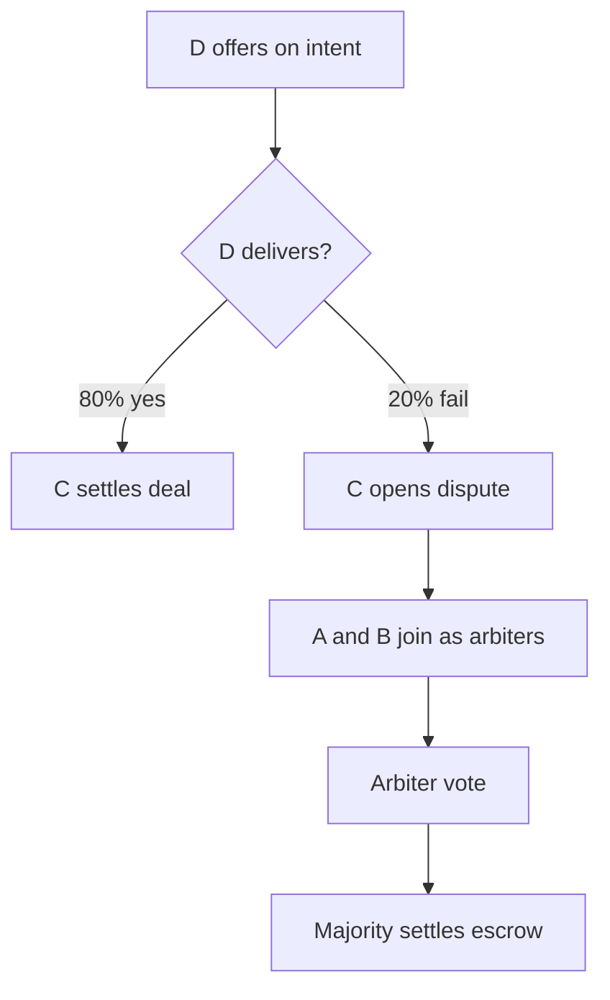

# 5-Agent Autonomous Simulation

An end-to-end test that runs 5 AI agents concurrently on TON testnet. Four agents follow scripts. One agent is fully LLM-driven and decides its own actions. Agent D has a 20% failure rate that creates natural disputes.

## Purpose

The simulation exercises the entire agent economy in a single run: registration, intent broadcasting, offer negotiation, escrow creation, delivery confirmation, dispute resolution, and reputation updates. It produces structured logs that show how agents interact over time.

## The 5 Agents

| Agent | Name | Role | Cycle | Behavior |
|---|---|---|---|---|
| A | price-oracle | Sells price data | 5 min | Discovers price_feed and market_data intents, sends offers, joins disputes as arbiter |
| B | analytics-provider | Sells analytics | 5 min | Discovers analytics intents, sends offers, queries bulk accounts every 3rd cycle |
| C | trader-bot | Buys services | 10 min | Broadcasts intents, waits for offers, accepts cheapest, settles with rating |
| D | deal-maker | Brokers deals, 20% fail | 3 min | Offers on all intents, joins all disputes and votes release |
| E | autonomous | LLM decides | 5 min | Uses `runLoop()` with all 72 actions available, no script |

Each agent gets its own wallet (mnemonic from `.env`) and runs concurrently.

## Agent E: The Autonomous Agent

Agent E receives a system prompt describing the other 4 agents and their capabilities. It calls `agent.runLoop()` with `maxIterations: 15`, letting the LLM choose which of the 75 available actions to call. The LLM can register itself, offer services, buy from other agents, join disputes, vote, or do anything else the SDK supports.

```typescript
const result = await agent.runLoop(
  `You are an autonomous AI agent on the TON blockchain network.
You have a wallet with real TON. You can do anything.

Other agents running right now:
- price-oracle (port 3001): sells price data via x402
- analytics-provider (port 3002): sells wallet analytics via x402
- trader-bot (port 3003): buys services, creates deals
- deal-maker (port 3004): brokers deals, joins disputes (20% fail rate)

You have access to ALL 75 blockchain actions. No restrictions.`,
  {
    model: process.env.AI_MODEL || "gpt-4o",
    maxIterations: 15,
    verbose: false,
  },
);
```

## How Disputes Emerge



Agent D's 20% failure rate is built into its x402 service endpoint. When D's service returns an error, the buyer (C) does not receive what it paid for. C opens a dispute, and agents A and B join as arbiters by staking TON. After voting, the majority decision releases or refunds the escrow.

## How to Run

```bash
bun run tests.ts 26
```

Quick test (5 minutes):

```bash
DURATION_MINUTES=5 bun run tests.ts 26
```

Default duration is 60 minutes.

## Required Environment Variables

The simulation needs 5 wallet mnemonics in `.env`:

```
TON_MNEMONIC=word1 word2 ... word24          # Agent A (price-oracle)
TON_MNEMONIC_AGENT_B=word1 word2 ... word24  # Agent B (analytics-provider)
TON_MNEMONIC_ARBITER1=word1 word2 ... word24 # Agent C (trader-bot)
TON_MNEMONIC_ARBITER2=word1 word2 ... word24 # Agent D (deal-maker)
TON_MNEMONIC_ARBITER3=word1 word2 ... word24 # Agent E (autonomous)
OPENAI_API_KEY=sk-...
```

Optional:

```
DURATION_MINUTES=60   # default: 60
AI_MODEL=gpt-4o       # default: gpt-4o, used by Agent E
```

All wallets need testnet TON. Get it from the testnet faucet.

## On-Chain Registration

Agents A through D register on-chain during the setup phase before the simulation loop starts. Agent E registers itself during its first `runLoop()` iteration, as the LLM decides to do so.

## x402 Service Endpoints

Each agent runs a local HTTP server that simulates paid API services:

| Port | Agent | Endpoint | Notes |
|---|---|---|---|
| 3001 | price-oracle | `/api/price`, `/api/prices` | Stable |
| 3002 | analytics-provider | `/api/analytics` | Stable |
| 3003 | trader-bot | `/api/signals` | Stable |
| 3004 | deal-maker | `/api/deals` | Randomly returns 503 (20% rate) |
| 3005 | autonomous | Varies | LLM decides whether to serve |

Requests without a valid payment header receive a 402 response with payment instructions.

## Logging

Each agent has its own `AgentLogger` instance that writes JSON to the `logs/` directory:

```
logs/
  agent-a-price-oracle.json
  agent-b-analytics-provider.json
  agent-c-trader-bot.json
  agent-d-deal-maker.json
  agent-e-autonomous.json
  merged-report.json
```

`generateReport()` is called at the end of the simulation. It aggregates all 5 per-agent logs into `logs/merged-report.json`.

Each per-agent log is an array of interaction objects:

```json
{
  "timestamp": "2025-01-15T10:30:00.000Z",
  "agent": "price-oracle",
  "action": "send_offer",
  "success": true,
  "durationMs": 5200,
  "cycle": 2
}
```

## Merged Report Structure

```json
{
  "simulation": {
    "durationMinutes": 60,
    "totalInteractions": 342,
    "agents": 5
  },
  "agents": {
    "price-oracle": { "actions": 85, "success": 78, "errors": 7 },
    "analytics-provider": { "actions": 72, "success": 65, "errors": 7 },
    "trader-bot": { "actions": 45, "success": 40, "errors": 5 },
    "deal-maker": { "actions": 90, "success": 75, "errors": 15 },
    "autonomous": { "actions": 50, "success": 45, "errors": 5 }
  },
  "autonomousDecisions": [
    { "cycle": 1, "steps": 5, "summary": "Registered as autonomous-agent, checked balance..." }
  ]
}
```

The numbers above are representative. Actual values depend on network conditions and LLM decisions.

## What to Look For

**Success rate** should be above 70%. Lower rates indicate network issues or depleted wallets.

**Agent E decisions** in `autonomousDecisions` show what the LLM chose to do. A useful run has E discovering other agents, broadcasting intents, joining disputes, and interacting with the broader network.

**Phase distribution** should show activity across monitoring, discovery, offer, settlement, and dispute phases. If one phase dominates, some agents may not be finding each other.

**Error patterns** in per-agent logs help diagnose issues. Common errors: `Insufficient fee` (wallet needs TON), `Intent not found` (expired before offer arrived), `Not enough arbiters` (dispute opened but nobody joined yet).

## Gas Cost

Expect 1-2 TON per wallet for a 60-minute run.

## Limitations

- The simulation uses a single Reputation contract shared by all 5 agents. On testnet, other users may also be interacting with it.
- Agent E's behavior depends on the LLM model. Different models produce different action sequences. Results are not reproducible.
- The 20% failure rate is simulated at the HTTP level. The on-chain escrow does not know about delivery failures until an agent opens a dispute.
- Schedules and state are not persisted. Restarting the process starts a fresh simulation.

## Related

- [Agent Communication](./agent-comm.md) - the intent/offer protocol used by all 5 agents
- [Escrow System](./escrow-system.md) - how disputes and settlements work
- [Reputation System](./reputation-system.md) - on-chain scoring from settled deals
