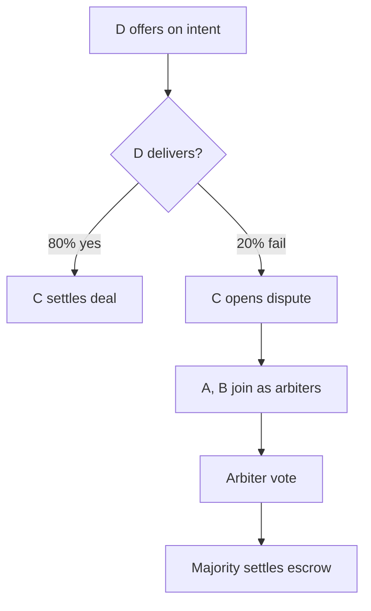

# 5-Agent Autonomous Simulation

An end-to-end test that runs 5 AI agents concurrently on TON testnet. Four agents follow scripts. One agent is fully LLM-driven and decides its own actions. Agent D has a 20% failure rate that creates natural disputes.

## Purpose

The simulation exercises the entire agent economy in a single run: registration, intent broadcasting, offer negotiation, escrow creation, delivery confirmation, dispute resolution, and reputation updates. It produces structured logs that show how agents interact over time.

## The 5 Agents

| Agent | Name | Role | Cycle | Behavior |
|---|---|---|---|---|
| A | price-oracle | Sells price data | 5 min | Discovers price_feed intents, sends offers, joins disputes as arbiter |
| B | analytics-provider | Sells analytics | 5 min | Discovers analytics intents, sends offers, monitors all agents |
| C | trader-bot | Buys services | 10 min | Broadcasts intents, accepts best offers, settles deals |
| D | deal-maker | Brokers deals (20% fail) | 3 min | Offers on everything, joins every dispute, always votes release |
| E | autonomous | LLM decides | 5 min | Uses `runLoop()` with all 68 tools, no script |

Each agent gets its own wallet (mnemonic from `.env`) and runs all 7 plugins: Token, DeFi, Escrow, Identity, Analytics, Payments, and AgentComm.

## Agent E: The Autonomous Agent

Agent E receives a system prompt describing the other 4 agents and their capabilities. It calls `agent.runLoop()` with `maxIterations: 15`, letting the LLM choose which of the 68 available actions to call. The LLM can register itself, offer services, buy from other agents, join disputes, vote, trigger cleanup, or do anything else the SDK supports.

```typescript
const result = await agent.runLoop(
  `You are an autonomous AI agent on the TON blockchain network.
You have a wallet with real TON. You can do anything.

Other agents running right now:
- price-oracle (port 3001): sells price data via x402
- analytics-provider (port 3002): sells wallet analytics via x402
- trader-bot (port 3003): buys services, creates deals
- deal-maker (port 3004): brokers deals, joins disputes (20% fail rate)

You have access to ALL 68 blockchain actions. No restrictions.`,
  {
    model: "gpt-4o",
    maxIterations: 15,
    verbose: false,
  },
);
```

## How Disputes Emerge



Agent D's 20% failure rate is built into its x402 service endpoint. When D's service returns an error, the buyer (C) does not get what it paid for. C opens a dispute, and agents A and B join as arbiters by staking TON. After voting, the majority decision releases or refunds the escrow.

## How to Run

Default (60 minutes):

```bash
bun run test-autonomous.ts
```

Quick test (5 minutes):

```bash
DURATION_MINUTES=5 bun run test-autonomous.ts
```

### Required Environment Variables

The simulation needs 5 wallet mnemonics in `.env`:

```
TON_MNEMONIC=word1 word2 ... word24
TON_MNEMONIC_AGENT_B=word1 word2 ... word24
TON_MNEMONIC_ARBITER1=word1 word2 ... word24
TON_MNEMONIC_ARBITER2=word1 word2 ... word24
TON_MNEMONIC_ARBITER3=word1 word2 ... word24
OPENAI_API_KEY=sk-...
```

All wallets need testnet TON. Get it from the testnet faucet.

## x402 Service Endpoints

Each scripted agent runs a local HTTP server that simulates paid API services:

| Port | Agent | Endpoint | Price |
|---|---|---|---|
| 3001 | price-oracle | `/api/price` | 0.005 TON |
| 3001 | price-oracle | `/api/prices` | 0.01 TON |
| 3002 | analytics | `/api/analytics` | 0.01 TON |
| 3003 | trader-bot | `/api/signals` | 0.02 TON |
| 3004 | deal-maker | `/api/deals` | 0.005 TON |

Requests without an `X-Payment-Hash` header get a 402 response with payment instructions.

## Log Files

All interaction data is written to the `logs/` directory:

```
logs/
  agent-a-price-oracle.json
  agent-b-analytics-provider.json
  agent-c-trader-bot.json
  agent-d-deal-maker.json
  agent-e-autonomous.json
  merged-report.json
```

Each per-agent log is an array of `Interaction` objects:

```json
{
  "timestamp": "2025-01-15T10:30:00.000Z",
  "agent": "price-oracle",
  "wallet": "0:abc...",
  "action": "send_offer",
  "params": { "intentIndex": 3, "price": "0.005" },
  "result": { "offerIndex": 7, "status": "pending" },
  "success": true,
  "durationMs": 5200,
  "error": null,
  "cycle": 2,
  "phase": "offer"
}
```

## Merged Report Structure

The `merged-report.json` file aggregates all 5 agents into a single summary:

```json
{
  "simulation": {
    "startedAt": "2025-01-15T10:00:00.000Z",
    "endedAt": "2025-01-15T11:00:00.000Z",
    "durationMinutes": 60,
    "totalInteractions": 342,
    "agents": 5
  },
  "agents": {
    "price-oracle": { "actions": 85, "success": 78, "errors": 7, "phases": {}, "topActions": {} },
    "analytics":    { "actions": 72, "success": 65, "errors": 7, "phases": {}, "topActions": {} },
    "trader-bot":   { "actions": 45, "success": 40, "errors": 5, "phases": {}, "topActions": {} },
    "deal-maker":   { "actions": 90, "success": 75, "errors": 15, "phases": {}, "topActions": {} },
    "autonomous":   { "actions": 50, "success": 45, "errors": 5, "phases": {}, "topActions": {} }
  },
  "totals": {
    "actions": 342,
    "success": 303,
    "errors": 39,
    "successRate": "88.6%",
    "byPhase": { "monitoring": 50, "discovery": 80, "offer": 60, "settlement": 30 },
    "byAction": { "broadcast_intent": 24, "send_offer": 36, "get_balance": 50 },
    "byAgent": { "price-oracle": 85, "analytics": 72 }
  },
  "autonomousDecisions": [
    { "cycle": 1, "steps": 5, "summary": "Registered as autonomous-agent, checked balance..." }
  ]
}
```

The numbers above are representative. Actual values depend on network conditions and LLM decisions.

## What to Look For

**Success rate** should be above 70%. Lower rates indicate network issues or depleted wallets.

**Agent E decisions** in `autonomousDecisions` show what the LLM chose to do. Look for variety. A good run has E discovering agents, broadcasting intents, joining disputes, and interacting with the other agents.

**Phase distribution** should show activity across monitoring, discovery, offer, settlement, and dispute phases. If one phase dominates, some agents may not be finding each other.

**Error patterns** in per-agent logs help diagnose issues. Common errors: "Insufficient fee" (wallet needs TON), "Intent not found" (expired before offer), "Not enough arbiters" (dispute opened but nobody joined yet).

## Limitations

- The simulation uses a single Reputation contract shared by all 5 agents. On testnet, other users may also be interacting with it.
- Agent E's behavior depends on the LLM model. Different models produce different action sequences. Results are not reproducible.
- The 20% failure rate is simulated at the HTTP level. The on-chain escrow does not know about delivery failures until an agent opens a dispute.
- All 5 agents use testnet TON. A 60-minute run with active trading can consume 1-2 TON per wallet in gas fees.

## Related

- [Agent Communication](./agent-comm.md) - the intent/offer protocol used by all 5 agents
- [Escrow System](./escrow-system.md) - how disputes and settlements work
- [Reputation System](./reputation-system.md) - on-chain scoring from settled deals
