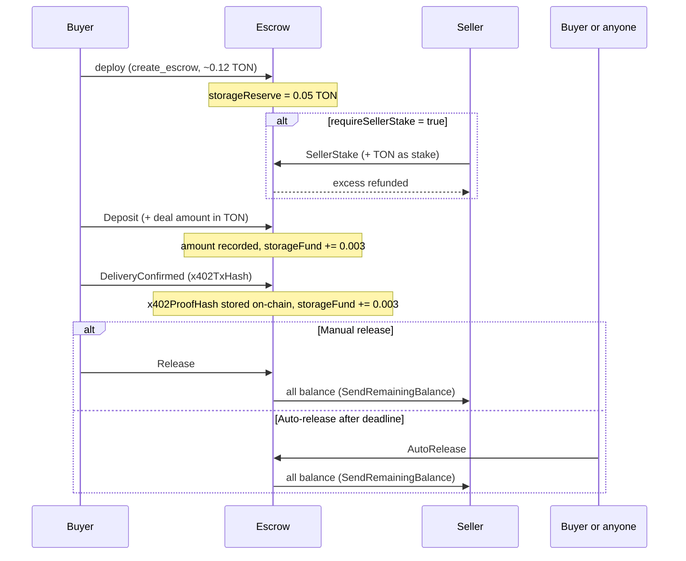
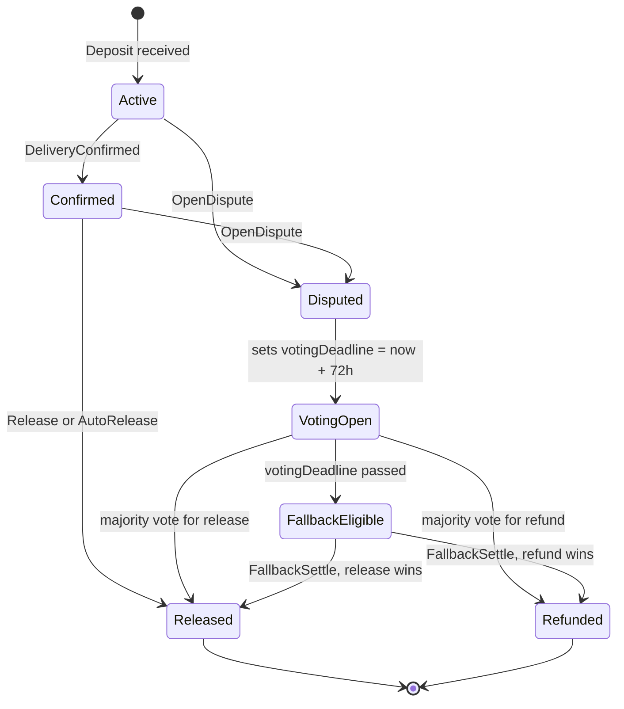

# Escrow System

How the TON Agent Kit escrow contract works: contract architecture, lifecycle, dispute resolution, and SDK actions.

## Overview

Each escrow is a separate Tact contract deployed per deal. There is no shared escrow registry. The deployer (buyer) pays ~0.12 TON to deploy, and the contract address is unique per deal.

The contract supports four layers of protection:

1. Basic buyer/seller escrow with deadline.
2. Arbiter dispute resolution with on-chain voting.
3. Seller stake (collateral from the seller, locked until settlement).
4. Reputation-based collateral scaling (stake amount adjusts with seller rep score).

An x402 payment proof hash is stored on-chain at delivery confirmation, giving a verifiable link between the off-chain payment and on-chain settlement.

## Contract Architecture

### State

The contract has 25 fields exposed through the `EscrowData` struct (returned by `escrowData()`):

| Field | Type | Description |
|---|---|---|
| depositor | Address | Buyer, funds the escrow |
| beneficiary | Address | Seller, receives funds on release |
| reputationContract | Address | Reputation contract for cross-contract notifications |
| amount | coins | Current deposited balance |
| deadline | uint32 | Unix timestamp deadline |
| released | Bool | Funds sent to seller |
| refunded | Bool | Funds returned to buyer |
| deliveryConfirmed | Bool | Buyer confirmed delivery |
| disputed | Bool | Dispute is currently open |
| votingDeadline | uint32 | Voting closes 72 hours after dispute opened |
| arbiterCount | uint16 | Number of joined arbiters |
| votesRelease | uint16 | Votes for release so far |
| votesRefund | uint16 | Votes for refund so far |
| minArbiters | uint8 | Minimum arbiters required before voting starts |
| minStake | coins | Minimum TON per arbiter |
| sellerStake | coins | Current seller stake amount |
| sellerStaked | Bool | Seller has staked |
| requireSellerStake | Bool | Deposit is gated on seller staking first |
| baseSellerStake | coins | Base stake before rep score adjustment |
| requireRepCollateral | Bool | Enable reputation-scaled seller stake |
| minRepScore | uint8 | Minimum rep score to participate (0-100) |
| autoReleaseAvailable | Bool | Computed: deadline passed, delivery confirmed, not settled, not disputed |
| refundAvailable | Bool | Computed: deadline passed, no delivery confirmed, not settled |
| x402ProofHash | String | x402 payment proof hash stored on delivery confirmation |

The contract also holds five state maps not exposed in EscrowData:

| Map | Key | Value | Description |
|---|---|---|---|
| arbiters | Int | Address | Index to arbiter address |
| arbiterIndex | Address | Int | Address to index (O(1) lookup) |
| stakes | Int | Int | Arbiter index to stake amount |
| voted | Int | Bool | Arbiter index to voted flag |
| votes | Int | Bool | Arbiter index to vote direction (true = release) |

### Messages

14 messages total:

| Message | Sender | Fields |
|---|---|---|
| Deposit | buyer | queryId |
| Release | buyer | queryId |
| Refund | buyer or anyone | queryId |
| DeliveryConfirmed | buyer | x402TxHash (String) |
| AutoRelease | anyone | (none) |
| OpenDispute | buyer or seller | (none) |
| JoinDispute | arbiter | (none, TON value = stake) |
| VoteRelease | arbiter | (none) |
| VoteRefund | arbiter | (none) |
| ClaimReward | arbiter | (none) |
| FallbackSettle | anyone | (none) |
| SellerStake | seller | (none, TON value = stake) |
| NotifyDisputeOpened | contract to reputation | escrowAddress, depositor, beneficiary, amount, votingDeadline |
| NotifyDisputeSettled | contract to reputation | escrowAddress, released, refunded |

### Getters

- `escrowData()` returns the full `EscrowData` struct.
- `balance()` returns `myBalance()` as an integer.

### Receive Handlers

12 handlers: `SellerStake`, `Deposit`, `DeliveryConfirmed`, `Release`, `Refund`, `AutoRelease`, `OpenDispute`, `JoinDispute`, `VoteRelease`, `VoteRefund`, `ClaimReward`, `FallbackSettle`.

## Lifecycle Diagram

Happy path without disputes:



## Seller Stake Mechanism

When `requireSellerStake = true`, the seller must call `SellerStake` before the buyer can `Deposit`. The seller sends TON with the message. The contract records `context().value` as `sellerStake`.

The required stake amount is adjusted by the seller's reputation score when `requireRepCollateral = true`:

| Rep Score Range | Stake Multiplier |
|---|---|
| 90-100 | 50% of baseSellerStake |
| 60-89 | 100% of baseSellerStake |
| 30-59 | 150% of baseSellerStake |
| Below minRepScore | Blocked, cannot participate |

The reputation score check is done off-chain by the SDK before sending the stake transaction. The contract does not query the reputation contract directly for the score.

On a release settlement, the seller gets back their stake plus the deal amount. On a refund, the seller's stake is forfeited to the buyer.

## Deposit and Release Flow

**Deposit:**
- Only `depositor` can call.
- If `requireSellerStake = true`, `sellerStaked` must already be true.
- The sent value is added to `self.amount`. The `storageFund` increments by 0.003 TON.

**Release (manual):**
- Only `depositor` can call.
- The contract must not be disputed.
- Sets `released = true`, then sends the entire balance to `beneficiary` with `SendRemainingBalance`.

**Refund:**
- Before deadline: only `depositor` can call.
- After deadline with no delivery confirmed: anyone can trigger.
- After deadline with delivery confirmed: blocked. Must open a dispute instead.
- Sets `refunded = true`, sends entire balance to `depositor` with `SendRemainingBalance`.

## Delivery Confirmation and x402 Proof Hash

The buyer calls `DeliveryConfirmed` with an `x402TxHash` string. The contract stores it on-chain:

```tact
self.deliveryConfirmed = true;
self.x402ProofHash = msg.x402TxHash;
self.storageFund = self.storageFund + ton("0.003");
```

This creates an on-chain record linking the deal to the x402 payment. The hash is readable via `escrowData().x402ProofHash`. Pass an empty string if no x402 payment was made.

After delivery is confirmed, a manual `Release` or `AutoRelease` can proceed. If the buyer wants to contest after confirming, they must open a dispute.

## Auto-Release Mechanism

After the deadline passes and delivery has been confirmed, anyone can call `AutoRelease`. The contract does not trigger this automatically. An external call is required.

Conditions checked in order:
1. `now() >= self.deadline`
2. `self.deliveryConfirmed == true`
3. `!self.released && !self.refunded`
4. `!self.disputed`
5. `self.amount > 0`

The `escrowData()` getter exposes `autoReleaseAvailable` as a computed bool. Read it before calling to avoid a failed transaction.

## Dispute Resolution



Both the buyer and seller can open a dispute. The `OpenDispute` handler sends `NotifyDisputeOpened` to the reputation contract (0.03 TON attached).

Voting deadline is set to `now() + 259200` (72 hours in seconds). This value is hardcoded.

## Arbiter Voting

Anyone except the buyer and seller can join a dispute by sending `JoinDispute` with at least `minStake` TON attached. Their stake is locked in the contract until they call `ClaimReward`.

**Joining conditions:**
- Dispute must be active.
- Must be before `votingDeadline`.
- Maximum 100 arbiters total.
- Cannot join twice.
- Cannot be the depositor or beneficiary.

**Voting conditions:**
- Must have joined (present in `arbiterIndex`).
- Must be before `votingDeadline` (FIX 13: `require(now() <= self.votingDeadline)`).
- Cannot vote twice.
- `arbiterCount >= minArbiters` must be true before the first vote is accepted.

**Majority formula:**

```
majority = floor(arbiterCount / 2) + 1
```

With 3 arbiters, majority = 2. With 5 arbiters, majority = 3.

Once one side reaches majority, settlement executes immediately inside the same handler call. The losing side's funds are sent out, and `nativeReserve` is updated to protect only remaining arbiter stakes.

## Arbiter Rewards

At the moment majority is reached, the contract snapshots two values (FIX 7 and FIX 8):

- `settlementWinnerCount`: number of arbiters who voted for the winning side.
- `settlementLoserTotal`: total stakes held by arbiters who voted for the losing side.

These values are frozen at settlement time. Subsequent `ClaimReward` calls read from the snapshot.

When a winning arbiter calls `ClaimReward`:

```
bonus = settlementLoserTotal / settlementWinnerCount
payout = myStake + bonus
```

Losing arbiters get nothing. Arbiters who did not vote get nothing.

After settlement, `nativeReserve` drops to protect only remaining arbiter stakes plus `storageFund` (FIX 1):

```
nativeReserve (after settlement) = totalArbiterStakes + storageFund + 0.01 TON
```

Before settlement, `nativeReserve` protects the full deal balance:

```
nativeReserve (active deal) = amount + sellerStake + totalArbiterStakes + storageFund + 0.01 TON
```

## Fallback Settlement

If `votingDeadline` passes without a majority verdict, anyone can call `FallbackSettle`.

Conditions for eligibility:
- `self.disputed == true`
- `!self.released && !self.refunded`
- `now() >= self.votingDeadline`

Settlement logic:

| Condition | Outcome |
|---|---|
| `arbiterCount < minArbiters` AND `deliveryConfirmed` | Released to seller |
| `arbiterCount < minArbiters` AND no delivery confirmed | Refunded to buyer |
| `votesRelease == votesRefund` (tie) AND `deliveryConfirmed` | Released to seller |
| `votesRelease == votesRefund` (tie) AND no delivery confirmed | Refunded to buyer |
| `votesRelease > votesRefund` | Released to seller |
| `votesRefund > votesRelease` | Refunded to buyer |

`FallbackSettle` calls `notifySettlement()`, which sends `NotifyDisputeSettled` to the reputation contract (0.02 TON).

## Self-Funding Model

The contract accumulates a `storageFund` with each operation. This fund covers long-term on-chain storage without requiring external top-ups.

### storageFund Increments

| Handler | Increment |
|---|---|
| SellerStake | +0.003 TON |
| Deposit | +0.003 TON |
| DeliveryConfirmed | +0.003 TON |
| OpenDispute | +0.005 TON |
| JoinDispute | +0.003 TON |
| VoteRelease (non-settling) | +0.003 TON |
| VoteRefund (non-settling) | +0.003 TON |

Settling votes (when majority is reached in the same call) do not increment the storageFund. The balance has already accumulated enough at that point in a typical deal.

The deploy reserve is 0.05 TON, held via `override const storageReserve: Int = ton("0.05")` from deployment.

### nativeReserve and Refund Pattern

Each handler calls `nativeReserve(pool_total, 0)` then sends with `SendRemainingBalance`. This returns all excess TON to the sender. The user effectively pays ~0.03 TON per operation rather than the full 0.12-0.15 TON attached.

During an active deal:

```
nativeReserve = amount + sellerStake + totalArbiterStakes + storageFund + 0.01 TON
```

After settlement:

```
nativeReserve = totalArbiterStakes + storageFund + 0.01 TON
```

The 0.01 TON is a gas buffer to ensure the contract can always process incoming messages.

## Cross-Contract Communication

Two messages flow outbound from Escrow to Reputation:

| Trigger | Message | TON Attached | bounce |
|---|---|---|---|
| OpenDispute handler | NotifyDisputeOpened | 0.03 TON | true |
| notifySettlement() (VoteRelease, VoteRefund, FallbackSettle on settlement) | NotifyDisputeSettled | 0.02 TON | true |

Both sends use `bounce: true`. If the Reputation contract rejects the message, the TON bounces back to the Escrow contract. The dispute itself is not affected.

The Reputation contract only accepts `NotifyDisputeOpened` and `NotifyDisputeSettled` from addresses whitelisted via `RegisterEscrow`. The `create_escrow` SDK action calls `RegisterEscrow` automatically after deployment.

## SDK Actions

14 actions in `plugin-escrow`:

| Action | Description | Key Parameters |
|---|---|---|
| `create_escrow` | Deploy a new Escrow contract | beneficiary, amount, minArbiters (default 3), minStake (default 0.5), deadline |
| `deposit_to_escrow` | Send deal funds to the contract | escrowId, amount |
| `release_escrow` | Release funds to seller, buyer only | escrowId |
| `refund_escrow` | Return funds to buyer | escrowId |
| `get_escrow_info` | Read escrowData() getter | escrowId |
| `confirm_delivery` | Set deliveryConfirmed, store x402 hash | escrowId, x402TxHash |
| `auto_release_escrow` | Trigger AutoRelease after deadline | escrowId |
| `open_dispute` | Open a dispute, notify reputation contract | escrowId |
| `join_dispute` | Join as arbiter and lock stake | escrowId, stake (TON amount) |
| `vote_release` | Vote to release funds to seller | escrowId |
| `vote_refund` | Vote to refund funds to buyer | escrowId |
| `claim_reward` | Claim stake and bonus after settlement | escrowId |
| `fallback_settle` | Trigger fallback after voting deadline | escrowId |
| `seller_stake_escrow` | Seller sends their required stake | escrowId, stake (TON amount) |

## Gas Costs

| Operation | TON Attached | Effective User Cost | Notes |
|---|---|---|---|
| deploy (create_escrow) | 0.12 (DEFAULT_GAS) | ~0.12 TON | storageReserve keeps 0.05, rest covers deploy |
| SellerStake | stake + 0.12 | ~0.03 TON overhead | Stake is locked, excess refunded |
| Deposit | amount + 0.12 | ~0.03 TON overhead | Deal amount locked, excess refunded |
| DeliveryConfirmed | 0.12 | ~0.03 TON | |
| Release | 0.12 | ~0.03 TON | |
| Refund | 0.12 | ~0.03 TON | |
| AutoRelease | 0.12 | ~0.03 TON | |
| OpenDispute | 0.15 (CROSS_CONTRACT_GAS) | ~0.03 TON | Sends 0.03 TON to reputation contract |
| JoinDispute | stake + 0.12 | ~0.03 TON overhead | Stake locked, excess refunded |
| VoteRelease / VoteRefund | 0.12 | ~0.03 TON | |
| ClaimReward | 0.12 | Net positive for winners | Receives stake + bonus |
| FallbackSettle | 0.15 (CROSS_CONTRACT_GAS) | ~0.03 TON | Sends 0.02 TON to reputation contract |

## Limitations

- **No contract upgrade.** The contract is immutable after deployment. Bugs require deploying a new contract per deal.
- **No oracle.** Delivery confirmation is self-reported by the buyer via `DeliveryConfirmed`. The x402 proof hash is stored but not verified cryptographically by the contract.
- **Reputation score check is off-chain.** Seller stake scaling is enforced by the SDK. A seller calling the contract directly can bypass the score-based gating.
- **Arbiters self-select.** There is no curated arbiter list. A dispute with no participants will not resolve until `FallbackSettle` is called after the 72-hour window.
- **Maximum 100 arbiters.** Hardcoded in `JoinDispute`.
- **Voting deadline is fixed at 72 hours.** Not configurable per deal.
- **No partial release.** All funds are released or refunded in full.
- **FallbackSettle favors the delivery-confirmed side on ties.** If `deliveryConfirmed = true` and votes are tied or arbiters are insufficient, funds release to the seller.
- **Cross-contract notification is best-effort.** If the reputation contract bounces `NotifyDisputeOpened`, the TON returns to escrow but the dispute record is not created in the reputation contract.
- **Deployment cost is fixed.** At ~0.12 TON per deployment, escrow is not economical for deals below ~0.5 TON.
