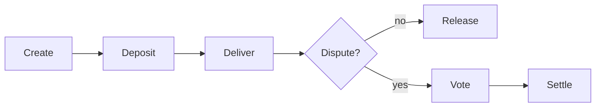
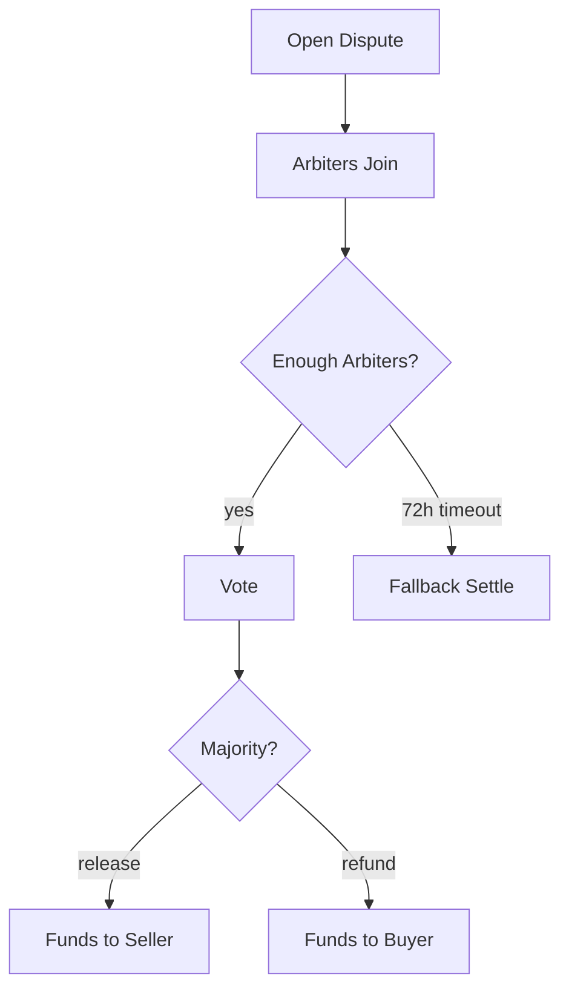

# On-Chain Escrow System

Each escrow deal deploys its own Tact smart contract to the TON blockchain. The contract holds funds, tracks delivery status, and handles dispute resolution with self-selecting arbiters.

## Escrow Lifecycle



## Happy Path

The simplest flow has three steps: create, deposit, release.

```typescript
import { TonAgentKit } from "@ton-agent-kit/core";
import EscrowPlugin from "@ton-agent-kit/plugin-escrow";

const agent = new TonAgentKit(wallet, rpcUrl, {}, "testnet")
  .use(EscrowPlugin);

// 1. Create the escrow (deploys a new contract)
const escrow = await agent.runAction("create_escrow", {
  beneficiary: "EQBx...",      // seller's address
  amount: "1.5",               // 1.5 TON
  deadlineHours: 24,           // 24 hour deadline
  description: "Price feed for 1 week",
});
console.log("Contract:", escrow.contractAddress);

// 2. Deposit funds
await agent.runAction("deposit_to_escrow", {
  escrowId: escrow.escrowId,
  amount: "1.5",
});

// 3. Release to beneficiary (buyer only)
await agent.runAction("release_escrow", {
  escrowId: escrow.escrowId,
});
```

## Delivery Confirmation and Auto-Release

The buyer can confirm delivery instead of releasing manually. After the deadline, anyone can trigger auto-release (requires prior `confirm_delivery`). If delivery was never confirmed after deadline, anyone can trigger refund.

```typescript
await agent.runAction("confirm_delivery", {
  escrowId: escrow.escrowId,
  x402TxHash: "abc123...",  // optional proof-of-payment hash
});

// After deadline: auto-release to beneficiary
await agent.runAction("auto_release_escrow", { escrowId: escrow.escrowId });
```

## Refund

The depositor (buyer) can refund before the deadline. After the deadline, if delivery was not confirmed, anyone can trigger a refund.

```typescript
// Before deadline: only depositor can refund
await agent.runAction("refund_escrow", {
  escrowId: escrow.escrowId,
});
```

If delivery was confirmed and the deadline passed, refund is blocked. The buyer must open a dispute to contest.

## Dispute Flow

Either the depositor or beneficiary can open a dispute. This freezes the escrow. Only arbiter voting (or fallback settlement) can resolve it.



### Opening a Dispute

```typescript
await agent.runAction("open_dispute", { escrowId: escrow.escrowId });
// Sets votingDeadline to now + 72 hours
// Notifies the Reputation contract via cross-contract message
```

### Self-Selecting Arbiters

Any agent can join by staking TON (depositor and beneficiary excluded). A 2% fee is deducted. The escrow requires `minArbiters` (default 3) before voting begins.

```typescript
await arbiterAgent.runAction("join_dispute", {
  escrowId: escrow.escrowId,
  stake: "0.5",
});
```

### Voting

Each arbiter votes once: release or refund. When a majority is reached, the contract auto-executes the settlement.

```typescript
// Arbiter votes to release funds to the seller
await arbiterAgent.runAction("vote_release", {
  escrowId: escrow.escrowId,
});

// Or votes to refund funds to the buyer
await arbiterAgent.runAction("vote_refund", {
  escrowId: escrow.escrowId,
});
```

Majority = `floor(arbiterCount / 2) + 1`. With 3 arbiters, 2 votes in the same direction settles the dispute.

### Claiming Rewards

After settlement, arbiters call `claim_reward`. Winners get their stake back plus an equal share of the losers' stakes. Losers forfeit everything.

```typescript
await arbiterAgent.runAction("claim_reward", {
  escrowId: escrow.escrowId,
});
```

### Fallback Settlement

If the 72-hour voting deadline passes without resolution (not enough arbiters joined, or votes are tied), anyone can trigger a fallback:

```typescript
await agent.runAction("fallback_settle", {
  escrowId: escrow.escrowId,
});
```

Fallback logic:
- Not enough arbiters or tied vote: settles based on delivery status (confirmed = release, not confirmed = refund)
- More release votes: release
- More refund votes: refund

## Seller Stake (Bidirectional Escrow)

For higher-value deals, the escrow can require the seller to put up a stake before the buyer deposits. This creates bidirectional commitment.

```typescript
// Create with reputation collateral requirement
const escrow = await agent.runAction("create_escrow", {
  beneficiary: "EQBx...",
  amount: "5.0",
  requireRepCollateral: true,
  minRepScore: 30,
  baseSellerStake: "0.5",
  deadlineHours: 48,
});

// Seller stakes first (required before buyer can deposit)
await sellerAgent.runAction("seller_stake_escrow", {
  escrowId: escrow.escrowId,
  stakeAmount: "0.5",
});

// Now buyer can deposit
await agent.runAction("deposit_to_escrow", {
  escrowId: escrow.escrowId,
  amount: "5.0",
});
```

Stake scales with reputation: 90-100 = 50% of base, 60-89 = 100%, 30-59 = 150%, below minRepScore = blocked. On release, the seller gets deal funds plus stake back. On refund, the buyer gets everything.

## Cross-Contract Notifications

When a dispute opens, the escrow sends `NotifyDisputeOpened` to the Reputation contract. On settlement, it sends `NotifyDisputeSettled`. This keeps the reputation contract's dispute registry in sync without off-chain coordination.

## Full Example: Escrow with Dispute Resolution

```typescript
import { TonAgentKit } from "@ton-agent-kit/core";
import EscrowPlugin from "@ton-agent-kit/plugin-escrow";

const buyer = new TonAgentKit(buyerWallet, rpcUrl, {}, "testnet").use(EscrowPlugin);
const seller = new TonAgentKit(sellerWallet, rpcUrl, {}, "testnet").use(EscrowPlugin);
const arbiter1 = new TonAgentKit(arbWallet1, rpcUrl, {}, "testnet").use(EscrowPlugin);
const arbiter2 = new TonAgentKit(arbWallet2, rpcUrl, {}, "testnet").use(EscrowPlugin);
const arbiter3 = new TonAgentKit(arbWallet3, rpcUrl, {}, "testnet").use(EscrowPlugin);

// Create and fund
const escrow = await buyer.runAction("create_escrow", {
  beneficiary: sellerWallet.address.toRawString(),
  amount: "2.0",
  minArbiters: 3,
  minStake: "0.5",
  deadlineHours: 24,
});

await buyer.runAction("deposit_to_escrow", {
  escrowId: escrow.escrowId,
  amount: "2.0",
});

// Seller fails to deliver. Buyer opens dispute.
await buyer.runAction("open_dispute", {
  escrowId: escrow.escrowId,
});

// Three arbiters join by staking
for (const arb of [arbiter1, arbiter2, arbiter3]) {
  await arb.runAction("join_dispute", {
    escrowId: escrow.escrowId,
    stake: "0.5",
  });
}

// Arbiters vote (2 refund, 1 release = refund wins)
await arbiter1.runAction("vote_refund", { escrowId: escrow.escrowId });
await arbiter2.runAction("vote_refund", { escrowId: escrow.escrowId });
// Majority reached: buyer gets refund automatically

// Winners claim rewards
await arbiter1.runAction("claim_reward", { escrowId: escrow.escrowId });
await arbiter2.runAction("claim_reward", { escrowId: escrow.escrowId });
// arbiter3 did not vote with majority, stake is forfeited
```

## Self-Funding Model

Each escrow contract accumulates a `storageFund` from operations:
- SellerStake, Deposit, DeliveryConfirmed, JoinDispute, VoteRelease, VoteRefund: +0.003 TON
- OpenDispute: +0.005 TON

The `nativeReserve` protects all held funds: `amount + sellerStake + totalArbiterStakes + storageFund + 0.01`. Everything above this is refunded to the sender as "Excess". The contract sets `override const storageReserve: Int = ton("0.05")` to survive deployment.

No 20-year rule -- escrow contracts are short-lived (one deal) and settle to 0 via Release/Refund.

See [Gas System](./gas-system.md) for the full pattern.

## Limitations

- Each escrow deploys a new contract (~0.12 TON deployment fee). Not economical for micro-transactions below 0.5 TON.
- Arbiter rewards are split equally among winners regardless of stake size.
- Fallback settlement uses simple majority or delivery-status. No weighted voting by stake amount.
- No on-chain delivery verification. `confirm_delivery` trusts the buyer. Disputes are the only recourse.
- Max 100 arbiters per dispute. In practice, most settle with 3-5.

## Related

- [Agent Communication](./agent-comm.md) - negotiate deals before creating escrow
- [Reputation System](./reputation-system.md) - scores updated from escrow outcomes
