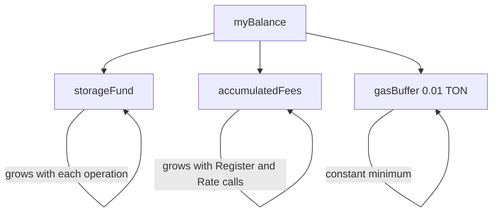

# Gas System

How TON Agent Kit handles gas, excess refunds, and contract self-funding.

## Overview

TON's gas model requires the sender to attach TON to each message. The contract consumes gas for computation. Any excess should be returned. Sending too little causes the transaction to fail. Sending too much is safe as long as the contract returns it.

TON Agent Kit's contracts implement a 3-pool model that solves three problems at once:

1. **Users get excess gas back.** Typical effective cost is ~0.03 TON per call even when 0.12-0.15 TON is attached.
2. **Contracts do not freeze.** A growing `storageFund` pays for on-chain storage over time.
3. **Owner revenue accumulates.** `accumulatedFees` tracks revenue from fee-charging operations.

## 3-Pool Model

The Reputation contract maintains three pools. Their sum equals the contract balance minus whatever is needed for the current operation:



| Pool | Description | Growth |
|---|---|---|
| storageFund | Pays for long-term on-chain storage | Increments per handler (0.003-0.015 TON) |
| accumulatedFees | Owner revenue | 0.01 TON per Register or Rate call |
| gasBuffer | Minimum balance so the contract can process messages | Fixed at 0.01 TON |

The Escrow contract uses only `storageFund` and `gasBuffer`. It has no `accumulatedFees` pool (escrow does not charge fees).

## SDK Gas Constants

Defined in `packages/core/src/gas.ts`:

```typescript
DEFAULT_GAS        = "0.12"  // simple contract calls
CROSS_CONTRACT_GAS = "0.15"  // operations that notify other contracts
```

Use `CROSS_CONTRACT_GAS` for `OpenDispute` (sends 0.03 TON to reputation) and `FallbackSettle` (sends 0.02 TON to reputation). All other escrow and reputation calls use `DEFAULT_GAS`.

## estimateGas() Function

`estimateGas(operation, state?)` computes a precise estimate and adds a 0.1 TON safety buffer. The buffer is always added regardless of state size.

```typescript
import { estimateGas } from "@ton-agent-kit/core";

const gas = estimateGas("register", { agentCount: 50 });
// estimated = 0.02 + 50 * 0.002 = 0.12
// total = 0.12 + 0.1 buffer = 0.22 TON
```

Estimates by operation:

| Operation | Base Estimate | State Factor |
|---|---|---|
| register, rate | 0.02 | + agentCount * 0.002 |
| broadcast_intent | 0.02 | + intentCount * 0.001 |
| send_offer, accept_offer, settle_deal, cancel_intent | 0.03 | none |
| cleanup | 0.03 | + (agentCount + intentCount) * 0.002 |
| open_dispute, join_dispute, vote | 0.02 | + disputeCount * 0.0006 |
| deposit, release, refund | 0.02 | none |
| (default) | 0.02 | none |

All values have 0.1 TON added as the buffer. The contract refunds the excess, so overestimating is always safe.

## storageFund Increments

### Reputation Contract

| Handler | Increment | Reason |
|---|---|---|
| Register | +0.015 TON | Creates ~7 map entries (owner, available, tasks, successes, registeredAt, lastActive, nameToIndex) |
| BroadcastIntent | +0.015 TON | Creates ~6 map entries (buyer, serviceHash, serviceName, budget, deadline, status) plus service index |
| IndexCapability | +0.008 TON | ~3-4 new map entries |
| SendOffer | +0.008 TON | Adds offer to intent's offer list |
| SettleDeal | +0.008 TON | Updates intent and offer status, triggers rating |
| NotifyDisputeOpened | +0.005 TON | Adds dispute record entries |
| RegisterEscrow | +0.003 TON | Adds escrow to whitelist |
| Rate | +0.003 TON | Updates score fields |
| UpdateAvailability | +0.003 TON | Updates single map entry |
| AcceptOffer | +0.003 TON | Status update |
| NotifyDisputeSettled | +0.003 TON | Updates dispute settled flag |
| TriggerCleanup | 0 TON | Removes data, reduces storage |

### Escrow Contract

| Handler | Increment | Reason |
|---|---|---|
| OpenDispute | +0.005 TON | Adds dispute state and triggers cross-contract notification |
| SellerStake | +0.003 TON | Records stake amount |
| Deposit | +0.003 TON | Updates amount |
| DeliveryConfirmed | +0.003 TON | Sets flag and stores x402 hash |
| JoinDispute | +0.003 TON | Adds arbiter to four maps |
| VoteRelease (non-settling) | +0.003 TON | Records vote |
| VoteRefund (non-settling) | +0.003 TON | Records vote |

Settling votes (when a majority is reached in the same call) do not increment storageFund.

## Refund Pattern

Both contracts use the same pattern to return excess gas to the sender:

```tact
// 1. Increment storageFund for this operation
self.storageFund = self.storageFund + ton("0.015");

// 2. For fee-charging operations only (Register, Rate in Reputation)
self.accumulatedFees = self.accumulatedFees + self.fee;

// 3. Reserve exactly what the contract needs to hold
nativeReserve(self.storageFund + self.accumulatedFees + ton("0.01"), 0);

// 4. Send everything above the reserve back to the sender
send(SendParameters{
    to: sender(),
    value: 0,
    mode: SendRemainingBalance | SendIgnoreErrors,
    bounce: false,
    body: "Excess".asComment()
});
```

The `nativeReserve` call marks an amount as protected before the action phase processes the outgoing send. `SendRemainingBalance` then sends everything above that protected amount. This order guarantees correctness regardless of gas consumed during execution.

Earlier attempts used `myBalance() - keep` with an explicit value. The action phase would sometimes consume more gas after the `myBalance()` call, causing the balance to drop below the computed amount and silently skipping the send. `nativeReserve + SendRemainingBalance` is the correct TON pattern.

### Reputation Contract Reserve Formula

```
nativeReserve = storageFund + accumulatedFees + 0.01 TON
```

### Escrow Contract Reserve Formula

During an active deal:

```
nativeReserve = amount + sellerStake + totalArbiterStakes + storageFund + 0.01 TON
```

After settlement (release or refund):

```
nativeReserve = totalArbiterStakes + storageFund + 0.01 TON
```

The escrow reserve must also protect the deal funds themselves (`amount`) and all staked collateral. This is why the formula is larger.

## Deploy Reserve

Both contracts override the `storageReserve` constant from Tact's `Deployable` trait:

```tact
override const storageReserve: Int = ton("0.05");
```

This ensures the `Deploy` handler keeps 0.05 TON in the contract instead of sending everything back. Without this, contracts deploy with near-zero balance and immediately freeze because they cannot pay storage fees.

## 20-Year Withdrawal Rule

The owner of the Reputation contract can withdraw excess `storageFund` beyond 20 years of projected storage costs.

The calculation uses a storage cost estimate of 240 nanoTON per cell per year:

```tact
let totalCells: Int = self.agentCount * 3 + self.intentCount * 3;
let annualCost: Int = totalCells * 240; // nanoTON per year
let yearsCovered: Int = self.storageFund / annualCost;
```

If `yearsCovered > 20`, the owner can withdraw:

```
withdrawableFromReserve = storageFund - (annualCost * 20)
```

The `accumulatedFees` pool is always fully withdrawable, independent of the 20-year rule. Minimum withdrawal amount is > 0.005 TON.

If `totalCells == 0` (empty contract), the entire `storageFund` is withdrawable.

The 240 nanoTON/cell/year constant is an approximation. TON storage pricing can change. At current rates this estimate is conservative.

## Effective Cost Per Operation

What users actually pay after the refund, for typical contract states:

| Operation | Attached | Reserved by Contract | Returned | Effective Cost |
|---|---|---|---|---|
| Register (Reputation) | 0.22 TON (estimated) | ~0.015 TON (storageFund) + 0.01 TON (fee) + 0.01 TON (buffer) | ~0.185 TON | ~0.035 TON |
| Rate (Reputation) | 0.12 TON | ~0.003 TON + 0.01 TON fee + 0.01 TON buffer | ~0.107 TON | ~0.013 TON |
| BroadcastIntent | 0.12 TON | ~0.015 TON + 0.01 TON buffer | ~0.095 TON | ~0.025 TON |
| SendOffer / AcceptOffer | 0.13 TON | ~0.008 TON + 0.01 TON buffer | ~0.112 TON | ~0.018 TON |
| Deposit (Escrow) | amount + 0.12 TON | amount + 0.003 TON + 0.01 TON buffer | ~0.107 TON | ~0.013 TON overhead |
| OpenDispute (Escrow) | 0.15 TON | ~0.005 TON + 0.01 TON buffer + 0.03 sent to reputation | ~0.105 TON | ~0.045 TON |
| JoinDispute (Escrow) | stake + 0.12 TON | stake + 0.003 TON + 0.01 TON buffer | ~0.107 TON | ~0.013 TON overhead |

These are approximate. Actual gas consumption varies by contract state size and TVM execution.

## verifyContractExecution

After sending a transaction, the SDK provides `verifyContractExecution()` to confirm the contract processed it without bouncing or failing:

```typescript
import { verifyContractExecution } from "@ton-agent-kit/core";

const result = await verifyContractExecution(
    walletAddress,   // raw address string
    "https://testnet.tonapi.io",
    tonapiKey,       // optional bearer token
    15000            // timeout in ms (default: 12000)
);

// result shape:
// {
//   verified: boolean,
//   contractExitCode: number | null,
//   bounced: boolean,
//   error: string | null
// }
```

The function:
1. Fetches the most recent account event from TONAPI to get the transaction hash.
2. Polls `/v2/traces/{txHash}` every 2 seconds until child transactions appear.
3. Checks the compute phase exit code of each child transaction.
4. Returns `verified: true` only if exit code is 0 and the message was not bounced.

Exit code -14 means out of gas. Any non-zero exit code returns `verified: false` with the code in the error message.

The polling loop runs until child transactions appear or `timeoutMs` is reached. Default timeout is 12000ms. The usage in the examples passes 15000ms.

## Design Notes

- Overestimating gas is always safe. The refund pattern guarantees excess is returned.
- The `estimateGas()` buffer of 0.1 TON is intentionally large. It covers worst-case iteration costs for cleanup and state-heavy operations.
- The Escrow contract has no 20-year rule because it is a short-lived per-deal contract. It settles to near-zero balance via `Release` or `Refund`.
- `accumulatedFees` in the Reputation contract only covers `Register` and `Rate`. All other handlers contribute to `storageFund` but do not charge the caller an explicit fee.
- `TriggerCleanup` contributes 0 to `storageFund` because cleanup removes data and reduces future storage costs.
- The `storageReserve = ton("0.05")` override applies to both contracts identically.
