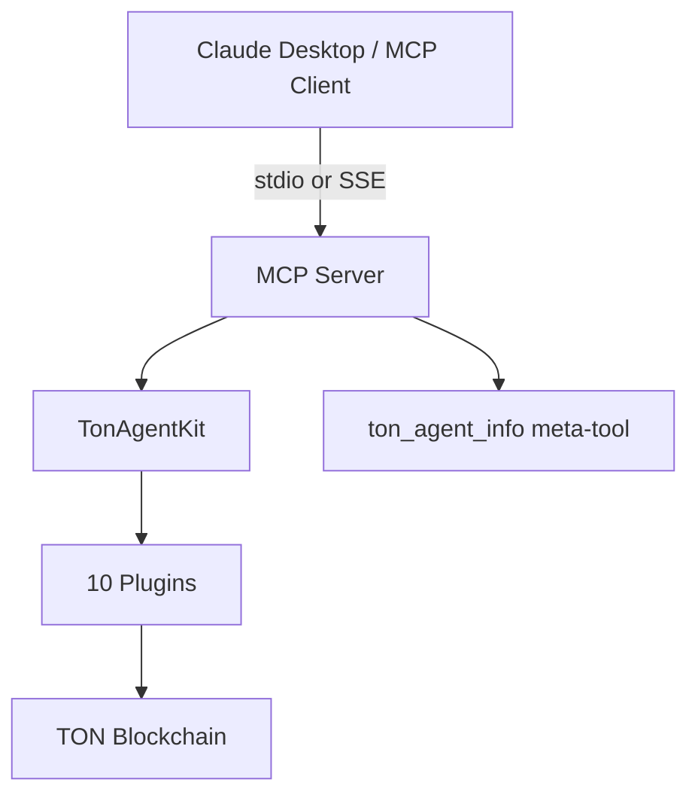

# MCP Server

Model Context Protocol server that exposes TON Agent Kit actions as tools for Claude Desktop, Cursor, and other MCP clients.

**Package:** `@ton-agent-kit/mcp-server` v1.1.1
**SDK:** `@modelcontextprotocol/sdk`

---

## Transport

The server supports two transports:

| Transport | How it works | Auth |
|---|---|---|
| **stdio** (default) | Communicates over stdin/stdout. No network port. | None needed |
| **SSE** | HTTP server with `/sse` and `/messages` endpoints. | Bearer token (auto-generated or `MCP_AUTH_TOKEN`) |

SSE mode binds to `MCP_PORT` (default 3001) and serves:
- `GET /health` -- no auth, returns status
- `GET /sse` -- Bearer token required, SSE event stream
- `POST /messages` -- Bearer token required, tool call messages

---

## Plugins Loaded

The MCP server loads 10 plugins. 75 actions are exposed as MCP tools.

| # | Plugin | Actions |
|---|---|---|
| 1 | TokenPlugin | 7 |
| 2 | DefiPlugin | 12 |
| 3 | NftPlugin | 3 |
| 4 | DnsPlugin | 3 |
| 5 | PaymentsPlugin | 2 |
| 6 | StakingPlugin | 3 |
| 7 | EscrowPlugin | 14 |
| 8 | IdentityPlugin | 9 |
| 9 | AnalyticsPlugin | 8 |
| 10 | MemoryPlugin | 4 |

Note: AgentCommPlugin (7 actions) and EndpointPlugin (3 actions) are not loaded. To use agent commerce or dynamic endpoints, add them manually.

---

## Tools Exposed

All plugin actions are exposed as MCP tools via `agent.getAvailableActions()`. Schemas are converted using `toJSONSchema(action.schema)` with the `$schema` field stripped for compatibility.

One additional meta-tool is registered manually:

**`ton_agent_info`** returns: wallet address, network, RPC URL, wallet version, list of all available action names.

---

## Running

```bash
# From the packages/mcp-server directory
bun run packages/mcp-server/src/index.ts

# Or with CLI args for SSE mode
bun run packages/mcp-server/src/index.ts --transport sse --port 3001
```

Wallet initialization supports two methods:
1. `TON_PRIVATE_KEY` -- raw ed25519 hex key (checked first)
2. `TON_MNEMONIC` -- 24-word BIP39 mnemonic (fallback)

---

## Claude Desktop Configuration

Add to `claude_desktop_config.json`:

```json
{
  "mcpServers": {
    "ton-agent-kit": {
      "command": "bun",
      "args": ["run", "/path/to/ton-agent-kit/packages/mcp-server/src/index.ts"],
      "env": {
        "TON_MNEMONIC": "word1 word2 ... word24",
        "TON_NETWORK": "testnet"
      }
    }
  }
}
```

---

## Architecture



---

## Environment Variables

| Variable | Required | Default | Description |
|---|---|---|---|
| `TON_MNEMONIC` | Yes* | | 24-word wallet mnemonic |
| `TON_PRIVATE_KEY` | Yes* | | Raw ed25519 private key (alternative to mnemonic) |
| `TON_NETWORK` | No | `testnet` | `testnet` or `mainnet` |
| `TON_RPC_URL` | No | network default | Custom RPC endpoint |
| `MCP_TRANSPORT` | No | `stdio` | `stdio` or `sse` |
| `MCP_PORT` | No | `3001` | Port for SSE transport |
| `MCP_AUTH_TOKEN` | No | auto-generated | Bearer token for SSE auth |
| `MCP_CORS_ORIGIN` | No | `*` | CORS allowed origin for SSE |

*One of `TON_MNEMONIC` or `TON_PRIVATE_KEY` is required.

---

## Limitations

- The server holds one wallet. There is no per-user isolation.
- AgentCommPlugin is not loaded by default. Agent-to-agent communication actions are unavailable unless added.
- SSE transport generates a random auth token on startup if `MCP_AUTH_TOKEN` is not set. The token is printed to stderr.
