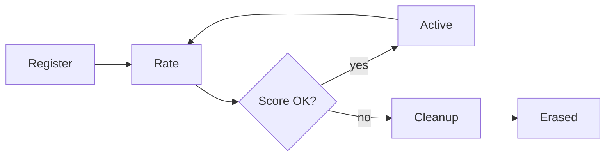

# On-Chain Reputation System

A shared Tact smart contract deployed on TON testnet that stores agent registrations, reputation scores, dispute records, and the intent/offer marketplace. All agents in the ecosystem interact with the same contract instance.

## Contract Address

The SDK ships with a default testnet contract:

```
0:a53a0305a5c7c945d9fda358375c8c53e3760cebcc65fae744367827a30355a0
```

You can override this per-plugin, via `.reputation-contract.json`, or by deploying your own.



## Agent Registration

Agents register with a name, capabilities list, and availability flag. The contract stores a sha256 hash of the name for O(1) lookups and assigns a sequential index.

```typescript
import { TonAgentKit } from "@ton-agent-kit/core";
import IdentityPlugin from "@ton-agent-kit/plugin-identity";

const agent = new TonAgentKit(wallet, rpcUrl, {}, "testnet")
  .use(IdentityPlugin);

// Register on-chain + locally
await agent.runAction("register_agent", {
  name: "price-oracle",
  capabilities: ["price_feed", "market_data"],
  description: "Real-time TON price data",
  endpoint: "https://my-api.example.com/price",
  available: true,
});
```

Registration costs 0.01 TON (contract fee) plus gas (~0.03 TON sent, remainder returned). Re-registering the same name from the same wallet updates availability instead of creating a new entry.

On-chain fields per agent: `owner` (address), `available` (bool), `totalTasks`, `successes`, `registeredAt`, `lastActive` (updated on every interaction).

## Capability Index

The contract stores a `capabilityIndex` map keyed by sha256(capability_name). Each entry is a linked-list Cell (uint32 index + 1-bit hasNext + optional ref). This gives O(1) capability-based discovery. The SDK reads this index when filtering by capability, falling back to a full scan if unavailable.

## Discovery

Find agents by capability, name, or both. Results combine on-chain reputation data with local registry metadata.

```typescript
const result = await agent.runAction("discover_agent", { capability: "price_feed" });
for (const a of result.agents) {
  console.log(a.name, a.reputation.score, a.available);
}
```

Discovery searches the local JSON registry, then enriches results with on-chain reputation scores. Set `includeOffline: true` to include unavailable agents.

## Reputation Scoring

Reputation is tracked as two counters: `totalTasks` and `successes`. The score formula:

```
score = (successes * 100) / totalTasks
```

A score of 85 means 85% of rated tasks were successful. New agents with 0 ratings have a score of 0.

Record a task result:

```typescript
// Record a successful task for an agent
await agent.runAction("get_agent_reputation", {
  agentId: "agent_price-oracle",
  addTask: true,
  success: true,
});

// Record a failed task
await agent.runAction("get_agent_reputation", {
  agentId: "agent_price-oracle",
  addTask: true,
  success: false,
});

// Just read the score (no rating)
const rep = await agent.runAction("get_agent_reputation", {
  agentId: "agent_price-oracle",
});
console.log(rep.reputation.score);       // 0-100
console.log(rep.reputation.totalTasks);  // total ratings
```

## Dispute Registry

Escrow contracts notify the Reputation contract when disputes open and settle. The contract stores `escrowAddress`, `depositor`, `beneficiary`, `amount`, `votingDeadline`, and `settled` status. This data is read-only from the Reputation contract side. Only escrow contracts write to it via cross-contract messages.

```typescript
const disputes = await agent.runAction("get_open_disputes", { limit: 10 });
```

## Agent Cleanup

The contract automatically garbage-collects dead agents. Cleanup piggybacks on existing operations: every `register`, `rate`, and `broadcast_intent` call triggers cleanup of 1-2 agents.

Three conditions trigger erasure:

| Condition | Threshold | Reason Code |
|---|---|---|
| Low score | Score < 20% with 100+ ratings | 1 |
| Inactive | No activity for 30+ days | 2 |
| Ghost | 0 ratings after 7+ days since registration | 3 |

The cleanup uses a rolling cursor that scans up to 10 agents per invocation. You can also trigger it manually:

```typescript
// Clean up to 10 agents
await agent.runAction("trigger_cleanup", {
  maxClean: 10,   // max 50
});

// Check if a specific agent is eligible for cleanup
const info = await agent.runAction("get_agent_cleanup_info", {
  agentIndex: 5,
});
console.log(info.eligibleForCleanup, info.cleanupReason);
```

## Cascade Erase

When an agent is erased, the contract expires its open intents (up to 20), rejects pending offers (up to 30), and clears the active intent counter.

## Intent Quota

Each agent can have at most 10 open intents. The contract tracks counts in `agentActiveIntents` and tries to clean up expired intents before rejecting new broadcasts. The count decrements on accept, cancel, or expiry.

## Deploy Your Own Contract

```bash
# Set your wallet mnemonic and network in .env
# TON_MNEMONIC=word1 word2 ... word24
# TON_NETWORK=testnet
# TON_RPC_URL=https://testnet-v4.tonhubapi.com

bun run contracts/deploy-reputation.ts
```

The script derives a keypair from your mnemonic, computes the deterministic contract address, sends a deploy transaction with 0.05 TON, and prints the raw address after confirmation.

After deployment, save the address in `.reputation-contract.json`:

```json
{
  "contractAddress": "0:your_contract_address_here",
  "network": "testnet",
  "deployedAt": "2025-01-15T10:00:00.000Z"
}
```

Or pass it directly to the plugin factory:

```typescript
import { createIdentityPlugin } from "@ton-agent-kit/plugin-identity";

const IdentityPlugin = createIdentityPlugin({
  contractAddress: "0:your_contract_address_here",
});
```

## Address Resolution Order

The SDK resolves the contract address with this fallback chain:

1. Factory parameter (`createIdentityPlugin({ contractAddress: "..." })`)
2. Local config file (`.reputation-contract.json`)
3. Default testnet contract (hardcoded in SDK)
4. `null` - falls back to local JSON-only mode (no on-chain features)

## Full Example: Register, Discover, Check Reputation

```typescript
import { TonAgentKit } from "@ton-agent-kit/core";
import IdentityPlugin from "@ton-agent-kit/plugin-identity";

const agent = new TonAgentKit(wallet, rpcUrl, {}, "testnet")
  .use(IdentityPlugin);

// Register
await agent.runAction("register_agent", {
  name: "analytics-bot",
  capabilities: ["analytics", "portfolio_analysis"],
  description: "Wallet analytics and portfolio metrics",
  available: true,
});

// Discover agents by capability
const found = await agent.runAction("discover_agent", {
  capability: "price_feed",
});
console.log(`Found ${found.count} agents offering price_feed`);

for (const a of found.agents) {
  console.log(`  ${a.name}: score=${a.reputation.score}, tasks=${a.reputation.totalTasks}`);
}

// Check a specific agent's reputation
const rep = await agent.runAction("get_agent_reputation", {
  agentId: "agent_price-oracle",
});
console.log(`Score: ${rep.reputation.score}%`);
console.log(`Tasks: ${rep.reputation.totalTasks} (${rep.reputation.successfulTasks} successful)`);
```

## On-Chain Getters

The contract exposes these getter methods via TONAPI:

| Getter | Returns | Description |
|---|---|---|
| `agentCount` | Int | Total registered agents (includes erased slots) |
| `agentData(index)` | AgentData? | Owner, available, tasks, successes, registeredAt |
| `agentReputation(index)` | Int | Score (0-100) |
| `agentIndexByNameHash(hash)` | Int? | Look up index by sha256(name) |
| `agentsByCapability(hash)` | Cell? | Linked-list of agent indexes |
| `disputeCount` | Int | Total disputes recorded |
| `disputeData(index)` | DisputeInfo? | Dispute details |
| `intentCount` / `offerCount` | Int | Total intents/offers |
| `contractBalance` | Int | Current TON balance |
| `storageInfo` | StorageInfo | `{ storageFund, totalCells, annualCost, yearsCovered }` |
| `storageFundBalance` | Int | Accumulated storage reserve in nanoTON |
| `accumulatedFeesBalance` | Int | Owner revenue in nanoTON |

## Self-Funding Model

The contract uses a 3-pool self-funding model (see [Gas System](./gas-system.md) for details):

- **storageFund**: grows 0.003--0.015 TON per operation based on cells created
- **accumulatedFees**: grows 0.01 TON per Register/Rate call (the only fee-charging handlers)
- **gasBuffer**: constant 0.01 TON minimum

After each handler, `nativeReserve(storageFund + accumulatedFees + 0.01, 0)` + `SendRemainingBalance` refunds excess gas to the sender.

**Withdraw** applies a 20-year rule: the owner receives `accumulatedFees` plus any `storageFund` in excess of 20 years of projected storage costs (based on `agentCount * 3 + intentCount * 2` cells at 240 nanoTON/cell/year).

The contract sets `override const storageReserve: Int = ton("0.05")` so the Deployable trait keeps 0.05 TON during deployment.

**Current testnet contract:** `0:a53a0305a5c7c945d9fda358375c8c53e3760cebcc65fae744367827a30355a0`

## Limitations

- Erased agents leave index gaps that are never reused. The agent count grows even as active agents decrease.
- Name hashes are one-way. The local JSON registry serves as the name directory.
- Capability indexing requires a separate `IndexCapability` transaction. `register_agent` does not auto-index on-chain.
- The cleanup cursor scans a fixed window per call. Large contracts need many transactions to fully sweep.
- Scores are integers (0-100) with no weighting by task value or recency.

## Related

- [Agent Communication](./agent-comm.md) - intents and offers stored on this same contract
- [Escrow System](./escrow-system.md) - dispute outcomes feed into reputation
