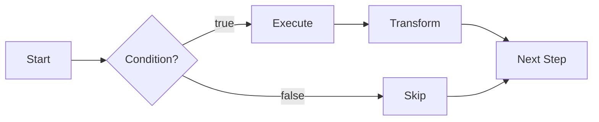

# Strategy Engine

Strategies are deterministic, multi-step workflows that run on a schedule. They are not LLM-driven. Each step calls a specific agent action with predefined or context-derived parameters.

Package: `@ton-agent-kit/strategies` v1.0.1

## Core Concepts

A strategy is a named list of steps, an optional schedule, and optional lifecycle hooks. The `StrategyScheduler` executes steps sequentially, passes results through a shared context, and respects conditions and transforms.



## defineStrategy API

```typescript
import { defineStrategy } from "@ton-agent-kit/strategies";

const myStrategy = defineStrategy({
  name: "my-strategy",
  schedule: "every 5m",    // or "once", "every 1h", "every 1d"
  maxRuns: 100,            // auto-stop after 100 executions
  context: { threshold: 5.0 },
  steps: [
    {
      action: "get_token_price",
      params: { token: "TON" },
    },
    {
      action: "get_balance",
      params: {},
      condition: (ctx) => ctx.results[0]?.price < 5.0,
      transform: (result) => ({ ...result, checked: true }),
      onError: "continue",  // or "stop" (default: stop)
    },
  ],
  onResult: (stepResult) => console.log(stepResult),
  onComplete: () => console.log("Run finished"),
  onStepSkipped: (step) => console.log(`Skipped: ${step.action}`),
  onStepError: (error, step) => console.error(`Error in ${step.action}`, error),
});
```

## Step Options

Each step supports:

| Field | Type | Purpose |
|---|---|---|
| `action` | string | Agent action name to call. |
| `params` | object or function | Static params, or `(ctx) => params` for dynamic resolution. |
| `condition` | function | `(ctx) => boolean`. Step is skipped when this returns false. |
| `transform` | function | `(result) => any`. Post-processes the action result before storing it in context. |
| `onError` | `"stop"` or `"continue"` | Behavior when the action throws. Defaults to `"stop"`. |

## Scheduling

The `parseSchedule` function converts human-readable strings to millisecond intervals:

```typescript
import { parseSchedule } from "@ton-agent-kit/strategies";

parseSchedule("once");       // null (run once, no repeat)
parseSchedule("every 30s");  // 30000
parseSchedule("every 5m");   // 300000
parseSchedule("every 1h");   // 3600000
parseSchedule("every 1d");   // 86400000
```

Supported units: `ms`, `s`, `m`, `h`, `d`. The scheduler uses `setInterval` internally.

## StrategyContext

Each strategy gets its own context instance. Context persists across runs: variables survive between scheduled executions. Results are reset at the start of each run.

| Property | Type | Lifetime |
|---|---|---|
| `results` | array | Reset per run. Contains the output of each step in order. |
| `runCount` | number | Incremented after each run. Persists across runs. |
| `variables` | object | User-defined. Persists across runs. |

String params support Mustache templates:

- `{{timestamp}}` - current ISO timestamp
- `{{runCount}}` - execution count
- `{{strategyName}}` - strategy name

## StrategyScheduler

The `StrategyScheduler` manages execution of strategies.

```typescript
// Agent integration (recommended)
agent.useStrategy(myStrategy);   // register strategy
agent.runStrategy("my-strategy"); // run once manually
agent.stopAllStrategies();        // stop all scheduled strategies
```

## Built-in Templates

Four pre-built strategy templates cover common use cases. They are convenience wrappers around `defineStrategy`. For anything beyond their parameters, use `defineStrategy` directly.

### DCA Buy

Periodically marks a token purchase intent. Skips if price exceeds a cap or balance is too low. Note: this template does not execute a swap automatically. It is illustrative of the DCA pattern.

```typescript
import { createDcaStrategy } from "@ton-agent-kit/strategies";

const dca = createDcaStrategy({
  token: "TON",
  amount: 10,          // spend 10 TON per buy
  maxPrice: 5.0,       // skip if price > $5.00
  schedule: "every 1h",
  dex: "dedust",
});
agent.useStrategy(dca);
```

### Price Monitor

Watches a token price and fires a callback when thresholds are crossed. Maintains a price history array in context variables across runs.

```typescript
import { createPriceMonitorStrategy } from "@ton-agent-kit/strategies";

const monitor = createPriceMonitorStrategy({
  token: "TON",
  schedule: "every 5m",
  alertAbove: 5.0,
  alertBelow: 2.0,
  onAlert: (price, direction, ctx) => {
    console.log(`TON price ${direction} threshold: $${price}`);
  },
});
agent.useStrategy(monitor);
```

### Portfolio Rebalance

Fetches portfolio metrics and wallet balance on a schedule. Does not execute trades automatically. Provides the data needed to make rebalancing decisions.

```typescript
import { createRebalanceStrategy } from "@ton-agent-kit/strategies";

const rebalance = createRebalanceStrategy({ schedule: "every 1d" });
agent.useStrategy(rebalance);
```

### Reputation Guard

Monitors an agent's on-chain reputation score and fires an alert if it drops below a threshold.

```typescript
import { createReputationGuardStrategy } from "@ton-agent-kit/strategies";

const guard = createReputationGuardStrategy({
  agentId: "agent_price-oracle",
  minScore: 50,
  schedule: "every 1h",
  onAlert: (score, agentId) => {
    console.log(`Warning: ${agentId} reputation dropped to ${score}`);
  },
});
agent.useStrategy(guard);
```

## Full Example

```typescript
import { TonAgentKit } from "@ton-agent-kit/core";
import TokenPlugin from "@ton-agent-kit/plugin-token";
import { createPriceMonitorStrategy } from "@ton-agent-kit/strategies";

const agent = new TonAgentKit(wallet, rpcUrl, {}, "testnet")
  .use(TokenPlugin);

const monitor = createPriceMonitorStrategy({
  token: "TON",
  schedule: "every 5m",
  alertAbove: 5.0,
  alertBelow: 2.0,
  onAlert: (price, direction, ctx) => {
    const history = ctx.variables.priceHistory || [];
    console.log(
      `Alert: TON $${price} (${direction}). ` +
      `${history.length} data points collected.`
    );
  },
});

agent.useStrategy(monitor);
```

## Limitations

- Strategies do not persist across process restarts. When the process exits, all scheduled strategies stop. Use a process manager (pm2, systemd) for long-running strategies.
- The scheduler uses `setInterval`, which is subject to event loop delays under heavy load.
- `maxRuns` is checked after each run, not before. A strategy with `maxRuns: 1` runs once and stops on the next scheduled tick.
- The DCA template does not execute actual swaps. It is a structural template showing the pattern.

## Related

- [Agent Communication](./agent-comm.md) - broadcast intents and negotiate deals
- [Escrow System](./escrow-system.md) - hold payment during service delivery
