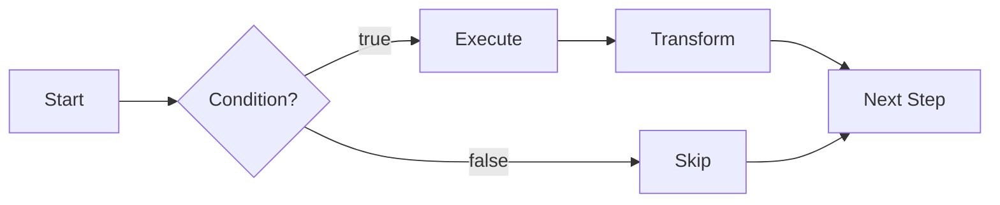

# Strategy Engine

Strategies are deterministic, multi-step workflows that run on a schedule. They are not LLM-driven. Each step calls a specific agent action with predefined or context-derived parameters.

## Core Concepts

A strategy is a named list of steps, an optional schedule, and optional lifecycle hooks. The `StrategyRunner` executes steps sequentially, passes results through a shared context, and respects conditions, retries, and transforms.



## defineStrategy API

```typescript
import { defineStrategy } from "@ton-agent-kit/strategies";

const myStrategy = defineStrategy({
  name: "my-strategy",
  description: "Fetch price and check balance",
  schedule: "every 5m",   // or "once", "every 1h", "every 1d"
  maxRuns: 100,            // auto-stop after 100 executions
  steps: [
    {
      id: "get_price",
      action: "get_token_price",
      params: { token: "TON" },
    },
    {
      id: "check_balance",
      action: "get_balance",
      params: {},
      condition: (ctx) => {
        const price = ctx.getResult("get_price");
        return price?.price < 5.0;
      },
      transform: (result, ctx) => {
        return { ...result, priceAtCheck: ctx.getResult("get_price")?.price };
      },
    },
  ],
  onError: (error, step) => "continue",  // or "stop" or "retry"
  onComplete: (result) => {
    console.log(`Ran in ${result.totalDuration}ms`);
  },
});
```

## Step Options

Each step supports:

| Field | Type | Purpose |
|---|---|---|
| `id` | string | Unique step identifier. Auto-generated as `step_N` if omitted. |
| `action` | string | Agent action name, or `"wait"` for a timed pause. |
| `params` | object or function | Static params, or `(ctx) => params` for dynamic resolution. |
| `condition` | function | `(ctx) => boolean`. If false, the step is skipped. |
| `retries` | number | Retry count on failure. Default 0. |
| `delay` | number | Milliseconds to wait before executing. |
| `transform` | function | `(result, ctx) => newResult`. Post-processes the action result. |
| `onResult` | function | Callback after successful execution. |

## Scheduling

The `parseSchedule` function converts human-readable strings to millisecond intervals:

```typescript
import { parseSchedule } from "@ton-agent-kit/strategies";

parseSchedule("once");       // null (run once)
parseSchedule("every 30s");  // 30000
parseSchedule("every 5m");   // 300000
parseSchedule("every 1h");   // 3600000
parseSchedule("every 1d");   // 86400000
```

Supported units: `ms`, `s`, `m`, `h`, `d`. The pattern must match `every <number><unit>`.

## StrategyContext

Each strategy gets its own `StrategyContext` instance. The context persists across runs, meaning variables survive between scheduled executions. Results are reset at the start of each run.

```typescript
// Inside a step's params function or condition:
ctx.getResult("get_price");         // result from a previous step (current run only)
ctx.getVariable("priceHistory");    // variable that persists across runs
ctx.setVariable("lastPrice", 3.85); // store a value for future runs
ctx.runCount;                       // how many times this strategy has executed
ctx.lastRunAt;                      // Date of the last execution
```

The context also resolves `{{mustache}}` templates in string params:

- `{{timestamp}}` - current ISO timestamp
- `{{runCount}}` - execution count
- `{{strategyName}}` - strategy name

## StrategyRunner

The runner registers strategies, executes them, and manages scheduling.

```typescript
import { StrategyRunner } from "@ton-agent-kit/strategies";

const runner = new StrategyRunner(agent, {
  onStepStart: (step, ctx) => console.log(`Starting ${step.id}`),
  onStepComplete: (result, ctx) => console.log(`Done: ${result.stepId}`),
  onRunComplete: (result) => console.log(`Run #${result.runCount} finished`),
});

// Register
runner.use(myStrategy);

// Run once manually
const result = await runner.run("my-strategy", { threshold: 5.0 });
console.log(result.completedSteps, "of", result.steps.length, "steps ran");

// Start on schedule
runner.start("my-strategy");

// Later: stop
runner.stop("my-strategy");
runner.stopAll();

// Inspect
runner.getActive();      // ["my-strategy"]
runner.getStrategies();  // ["my-strategy"]
runner.getContext("my-strategy");  // StrategyContext instance
```

## Built-in Templates

Four pre-built strategy templates cover common use cases:

### DCA Buy

Periodically buys a token at the best available price. Skips if price exceeds a cap or balance is too low.

```typescript
import { createDcaStrategy } from "@ton-agent-kit/strategies";

const dca = createDcaStrategy({
  token: "TON",
  amount: 10,          // spend 10 TON per buy
  maxPrice: 5.0,       // skip if price > $5
  schedule: "every 1h",
  dex: "dedust",
});
runner.use(dca).start(dca.name);
```

### Price Monitor

Watches a token price and fires a callback when thresholds are crossed. Maintains a price history array in context.

```typescript
import { createPriceMonitorStrategy } from "@ton-agent-kit/strategies";

const monitor = createPriceMonitorStrategy({
  token: "TON",
  schedule: "every 5m",
  alertAbove: 5.0,
  alertBelow: 2.0,
  onAlert: (price, direction, ctx) => {
    console.log(`TON price ${direction} threshold: $${price}`);
  },
});
runner.use(monitor).start(monitor.name);
```

### Portfolio Rebalance

Fetches portfolio metrics and wallet balance on a daily schedule. Does not execute trades automatically, but provides the data needed to make rebalancing decisions.

```typescript
import { createRebalanceStrategy } from "@ton-agent-kit/strategies";

const rebalance = createRebalanceStrategy({ schedule: "every 1d" });
runner.use(rebalance).start(rebalance.name);
```

### Reputation Guard

Monitors an agent's on-chain reputation score and fires an alert if it drops below a threshold.

```typescript
import { createReputationGuardStrategy } from "@ton-agent-kit/strategies";

const guard = createReputationGuardStrategy({
  agentId: "agent_price-oracle",
  minScore: 50,
  schedule: "every 1h",
  onAlert: (score, agentId) => {
    console.log(`Warning: ${agentId} reputation dropped to ${score}`);
  },
});
runner.use(guard).start(guard.name);
```

## Price Monitor: Full Working Example

```typescript
import { TonAgentKit } from "@ton-agent-kit/core";
import TokenPlugin from "@ton-agent-kit/plugin-token";
import { StrategyRunner, createPriceMonitorStrategy } from "@ton-agent-kit/strategies";

const agent = new TonAgentKit(wallet, rpcUrl, {}, "testnet")
  .use(TokenPlugin);

const monitor = createPriceMonitorStrategy({
  token: "TON",
  schedule: "every 5m",
  alertAbove: 5.0,
  alertBelow: 2.0,
  onAlert: (price, direction, ctx) => {
    const history = ctx.variables.priceHistory || [];
    console.log(
      `Alert: TON $${price} (${direction}). ` +
      `${history.length} data points collected.`
    );
  },
});

const runner = new StrategyRunner(agent);
runner.use(monitor);
runner.start(monitor.name);

// After some time, check collected data:
// const ctx = runner.getContext(monitor.name);
// console.log(ctx.variables.priceHistory);
```

## Limitations

- Strategies do not persist across process restarts. If the Node.js process dies, all scheduled strategies stop. You need external process management (e.g., pm2, systemd) for long-running strategies.
- The scheduler uses `setInterval`, which is subject to event loop delays under heavy load.
- The `maxRuns` limit checks after each run, not before. A strategy with `maxRuns: 1` will run once and then stop on the next scheduled tick.
- Templates are convenience wrappers. For anything beyond their parameters, define a custom strategy with `defineStrategy`.

## Related

- [Agent Communication](./agent-comm.md) - broadcast intents and negotiate deals
- [Escrow System](./escrow-system.md) - hold payment during service delivery
