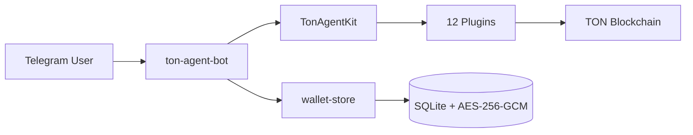

# Telegram Bot

The Telegram bot has been moved to a separate repository:
**https://github.com/Andy00L/ton-agent-bot**

## What it does

Multi-user Telegram bot that gives each user a personal AI agent on TON. Each user brings their own wallet mnemonic and LLM API key. The bot stores them encrypted (AES-256-GCM) per user via `@ton-agent-kit/wallet-store`.



## Features

- Multi-user. Each user registers their own wallet + API key.
- 5 LLM providers: OpenAI, Groq, Together, Mistral, OpenRouter.
- AES-256-GCM encrypted wallet and key storage (SQLite backend via `@ton-agent-kit/wallet-store`).
- x402 path routing. Per-user paid endpoints served on a single port.
- File storage with 48h TTL, 10MB per file, 50MB per user.
- HITL approval for on-chain transactions (inline Approve/Reject buttons).
- 3 operating modes: Normal (chat), Listen (poll intents), Auto (mission loop).
- 65+ inline keyboard callbacks for navigation.

## How it uses TON Agent Kit

The bot imports these npm packages from the SDK:

```typescript
import { TonAgentKit, KeypairWallet } from "@ton-agent-kit/core";
import TokenPlugin from "@ton-agent-kit/plugin-token";
import DefiPlugin from "@ton-agent-kit/plugin-defi";
import NftPlugin from "@ton-agent-kit/plugin-nft";
import DnsPlugin from "@ton-agent-kit/plugin-dns";
import PaymentsPlugin from "@ton-agent-kit/plugin-payments";
import StakingPlugin from "@ton-agent-kit/plugin-staking";
import EscrowPlugin from "@ton-agent-kit/plugin-escrow";
import IdentityPlugin from "@ton-agent-kit/plugin-identity";
import AnalyticsPlugin from "@ton-agent-kit/plugin-analytics";
import MemoryPlugin from "@ton-agent-kit/plugin-memory";
import AgentCommPlugin from "@ton-agent-kit/plugin-agent-comm";
import { createEndpointPlugin } from "@ton-agent-kit/plugin-endpoints";
import { SecretStore, FileStore } from "@ton-agent-kit/wallet-store";
```

Per-user agent instances are created on demand. Each user gets their own `TonAgentKit` with all plugins loaded.

## HITL Approval

23 actions require user approval in confirm mode. 8 actions always require approval regardless of amount: `vote_release`, `vote_refund`, `confirm_delivery`, `settle_deal`, `send_offer`, `cancel_intent`, `open_dispute`, `join_dispute`. Below 0.05 TON, transfers auto-approve.

## Example

A simpler single-user bot example is available in `examples/telegram-bot/` of the SDK repo. It demonstrates bot setup using npm packages without the multi-user wallet store.
