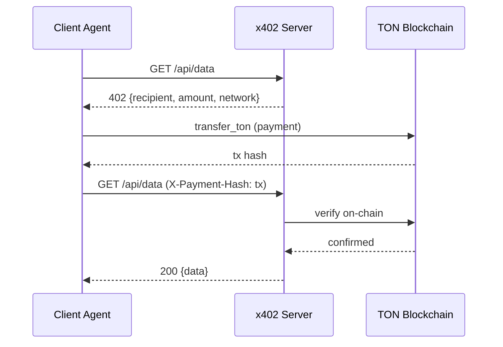
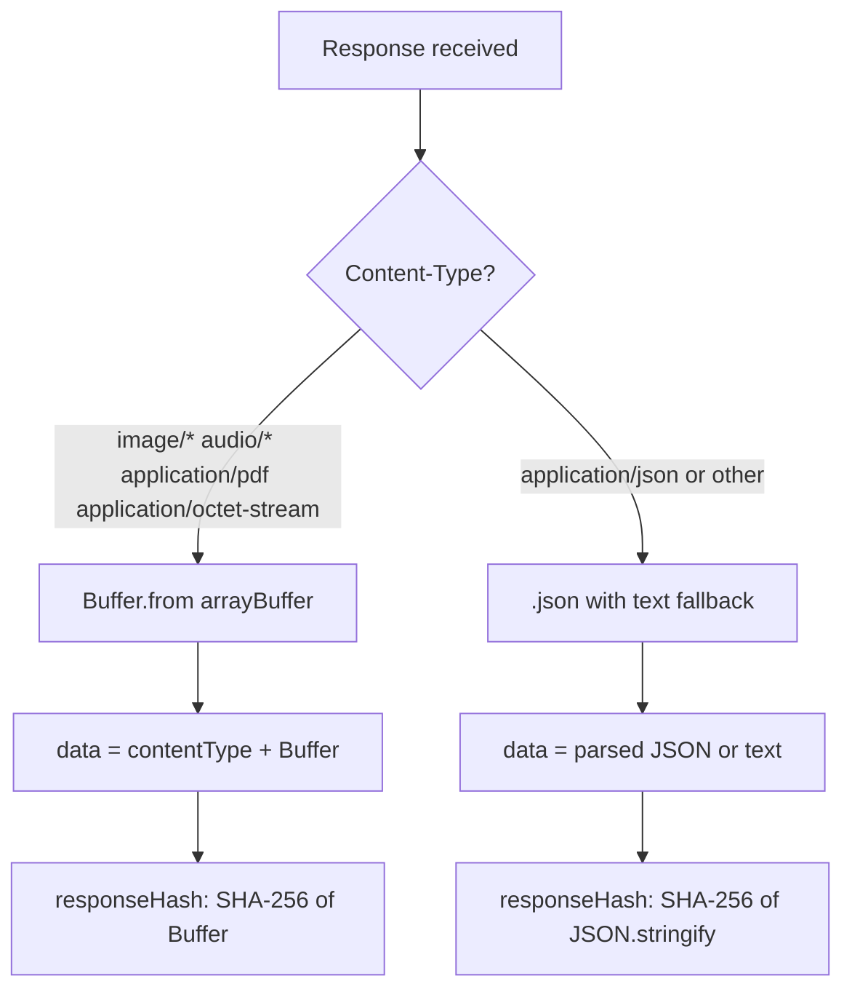
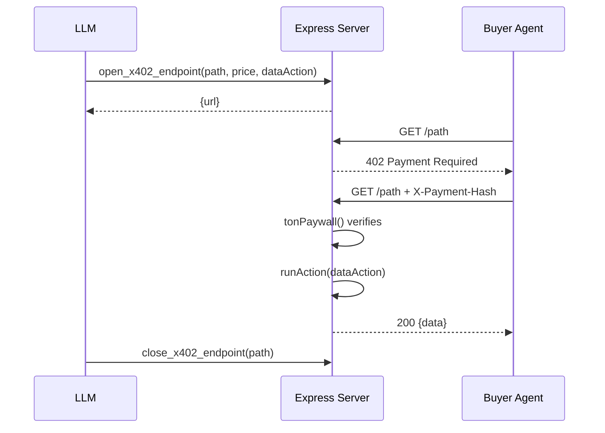

# x402 Protocol

HTTP 402 Payment Required middleware for Express. Gates API endpoints behind TON payments.

**Package:** `@ton-agent-kit/x402-middleware` v1.1.10

---

## Payment Flow



---

## Server Setup

```typescript
import { tonPaywall, FileReplayStore } from "@ton-agent-kit/x402-middleware";

app.get("/api/data", tonPaywall({
    amount: "0.001",
    recipient: "0QAVhp...",
    network: "testnet",
    description: "Market data feed",
    proofTTL: 300,
    replayStore: new FileReplayStore(),
}), (req, res) => {
    res.json({ price: 3.42 });
});
```

A convenience function `createPaymentServer(options)` creates an Express server with a paywall already attached.

---

## Client (Agent) Usage

```typescript
const result = await agent.runAction("pay_for_resource", {
    url: "https://oracle.example.com/api/data",
});
// result.data contains the API response
```

`pay_for_resource` handles the full flow: initial request, TON payment, wait for confirmation, retry with `X-Payment-Hash`. It can optionally confirm escrow delivery after payment.

---

## Binary Response Handling

Since v1.0.18, `pay_for_resource` detects the response `Content-Type` and handles binary data (images, audio, video, PDF). It also unwraps JSON-wrapped binary from servers that use `res.json()` by detecting `{type:"Buffer",data:[...]}` patterns.



Both the paid response and the free response (non-402) paths handle binary content types. The `responseHash` in the delivery proof hashes the raw Buffer for binary data and JSON.stringify for structured data.

---

## Verification

Payment verification runs at two levels:

1. **Primary:** Fetch transaction directly from the blockchain endpoint. Check: success status, timestamp, recipient address, amount.
2. **Fallback:** If primary fails, fetch via TONAPI events endpoint.

### Timestamp

The transaction must be within `maxAge` of the current time. Default: 300 seconds (5 minutes).

### Amount Tolerance

| Transfer type | Tolerance |
|---|---|
| Self-transfer (sender == recipient) | 5,000,000 nanoTON |
| Cross-transfer | 500,000 nanoTON |

Tolerance accounts for gas fees and rounding.

---

## Anti-Replay Protection

Each transaction hash can be used only once. Three built-in store implementations:

| Store | Persistence | Notes |
|---|---|---|
| `FileReplayStore` | JSON file on disk | Survives restarts. No dependencies. Default. |
| `RedisReplayStore` | Redis with TTL | For multi-instance deployments. Supports Upstash, Redis Cloud, self-hosted. |
| `MemoryReplayStore` | In-memory Set | Lost on restart. For testing or short-lived processes. |

Custom stores are supported. Implement `has(hash: string): boolean` and `add(hash: string): void`.

---

## Dynamic Endpoints (EndpointPlugin)

**Package:** `@ton-agent-kit/plugin-endpoints` v1.0.1

The `EndpointPlugin` lets agents open and close paywall endpoints at runtime. It is a separate npm package.

```typescript
import { createEndpointPlugin } from "@ton-agent-kit/plugin-endpoints";

const EndpointPlugin = createEndpointPlugin({
  port: 4000,
  getPublicUrl: () => "https://my-agent.example.com",
});

agent.use(EndpointPlugin);
```

Dynamic endpoints use `MemoryReplayStore`. They do not survive a process restart.

### Actions (3)

| Action | Description |
|---|---|
| `open_x402_endpoint` | Creates a paid endpoint. Specify path, price, and a data action to call. Returns the public URL. |
| `close_x402_endpoint` | Removes an endpoint by path. |
| `list_x402_endpoints` | Lists all active endpoints with prices and serve counts. |

### Architecture



### Public URL Detection

At startup, the process calls `https://api.ipify.org` to get its public IP. Endpoints are advertised as `http://<public-ip>:<port>/path`. Override with `PUBLIC_URL` or set `LOCAL_MODE=true` for localhost.

---

## Example Server

`examples/x402-server/` contains a reference implementation with static and dynamic endpoints.

| Endpoint | Price | Replay Store |
|---|---|---|
| `/api/price` | 0.001 TON | MemoryReplayStore |
| `/api/analytics` | 0.01 TON | MemoryReplayStore |
| `/api/premium` | 0.05 TON | FileReplayStore |
| `/api/dynamic-price` | 0.002 TON (opened programmatically) | MemoryReplayStore |

---

## Environment Variables

| Variable | Required | Default | Description |
|---|---|---|---|
| `X402_PORT` | No | `3402` | HTTP server port (examples) |
| `PUBLIC_URL` | No | auto-detected | Override the public URL advertised in offers |
| `LOCAL_MODE` | No | `false` | Set to `true` to use localhost instead of public IP |

---

## Related

- [Agent Communication](./agent-comm.md) -- offers include endpoint URLs for x402 delivery
- [Escrow System](./escrow-system.md) -- x402 proof hash stored on-chain at delivery confirmation
